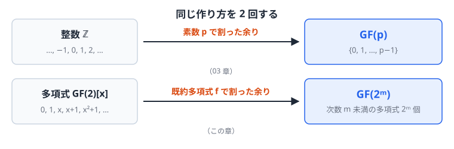
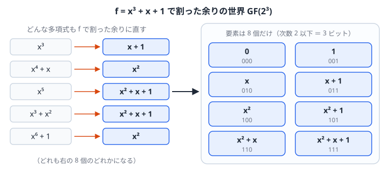
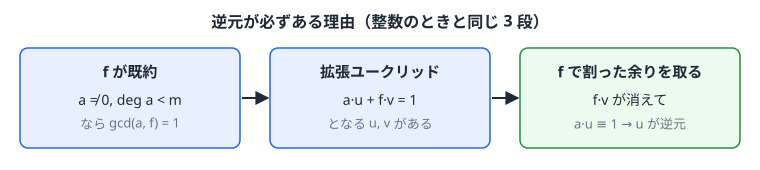
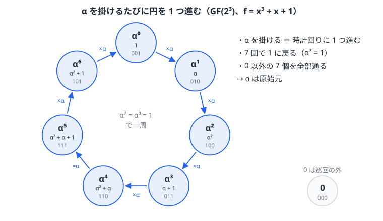
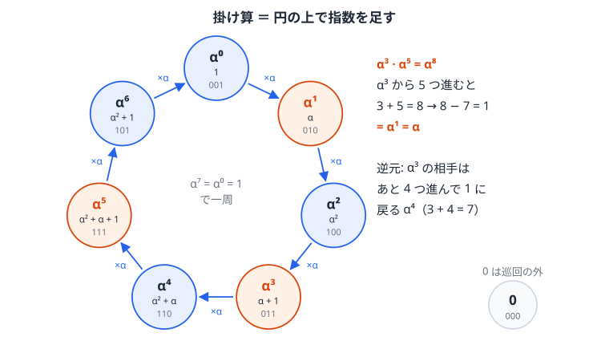
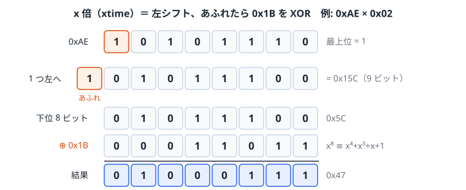

# 05. 拡大体 GF(2^m) — 1 バイトが 1 つの「数」になる世界

> **この章の位置づけ.**
> [03 章](03_有限体GFp.md#gf-p-の構成と演算表)では整数を素数$`p`$で割った余りの世界として$`\mathrm{GF}(p)`$を作った。
> [04 章](04_多項式と既約多項式.md)では多項式の世界と、そこでの「素数」にあたる既約多項式を用意した。
> この章では同じ論法を多項式に適用して$`\mathrm{GF}(2^m)`$を作る。
>
> | | 材料 | 「素数」で割る | できる体 |
> |---|---|---|---|
> | [03 章](03_有限体GFp.md#gf-p-の構成と演算表) | 整数$`\mathbb{Z}`$ | 素数$`p`$ | $`\mathrm{GF}(p)`$ |
> | **本章** | 多項式$`\mathrm{GF}(2)[x]`$ | 次数$`m`$の既約多項式$`f`$ | $`\mathrm{GF}(2^m)`$ |
>
> $`m = 8`$とすると、1 バイト（8 ビット）が 1 個の要素になり、バイトどうしの四則演算が自由にできる。AES やリード・ソロモン符号はこの体の上で計算する。



*03 章で整数に対して行ったことを、04 章の多項式に対してもう一度行う。*

> **この章で使う既出の用語（定義は各リンク先）.**
> 群・巡回群・生成元・位数・ラグランジュの定理の帰結（[02 章 1 節](02_群・環・体.md#群-group)）、零因子（[02 章 2 節](02_群・環・体.md#環-ring)）、体・標数（[02 章 3 節](02_群・環・体.md#体-field)）、
> 原始元（[03 章 3 節](03_有限体GFp.md#原始元-生成元-と離散対数)）、要素数は$`p^m`$に限ること（[03 章 5 節](03_有限体GFp.md#gf-p-の限界-なぜ次章が必要か)）、
> 多項式の除算と合同式$`\equiv \pmod f`$（[04 章 2 節](04_多項式と既約多項式.md#多項式の除算)）、既約多項式・因数（[04 章 3 節](04_多項式と既約多項式.md#既約多項式-多項式の世界の-素数)）、原始多項式（[04 章 4 節](04_多項式と既約多項式.md#原始多項式-既約よりさらに強い条件)）、最大公約多項式と互除法（[04 章 5 節](04_多項式と既約多項式.md#最大公約多項式とユークリッドの互除法)）、繰り返し二乗法（[01 章 6 節](01_合同算術とユークリッドの互除法.md#繰り返し二乗法-巨大なべき乗を現実的な時間で)）

## 1. 構成 — 既約多項式で割った余りの世界

### 定義

次数$`m`$の既約多項式$`f`$を 1 つ選ぶ。$`\mathrm{GF}(2^m)`$の要素は、$`f`$で割った余りとして現れる多項式、すなわち次数$`m`$未満の多項式

$$
a_{m-1}x^{m-1} + \cdots + a_1 x + a_0, \qquad a_i \in \{0,1\}
$$

の全体である。係数$`m`$個がそれぞれ 0 か 1 なので、要素数は$`2^m`$個である。係数を並べると$`m`$ビットのビット列になる。



*$`m = 3`$、$`f = x^3+x+1`$の場合。どんな多項式も$`f`$で割った余りに直すと、右の 8 個のどれかになる。*

演算は、多項式として計算してから$`f`$で割った余りを取る。足し算は係数ごとの XOR なので次数が上がらず、割る必要はない。掛け算は次数が$`m`$以上になりうるので、$`f`$で割った余りに直す。
結合律・分配律などは多項式の計算からそのまま引き継がれる。途中で余りに置き換えてもよいこと（[04 章 2 節](04_多項式と既約多項式.md#合同式の記法)）により、どの順で余りを取っても結果は変わらない。

### なぜ体になるのか（逆元の存在）

体であるための残りの条件は、0 以外のすべての要素が掛け算の逆元を持つことである。

**方針**: 整数で「$`p`$が素数なら$`\gcd(a, p) = 1`$、したがって拡張ユークリッドで逆元が作れる」と示したのと同じ流れをたどる。既約性を使うのは$`\gcd(a, f) = 1`$を示す 1 か所だけである。



**導出**: $`a \neq 0`$、$`\deg a < m`$とし、$`d = \gcd(a, f)`$とおく。
$`d`$は$`f`$の因数なので$`f = d h`$と書ける。$`f`$は既約なので、$`d`$と$`h`$のどちらかは次数 0、つまり定数$`1`$である。
$`h = 1`$なら$`d = f`$だが、$`d`$は$`a`$も割り切るので$`f`$が$`a`$を割り切ることになり、$`0 \neq a`$の次数が$`f`$より低いことに反する。よって$`d = 1`$、すなわち

$$
\gcd(a, f) = 1
$$

[04 章 5 節](04_多項式と既約多項式.md#最大公約多項式とユークリッドの互除法)の拡張ユークリッドの互除法により、次を満たす多項式$`u, v`$が求まる:

$$
a\,u + f\,v = 1
$$

$`f v`$は$`f`$で割り切れるので、$`f`$で割った余りを取ると消えて$`a u \equiv 1 \pmod f`$となる。$`u`$を$`f`$で割った余りが$`a`$の逆元である ∎

**例**: $`f = x^3+x+1`$、$`a = x^2+x`$。[04 章 5 節](04_多項式と既約多項式.md#最大公約多項式とユークリッドの互除法)のステップ 2 の筆算は$`x^3+x+1 = (x+1)(x^2+x) + 1`$を表している（左辺は$`f`$）。$`(x+1)(x^2+x)`$を左辺に移項すると、普通の計算どおり符号が変わって

$$
f - (x+1)(x^2+x) = 1
$$

となる。$`\mathrm{GF}(2)`$係数の多項式では$`-1 = 1`$なので引き算は足し算と同じであり（[04 章 1 節](04_多項式と既約多項式.md#加算-=-xor)）、これは

$$
f + (x^2+x)(x+1) = 1
$$

とも書ける。符号を変え忘れたのではなく、標数 2 では$`-`$と$`+`$が同じ意味になるので、どちらで書いても同じ式である。実際に展開すると$`(x^2+x)(x+1) = x^3 + x`$で、$`f + x^3 + x = (x^3 + x + 1) + (x^3 + x) = 1`$と確かめられる。
$`f`$は$`f`$で割り切れるので$`(x^2+x)(x+1) \equiv 1 \pmod f`$であり、$`x^2+x`$（ビット$`110`$）の逆元は$`x+1`$（ビット$`011`$）である。

**$`f`$が可約だと体にならない**: たとえば$`f = x^2 = x \cdot x`$で割った余りの世界では$`x \cdot x \equiv 0`$なのに$`x \neq 0`$で、$`x`$は零因子である。
もし$`x`$に逆元$`u`$があれば、$`x \cdot x \equiv 0`$の両辺に$`u`$を掛けて$`x \equiv 0`$となり矛盾する。したがって$`x`$は逆元を持たない。

**原始多項式である必要はない**: 体になるために使ったのは「$`f`$が既約」ということだけで、原始多項式（[04 章 4 節](04_多項式と既約多項式.md#原始多項式-既約よりさらに強い条件)）である必要はない。
原始多項式かどうかで変わるのは、$`x`$自身が原始元になるか（$`x`$のべき乗で 0 以外の全要素を巡るか）だけである。
たとえば既約だが原始でない$`f = x^4+x^3+x^2+x+1`$で割った余りの世界も、要素数 16 の体になる。この体では$`x^5 \equiv 1`$なので$`x`$の位数は 5 で原始元ではないが、$`x+1`$の位数は 15 で、$`x+1`$が原始元になる。
2 節では$`x`$が原始元になる原始多項式を選ぶので、$`x`$のべき乗だけで全要素を書き出せる。実用でも、$`\alpha = x`$をそのまま原始元に使えて便利なので原始多項式を選ぶことが多い。

## 2. 原始多項式の計算 — GF(2^3) を手で作る

$`m = 3`$、$`f = x^3 + x + 1`$（[04 章 3 節](04_多項式と既約多項式.md#実例-次数-3-の多項式を全部調べる)で既約と確認済み）を使う。

1 節の定義どおり、この体の要素は次数 2 以下の多項式 8 個である:

| 多項式 | $`0`$ | $`1`$ | $`x`$ | $`x+1`$ | $`x^2`$ | $`x^2+1`$ | $`x^2+x`$ | $`x^2+x+1`$ |
|---|---|---|---|---|---|---|---|---|
| ビット | 000 | 001 | 010 | 011 | 100 | 101 | 110 | 111 |

### 生成元 α によるべき表現

**要素 x を掛けていく**: 要素$`x`$（ビット$`010`$）を何度も掛けてみる。$`x \cdot x = x^2`$は次数 2 なのでそのまま要素である。次の$`x^2 \cdot x = x^3`$は次数 3 なので、$`f`$で割った余りに直す:

```longdiv
                1
          -------
1 0 1 1 ) 1 0 0 0
          1 0 1 1
          -------
            0 1 1
```

余りは$`011`$、つまり$`x + 1`$である。したがってこの体の中では、要素$`x`$を 3 回掛けた結果は要素$`x+1`$に等しい。

**$`x`$に$`\alpha`$という名前を付ける**: ここで記号の問題が起きる。$`x`$は、$`f(x) = x^3 + x + 1`$のように多項式の変数（値を代入する文字）としても使っている。そのまま「$`x^3 = x + 1`$」と書くと、$`x`$を求める方程式のように見えてしまう。
そこで、**この体の 1 つの要素である$`x`$（ビット$`010`$）を、$`\alpha`$という名前で呼ぶ**。$`\alpha`$は変数ではなく、ビット$`010`$という決まった要素の名前である。以後、多項式の変数としての$`x`$と、要素としての$`\alpha`$を区別して書く。
名前を変えただけなので、要素はすべて$`x`$を$`\alpha`$に書き換えて表せる。たとえばビット$`011`$の要素は$`\alpha + 1`$、ビット$`110`$の要素は$`\alpha^2 + \alpha`$である。上の筆算の結果は

$$
\alpha^3 = \alpha + 1
$$

と書ける。これは方程式ではなく、要素どうしの等式（「ビット$`010`$を 3 回掛けるとビット$`011`$になる」）である。

**複素数の$`i`$との比較**: これは実数から複素数を作るときの$`i`$と同じ考え方である。$`x^2 + 1 = 0`$を満たす実数は無いが、「$`i^2 = -1`$を満たす新しい数$`i`$」を加えて、$`a + bi`$の形の数の世界を作る。
ここでも、$`\mathrm{GF}(2)`$には$`f(x) = x^3 + x + 1 = 0`$を満たす数（0 と 1 を入れても$`f(0) = f(1) = 1`$）は無いが、$`f`$で割った余りの世界を作ると、その中の要素$`\alpha`$を$`f`$に代入して

$$
f(\alpha) = \alpha^3 + \alpha + 1 = \underbrace{(\alpha + 1)}_{\alpha^3} + \alpha + 1 = (\alpha + \alpha) + (1 + 1) = 0 + 0 = 0
$$

となる。$`\alpha^3`$を$`\alpha + 1`$に置き換えると、$`\alpha`$と$`1`$がそれぞれ 2 個ずつになり、係数は$`\mathrm{GF}(2)`$なので$`1 + 1 = 0`$で両方とも消える。普通の数なら$`2\alpha + 2`$で 0 にならないが、ここでは「2」が 0 である。
ビット列で確かめると、$`\alpha^3 = 011`$、$`\alpha = 010`$、$`1 = 001`$で、$`011 \oplus 010 \oplus 001 = 000`$である。$`\alpha`$はこの体の中での$`f`$の根であり、体の要素は$`a_2\alpha^2 + a_1\alpha + a_0`$（$`a_i \in \{0, 1\}`$）の形で書ける。$`a + bi`$で複素数を書くのと同じである。

この関係を使うと、$`\alpha`$のべき乗は「1 つ前に$`\alpha`$を掛け、$`\alpha^3`$が出たら$`\alpha+1`$に置き換える」ことで順に求まる:

| べき | 計算 | 多項式表現 | ビット | 10 進 |
|---|---|---|---|---|
| $`\alpha^0`$ | — | $`1`$ | 001 | 1 |
| $`\alpha^1`$ | — | $`\alpha`$ | 010 | 2 |
| $`\alpha^2`$ | — | $`\alpha^2`$ | 100 | 4 |
| $`\alpha^3`$ | $`\alpha^3 = \alpha+1`$ | $`\alpha+1`$ | 011 | 3 |
| $`\alpha^4`$ | $`\alpha(\alpha+1) = \alpha^2+\alpha`$ | $`\alpha^2+\alpha`$ | 110 | 6 |
| $`\alpha^5`$ | $`\alpha(\alpha^2+\alpha) = \alpha^3+\alpha^2 = \alpha^2+\alpha+1`$ | $`\alpha^2+\alpha+1`$ | 111 | 7 |
| $`\alpha^6`$ | $`\alpha(\alpha^2+\alpha+1) = \alpha^3+\alpha^2+\alpha = \alpha^2+1`$ | $`\alpha^2+1`$ | 101 | 5 |
| $`\alpha^7`$ | $`\alpha(\alpha^2+1) = \alpha^3+\alpha = 1`$ | $`1`$ | 001 | 1 |

$`\alpha^7 = 1`$で一周し、$`\alpha^1`$から$`\alpha^7`$までに 0 以外の 7 個の要素がすべて 1 回ずつ現れる。$`\alpha`$の位数は 7 で、$`\alpha`$は原始元である。これは$`f`$が原始多項式（[04 章 4 節](04_多項式と既約多項式.md#原始多項式-既約よりさらに強い条件)）であることの言い換えである。



*表を円に並べたもの。$`\alpha`$を掛けると時計回りに 1 つ進み、7 回で 1 に戻る。0 だけはこの円に入らない。*

下の図で既約多項式を選ぶと、同じように$`\alpha = x`$のべき乗を順に計算した表が表示される。$`x^3+x+1`$、$`x^3+x^2+1`$、$`x^4+x+1`$は原始多項式なので 0 以外の全要素を巡る。$`x^4+x^3+x^2+x+1`$は既約だが原始でないので、$`\alpha^5 = 1`$で一周してしまい、15 個のうち 5 個しか現れない（それでも 1 節のとおり体にはなっている）。

<!-- widget:gf2m -->

### 演算の実例



*$`\alpha^i`$は円の上の位置$`i`$なので、掛け算は位置を足すこと、逆元は 1（位置 0）まで残りを進むことになる。*

**加算**はビット列の XOR: $`\alpha^3 + \alpha^5 = 011 \oplus 111 = 100 = \alpha^2`$

**乗算**は指数の足し算: $`\alpha^3 \cdot \alpha^5 = \alpha^8 = \alpha^7 \cdot \alpha = \alpha`$。$`\alpha^7 = 1`$なので、指数は 7 で割った余りだけを見ればよい。
多項式で直接計算しても一致する: $`(\alpha+1)(\alpha^2+\alpha+1) = \alpha^3+1 = (\alpha+1)+1 = \alpha`$

**逆元**: $`a`$の逆元とは、$`a`$に掛けると$`1`$になる要素のことである。この体では$`1 = \alpha^7`$（表の最後の行）なので、$`\alpha^3`$に掛けて$`\alpha^7`$になる$`\alpha^k`$を探せばよい。掛け算は指数の足し算なので$`3 + k = 7`$、つまり$`k = 7 - 3 = 4`$で、$`\alpha^3`$の逆元は$`\alpha^4`$である。
検算すると$`\alpha^3 \cdot \alpha^4 = \alpha^7 = 1`$。円の図で言えば、$`\alpha^3`$から 1（$`\alpha^0 = \alpha^7`$）まで残り何歩かを数えることに当たる。一般に$`\alpha^i`$の逆元は$`\alpha^{7-i}`$である。
1 節の例で求めた「$`110`$の逆元は$`011`$」は、表では「$`\alpha^4`$の逆元は$`\alpha^3`$」であり、一致している。

**除算**は逆元を掛けること: $`\alpha^5 / \alpha^3 = \alpha^5 \cdot \alpha^4 = \alpha^9 = \alpha^2`$

### 対数表による実装

掛け算のたびに多項式を展開して$`f`$で割るのは手間がかかる。そこで 2 節の表を、2 つの向きに引ける表にしておく。

- **対数表**: ビット列 → 指数$`i`$（ビット列が$`\alpha^i`$のどれかを引く）。0 は$`\alpha`$のべき乗で表せないので、表に入れず別扱いにする。
- **逆対数表**: 指数$`i`$ → ビット列（$`\alpha^i`$が何かを引く）。

$`\mathrm{GF}(2^3)`$、$`f = x^3+x+1`$の場合、2 節の表を並べ替えると次の 2 枚になる。10 進はビット列を数として読んだもので、プログラムでは配列の添字に使う。

**対数表**（ビット列から指数へ）

| ビット列 | 001 | 010 | 011 | 100 | 101 | 110 | 111 |
|---|---|---|---|---|---|---|---|
| 10 進 | 1 | 2 | 3 | 4 | 5 | 6 | 7 |
| 指数$`i`$ | 0 | 1 | 3 | 2 | 6 | 4 | 5 |

**逆対数表**（指数からビット列へ）

| 指数$`i`$ | 0 | 1 | 2 | 3 | 4 | 5 | 6 |
|---|---|---|---|---|---|---|---|
| ビット列 | 001 | 010 | 100 | 011 | 110 | 111 | 101 |
| 10 進 | 1 | 2 | 4 | 3 | 6 | 7 | 5 |

**例 1（掛け算）**: $`110 \times 111`$
1. 対数表を引く: $`110 \to 4`$、$`111 \to 5`$。
2. 指数を足して 7 で割った余りを取る: $`4 + 5 = 9`$、$`9 - 7 = 2`$。
3. 逆対数表を引く: $`2 \to 100`$。

よって$`110 \times 111 = 100`$である。多項式で確かめると$`(\alpha^2+\alpha)(\alpha^2+\alpha+1) = \alpha^4 + \alpha = (\alpha^2 + \alpha) + \alpha = \alpha^2`$で、ビット列$`100`$と一致する。

**例 2（割り算）**: $`011 \div 101`$
1. 対数表を引く: $`011 \to 3`$、$`101 \to 6`$。
2. 指数を引いて 7 で割った余りを取る: $`3 - 6 = -3`$、$`-3 + 7 = 4`$。
3. 逆対数表を引く: $`4 \to 110`$。

よって$`011 \div 101 = 110`$である。検算として$`110 \times 101`$を表で計算すると$`4 + 6 = 10 \to 3 \to 011`$に戻る。

**例 3（逆元）**: $`101`$の逆元は、指数$`6`$から$`7 - 6 = 1`$を求めて逆対数表で$`1 \to 010`$。$`101 \times 010`$を表で計算すると$`6 + 1 = 7 \to 0 \to 001`$で、確かに 1 になる。

0 が入る掛け算は表を引かずに 0 を返す。足し算は表を使わず、ビット列の XOR のままでよい。

C 言語で書くと、表は 2 つの配列になる:

```c
const uint8_t LOG[8] = { 0, 0, 1, 3, 2, 6, 4, 5 };  /* LOG[0] は使わない */
const uint8_t EXP[7] = { 1, 2, 4, 3, 6, 7, 5 };

uint8_t gf8_mul(uint8_t a, uint8_t b) {
    if (a == 0 || b == 0) return 0;
    return EXP[(LOG[a] + LOG[b]) % 7];
}
```

掛け算が「表を 2 回引いて足し算」に変わるのは、$`\log(ab) = \log a + \log b`$で掛け算を足し算にするのと同じ考え方である。
$`\mathrm{GF}(2^8)`$なら 255 で割った余りを使い、表は 256 項ずつの 2 枚で済む。リード・ソロモン符号（[11 章](11_リードソロモン符号.md)）の実装でよく使われる。

### 03 章の GF(4) の正体

[03 章 5 節](03_有限体GFp.md#例-gf-4)で演算表だけを与えた$`\mathrm{GF}(4) = \{0, 1, \alpha, \beta\}`$は、$`m = 2`$、$`f = x^2+x+1`$で作った体である。$`x^2+x+1`$は次数 2 の原始多項式（[04 章 4 節](04_多項式と既約多項式.md#原始多項式-既約よりさらに強い条件)）で、2 節の$`x^3+x+1`$と同じく$`\alpha = x`$のべきで 0 以外の全要素を書ける（下の表）。
要素は$`0, 1, x, x+1`$の 4 個で、2 節と同じく要素$`x`$を$`\alpha`$と呼ぶ（体が違うので、2 節の$`\alpha`$とは別の要素である）。$`x^2`$を$`f`$で割った余りは$`x+1`$なので$`\alpha^2 = \alpha + 1`$であり、残りの要素$`\alpha + 1`$が 03 章の$`\beta`$である。
4 つの要素の対応をまとめると次のようになる。ビットは 2 節と同じく係数を並べたもの（左が$`\alpha`$の係数、右が定数項）である。

| 03 章の名前 | 多項式表現 | ビット | $`\alpha`$のべき | 10 進 |
|---|---|---|---|---|
| $`0`$ | $`0`$ | 00 | — | 0 |
| $`1`$ | $`1`$ | 01 | $`\alpha^0`$ | 1 |
| $`\alpha`$ | $`\alpha`$ | 10 | $`\alpha^1`$ | 2 |
| $`\beta`$ | $`\alpha + 1`$ | 11 | $`\alpha^2`$ | 3 |

$`\alpha^3 = \alpha \cdot \alpha^2 = \alpha(\alpha+1) = \alpha^2 + \alpha = (\alpha + 1) + \alpha = 1`$なので、$`\alpha`$のべきは$`\alpha^0, \alpha^1, \alpha^2`$の 3 個で一周し、0 以外の 3 個の要素をすべて巡る。$`\alpha`$の位数は 3 で、$`\alpha`$は原始元である。

**加算**はビットの XOR である。03 章の加算表をビットで書き直すと、2 ビットの XOR の表そのものになる。

| $`+`$ | 00 | 01 | 10 | 11 |
|---|---|---|---|---|
| **00** | 00 | 01 | 10 | 11 |
| **01** | 01 | 00 | 11 | 10 |
| **10** | 10 | 11 | 00 | 01 |
| **11** | 11 | 10 | 01 | 00 |

例えば 03 章の$`1 + \alpha = \beta`$は$`01 \oplus 10 = 11`$、$`\alpha + \beta = 1`$は$`10 \oplus 11 = 01`$である。

**乗算**は$`\alpha^2 = \alpha + 1`$と$`1 + 1 = 0`$だけを使って計算する。03 章の乗算表の 3 つの欄は次のとおりである。

- $`\alpha \cdot \alpha = \alpha^2 = \alpha + 1 = \beta`$（ビットで$`10 \times 10 = 11`$）
- $`\alpha \cdot \beta = \alpha(\alpha + 1) = \alpha^2 + \alpha = (\alpha+1) + \alpha = 1`$（$`10 \times 11 = 01`$）
- $`\beta \cdot \beta = (\alpha+1)^2 = \alpha^2 + 1 = (\alpha+1) + 1 = \alpha`$（$`11 \times 11 = 10`$。標数 2 なので$`(\alpha+1)^2 = \alpha^2 + 2\alpha + 1 = \alpha^2 + 1`$）

$`\alpha`$のべきで見ると、掛け算は指数の足し算を 3 で割った余りになる。例えば$`\beta \cdot \beta = \alpha^2 \cdot \alpha^2 = \alpha^{4 \bmod 3} = \alpha^1 = \alpha`$である。

| $`\times`$ | 01 | 10 | 11 |
|---|---|---|---|
| **01** | 01 | 10 | 11 |
| **10** | 10 | 11 | 01 |
| **11** | 11 | 01 | 10 |

### 実務の例 — リード・ソロモン（QR コード）の GF(2^8)

$`m = 8`$とすると要素は 0x00〜0xFF の 256 個になり、1 バイトが 1 個の要素になる。QR コードは$`f = x^8+x^4+x^3+x^2+1`$（0x11D）を使う。これは原始多項式なので、$`\alpha = x`$（ビット$`00000010`$、10 進で 2）が原始元であり、$`\alpha^1, \dots, \alpha^{255}`$が 0 以外の 255 個の要素を 1 回ずつ巡って$`\alpha^{255} = 1`$に戻る。
そのため上の$`\mathrm{GF}(2^3)`$と同じく、$`x`$（0x02）を底にした対数表・逆対数表（各 256 項）がそのまま作れ、掛け算・割り算・逆元はすべて表引きと指数の足し引き（255 で割った余り）で計算できる。

**逆対数表の作り方**: $`\alpha^0 = \texttt{0x01}`$から始めて、$`\alpha`$（0x02）を 1 回ずつ掛けていく。$`x`$を掛けるとビット列は 1 ビット左シフトになり、最上位ビットからあふれた$`x^8`$は$`x^8 \equiv x^4+x^3+x^2+1 \pmod f`$、つまり 0x1D に置き換える（0x1D は 0x11D の下位 8 ビット）。

| $`i`$ | 0 | 1 | 2 | 3 | 4 | 5 | 6 | 7 | 8 | 9 | 10 | 11 | 12 |
|---|---|---|---|---|---|---|---|---|---|---|---|---|---|
| $`\alpha^i`$ | 01 | 02 | 04 | 08 | 10 | 20 | 40 | 80 | 1D | 3A | 74 | E8 | CD |

$`\alpha^7 = \texttt{0x80}`$までは左シフトだけで、$`\alpha^8`$で初めてあふれて 0x1D になる。$`\alpha^9 = \texttt{0x1D} \times 2 = \texttt{0x3A}`$、…と続け、$`\alpha^{254}`$まで 255 個を書き出すと 0x01〜0xFF がちょうど 1 回ずつ現れる。対数表はこれを逆引きにしたものである。

**例（掛け算）**: $`\texttt{0x12} \times \texttt{0x34}`$
1. 対数表を引く: $`\log \texttt{0x12} = 224`$、$`\log \texttt{0x34} = 106`$。
2. 指数を足して 255 で割った余りを取る: $`224 + 106 = 330`$、$`330 - 255 = 75`$。
3. 逆対数表を引く: $`\alpha^{75} = \texttt{0x0F}`$。

**例（逆元）**: $`\texttt{0x12} = \alpha^{224}`$の逆元は$`\alpha^{255 - 224} = \alpha^{31} = \texttt{0xC0}`$である（$`\alpha^{224} \cdot \alpha^{31} = \alpha^{255} = 1`$）。

掛け算・逆元とも、表を 2 回引いて指数を足し引きするだけで済み、多項式の展開も$`f`$での割り算も要らない。

## 3. 既約多項式の計算 — AES の GF(2^8) を xtime で計算する

$`m = 8`$とすると要素は 0x00〜0xFF の 256 個になり、1 バイトが 1 個の要素になる。実務で使われる$`\mathrm{GF}(2^8)`$は主に次の 2 つで、どちらも既約多項式だが、原始多項式かどうかが違う。原始かどうかで、掛け算の計算方法の選び方が変わる。原始多項式 0x11D の計算は 2 節の$`\mathrm{GF}(2^3)`$と同じく対数表で行える（[2 節の最後](#実務の例-リード-ソロモン-qr-コード-の-gf-28)）。この節では、原始多項式ではない 0x11B を使う AES の計算を扱う。

| 用途 | 多項式 | 16 進 | 原始多項式か | 主な計算方法 |
|---|---|---|---|---|
| リード・ソロモン符号（QR コードなど） | $`x^8+x^4+x^3+x^2+1`$ | 0x11D | はい | 対数表（[2 節](#実務の例-リード-ソロモン-qr-コード-の-gf-28)） |
| AES | $`x^8+x^4+x^3+x+1`$ | 0x11B | いいえ | xtime（この節） |

AES は$`f = x^8 + x^4 + x^3 + x + 1`$（0x11B）を使う。要素は 0x00〜0xFF の 256 個で、各バイトのビット列を多項式の係数と見る。
原始多項式でないので$`x`$（0x02）のべきで全要素を書くことはできず、2 節のように$`x`$を底にしたべき表・対数表は作れない（別の底なら作れることは後で述べる）。以下では、足し算・掛け算・割り算を多項式の計算のまま（ビット演算で）行う。

### 加算

係数ごとの$`\mathrm{GF}(2)`$の足し算なので、ビットごとの XOR である。$`f`$で割る必要は無い（次数が 8 以上にならない）。

**例**: $`\texttt{0x57} + \texttt{0x83} = 01010111_2 \oplus 10000011_2 = 11010100_2 = \texttt{0xD4}`$。

### 乗算 — xtime の繰り返し

**$`x`$倍（xtime）**: $`x`$を掛けると各項の次数が 1 上がるので、ビット列では 1 ビット左シフトになる。
最上位ビット（$`x^7`$の係数）が 1 だった場合は$`x^8`$の項が生じ、8 ビットからあふれる。$`x^8 \equiv x^4+x^3+x+1 \pmod f`$なので、あふれた$`x^8`$を捨てる代わりに$`x^4+x^3+x+1`$、つまり 0x1B を XOR で足す。0x1B は 0x11B の下位 8 ビットである。



*下の例 2 を図にしたもの。あふれた$`x^8`$を捨てる代わりに、$`x^8`$を$`f`$で割った余り$`x^4+x^3+x+1`$（0x1B）を足す。*

```c
uint8_t xtime(uint8_t a) {
    return (a << 1) ^ ((a & 0x80) ? 0x1B : 0x00);
}
```

`uint8_t`に入れた時点で 9 ビット目は捨てられるので、コードでは XOR 0x1B だけを書けばよい。

**例 1**: $`\texttt{0x57} \times \texttt{0x02}`$。$`\texttt{0x57} = 01010111_2`$は最上位ビットが 0 なので、左シフトするだけで$`\texttt{0xAE}`$。

**例 2**: $`\texttt{0xAE} \times \texttt{0x02}`$。$`\texttt{0xAE} = 10101110_2`$は最上位ビットが 1 なので、左シフトして下位 8 ビットを取った$`\texttt{0x5C}`$に 0x1B を XOR して$`\texttt{0x5C} \oplus \texttt{0x1B} = \texttt{0x47}`$。

**一般の乗算**は、片方をビットに分解し、xtime の繰り返しと XOR で組み立てる。
例 3: $`\texttt{0x57} \times \texttt{0x13}`$。$`\texttt{0x13} = 00010011_2 = \texttt{0x10} \oplus \texttt{0x02} \oplus \texttt{0x01}`$である。xtime を繰り返すと

| | $`\times\texttt{0x01}`$ | $`\times\texttt{0x02}`$ | $`\times\texttt{0x04}`$ | $`\times\texttt{0x08}`$ | $`\times\texttt{0x10}`$ |
|---|---|---|---|---|---|
| $`\texttt{0x57}`$ | 0x57 | 0xAE | 0x47 | 0x8E | 0x07 |

となるので、$`\texttt{0x57} \times \texttt{0x13} = \texttt{0x07} \oplus \texttt{0xAE} \oplus \texttt{0x57} = \texttt{0xFE}`$。

このやり方では、XOR で足し込む回数が掛ける数のビットの 1 の個数で変わる（0x13 なら 3 回、0xFF なら 8 回、0x01 なら 1 回）。xtime も、あふれるかどうかで 0x1B を足すかが変わる。つまり**計算の手順が値ごとに変わる**。これが問題になる場合と、その対処は下の「[対数表ではなく xtime を使う理由](#対数表ではなく-xtime-を使う理由)」で扱う。

AES の MixColumns でバイトに 0x02 や 0x03 を掛ける操作は、この$`\mathrm{GF}(2^8)`$上の掛け算である（[14 章](14_ブロック暗号とAES.md)）。

### 割り算 — 逆元を求めて掛ける

$`a \div b = a \times b^{-1}`$なので、逆元$`b^{-1}`$が求まれば割り算は掛け算になる。逆元の求め方は 2 つある。

**方法 1: 拡張ユークリッドの互除法**。1 節の「なぜ体になるのか」と同じ計算で、$`b \cdot u + f \cdot v = 1`$となる$`u`$を求めれば$`u = b^{-1}`$である。

**方法 2: 254 乗する**。

**方針**: 0 以外の 255 個の要素は掛け算について群になる。その群の中で$`b^{255} = 1`$が成り立つことを使い、$`b^{254}`$が逆元になることを示す。

**導出**: 1 節で示したとおりこの集合は体なので、0 以外の 255 個の要素は掛け算について群（位数 255）をなす。ラグランジュの定理の帰結（[02 章 1 節](02_群・環・体.md#群-group)）から、群の任意の要素$`b`$について$`b^{255} = 1`$である。$`b^{255} = b \cdot b^{254}`$なので

$$
b \cdot b^{254} = 1 \quad\Longrightarrow\quad b^{-1} = b^{254}
$$

である ∎

$`b^{254}`$は繰り返し二乗法（[01 章 6 節](01_合同算術とユークリッドの互除法.md#繰り返し二乗法-巨大なべき乗を現実的な時間で)）で計算する。$`254 = 11111110_2 = 128+64+32+16+8+4+2`$なので、$`b`$を 2 乗していって$`b^2, b^4, \dots, b^{128}`$の 7 個を作り（2 乗 7 回）、それらを全部掛ける（掛け算 6 回）。

**例**: $`b = \texttt{0x53}`$（[14 章](14_ブロック暗号とAES.md)の S-box の計算例と同じ値）。

| | $`b^2`$ | $`b^4`$ | $`b^8`$ | $`b^{16}`$ | $`b^{32}`$ | $`b^{64}`$ | $`b^{128}`$ |
|---|---|---|---|---|---|---|---|
| 値 | 0xB5 | 0xFC | 0x16 | 0x0F | 0x55 | 0xA1 | 0xF7 |

この 7 個を掛け合わせると$`b^{254} = \texttt{0xCA}`$になる。確かめると$`\texttt{0x53} \times \texttt{0xCA} = \texttt{0x01}`$である。

**例（割り算）**: $`\texttt{0xFE} \div \texttt{0x13}`$。上と同じ計算で$`\texttt{0x13}^{-1} = \texttt{0x13}^{254} = \texttt{0x4B}`$なので、$`\texttt{0xFE} \times \texttt{0x4B} = \texttt{0x57}`$。乗算の例 3（$`\texttt{0x57} \times \texttt{0x13} = \texttt{0xFE}`$）と一致する。

方法 1 は割り算の繰り返し回数が値ごとに変わるが、方法 2 は値によらず 2 乗 7 回と掛け算 6 回で固定である。AES の S-box はこの逆元から作られる（[14 章](14_ブロック暗号とAES.md)）。

### 対数表ではなく xtime を使う理由

2 節の対数表の方法は AES の体でも使える。ただし 2 つの点で、AES ではシフトと XOR（xtime）で計算するのが普通である。

**1. 0x02 は原始元ではない**: 0x11B は既約多項式だが原始多項式ではない（[04 章 4 節](04_多項式と既約多項式.md#原始多項式-既約よりさらに強い条件)）。そのため$`x`$（0x02）を掛け続けても 51 回で 1 に戻り（位数 51）、0 以外の 255 個の要素のうち 51 個しか現れない。0x02 を底にした対数表は作れない。
対数表を作るには位数 255 の原始元を底にする必要があり、AES の体では$`x + 1`$（0x03）がそれに当たる。0x03 を底にすると$`\log \texttt{0x57} = 98`$、$`\log \texttt{0x13} = 14`$なので、$`98 + 14 = 112`$を逆対数表で引いて$`\texttt{0x57} \times \texttt{0x13} = \texttt{0xFE}`$となり、上の xtime の結果と一致する。

**2. 表を引く時間から鍵が漏れる**: 表の参照はメモリアクセスであり、アクセスする番地（＝秘密のデータから決まる値）によってキャッシュに載っているかどうかが変わり、かかる時間が変わる。暗号ではこの時間差を測って鍵を推定する攻撃（キャッシュタイミング攻撃）がある。シフトと XOR はメモリの表を引かないので、この漏れが無い。
ただし乗算の節で見たとおり、素直に書くと手順が値ごとに変わり、その時間差からも値が漏れうる。そこで「分岐しない」「回数を値によらず固定する」形に書く。まず xtime の`? :`（値によって分岐しうる）を、分岐の無い形にする:

```c
uint8_t xtime_ct(uint8_t a) {
    return (uint8_t)((a << 1) ^ (0x1B & -(a >> 7)));  /* 最上位ビットが 1 なら 0x1B、0 なら 0 */
}
```

`a >> 7`は最上位ビット（0 か 1）で、`-(a >> 7)`は 0 か全ビット 1 になるので、0x1B との AND で「0x1B か 0」が分岐なしで選ばれる。

一般の乗算も、ビットが 1 のときだけ足すのではなく、**8 ビットすべてについて毎回 xtime と XOR を行い、足すかどうかをマスクで選ぶ**:

```c
uint8_t gf_mul_ct(uint8_t a, uint8_t b) {
    uint8_t r = 0;
    for (int i = 0; i < 8; i++) {          /* 回数は常に 8 回 */
        r ^= a & -(b & 1);                 /* b の最下位ビットが 1 なら a を、0 なら 0 を足す */
        a = xtime_ct(a);
        b >>= 1;
    }
    return r;
}
```

ビットが 0 のときも「0 を XOR する」ので、どの値でも同じ命令列を同じ回数だけ実行する。例 3 の 0x57 × 0x13 も 0x57 × 0x01 も、8 回の xtime と 8 回の XOR になる。

また、AES の MixColumns で掛ける定数は 0x02 と 0x03 だけで、$`\times\texttt{0x02}`$は xtime 1 回、$`\times\texttt{0x03} = \times\texttt{0x02} \oplus \times\texttt{0x01}`$は xtime 1 回と XOR 1 回で済む。任意の 2 つの値を掛ける必要が無いので、表を持つ利点が小さい。掛ける定数 0x02・0x03 は公開された値なので、それによって手順が変わっても秘密は漏れない（漏れてはいけないのは、掛けられる側の状態のバイトである）。

なお、S-box（逆元とアフィン変換）はソフトウェアでは 256 項の表で引く実装が多く、同じキャッシュタイミングの問題がある。そのため、CPU の AES 専用命令を使うか、表を使わずにビット演算だけで S-box を計算する実装が使われる。

一方、リード・ソロモン符号（[2 節](#実務の例-リード-ソロモン-qr-コード-の-gf-28)、[11 章](11_リードソロモン符号.md)）は原始多項式を使い、秘密の値を扱わず、任意の要素どうしの掛け算や割り算を大量に行うので、対数表を使うのが普通である。

## 4. 有限体の一般論（まとめの定理）

ここまでの構成を一般化した定理を挙げる。定理 1〜3 は証明が長いので、本シリーズでは事実として引用する。2 節の$`\mathrm{GF}(2^3)`$がそれぞれの実例になっている。

**定理 1（存在と一意性）**: 任意の素数$`p`$と正整数$`m`$に対し、要素数$`p^m`$の有限体が存在し、同型を除いて一意である。
存在は、次数$`m`$の既約多項式が必ず存在することから、1 節と同じ構成で示される。要素数が$`p^m`$の形に限ることは[03 章 5 節](03_有限体GFp.md#gf-p-の限界-なぜ次章が必要か)で示した。

「同型」とは、要素どうしの 1 対 1 の対応で、足し算と掛け算の結果も対応するもののことである。「同型を除いて一意」とは、どの既約多項式を選んでも、要素の名前が変わるだけで演算の構造は同じ体ができるという意味である。
たとえば$`\mathrm{GF}(2^3)`$は$`x^3+x+1`$で作っても$`x^3+x^2+1`$で作っても同じ構造になる。ただしビット列の値は多項式ごとに異なるので、AES（0x11B）と QR コード（0x11D）のように、同じシステム内では同じ多項式を使う必要がある。

**定理 2（乗法群は巡回群）**: $`\mathrm{GF}(p^m)`$の 0 以外の要素は、掛け算について位数$`p^m - 1`$の巡回群をなす。すなわち原始元が存在し、0 以外のすべての要素がその累乗で書ける。
2 節で$`\alpha`$の累乗が 7 個すべてを巡ったのはこの例である。ただし$`\alpha = x`$自身が原始元になるのは、$`f`$が原始多項式のときに限る。

**系**: 0 以外の任意の要素$`a`$について

$$
a^{p^m-1} = 1, \qquad \text{よって} \quad a^{-1} = a^{p^m-2}
$$

この系は定理 2 を使わなくても示せる。0 以外の要素は掛け算について要素数$`p^m - 1`$の群をなすので、[02 章](02_群・環・体.md#帰結-どの要素も-g-個並べると単位元に戻る-後で使う重要事実)のラグランジュの定理の帰結から$`a^{p^m-1} = 1`$である。
$`\mathrm{GF}(2^8)`$なら$`a^{-1} = a^{254}`$で、AES の S-box はこの逆元を使う（[14 章](14_ブロック暗号とAES.md#subbytes-gf-28-の逆元)）。

**定理 3（部分体）**: 体$`F`$の部分集合で、同じ演算でそれ自身も体になっているものを$`F`$の**部分体**という。
$`\mathrm{GF}(p^m)`$が$`\mathrm{GF}(p^n)`$を部分体として含むのは、$`n`$が$`m`$を割り切るときに限る。
たとえば$`\mathrm{GF}(2^8)`$は$`\mathrm{GF}(2)`$、$`\mathrm{GF}(2^2)`$、$`\mathrm{GF}(2^4)`$を含むが、$`\mathrm{GF}(2^3)`$は含まない。

**定理 4（フロベニウス）**: 標数$`p`$の体では、任意の要素$`a, b`$について

$$
(a + b)^p = a^p + b^p
$$

**方針**: 左辺を二項定理で展開し、両端以外の項の係数が$`p`$の倍数になることを示す。標数$`p`$の体では、1 を$`p`$個足すと 0 なので、係数が$`p`$の倍数の項は消える。

**例**: $`p = 2`$なら$`(a+b)^2 = a^2 + 2ab + b^2`$で、$`2ab = ab + ab = 0`$なので$`(a+b)^2 = a^2 + b^2`$。

**導出**: 二項定理より$`(a+b)^p = \sum_{k=0}^{p} \binom{p}{k} a^k b^{p-k}`$。$`0 < k < p`$のとき

$$
\binom{p}{k} = \frac{p!}{k!\,(p-k)!}
$$

は整数で、分子は$`p`$を因数に持つ。分母は$`p`$より小さい数の積であり、$`p`$は素数（[02 章 3 節](02_群・環・体.md#標数-characteristic)より標数は素数）なので分母は$`p`$を因数に持たない。よって$`\binom{p}{k}`$は$`p`$の倍数であり、その項は消える。残るのは$`k = 0`$と$`k = p`$の項$`b^p`$と$`a^p`$だけである ∎

標数 2 では「2 乗すると各項が別々に 2 乗される」。この性質は BCH 符号の共役根（[10 章](10_BCH符号.md)）で使う。

## 5. 第 I 部のまとめ — 手に入った道具

| 道具 | 内容 | この先の使い道 |
|---|---|---|
| 合同算術（[01 章](01_合同算術とユークリッドの互除法.md)） | $`\bmod`$ の四則演算 | RSA、CRC |
| 拡張ユークリッド（[01 章 4 節](01_合同算術とユークリッドの互除法.md#拡張ユークリッドの互除法-逆元を作る道具)） | 逆元の計算 | RSA 鍵生成、体の逆元 |
| 繰り返し二乗法（[01 章 6 節](01_合同算術とユークリッドの互除法.md#繰り返し二乗法-巨大なべき乗を現実的な時間で)） | 巨大なべき乗 | RSA、DH、楕円曲線 |
| 群・環・体（[02 章](02_群・環・体.md)） | 構造の分類 | 全体の見通し |
| $`\mathrm{GF}(p)`$（[03 章](03_有限体GFp.md)） | 素数個の完全な世界 | 数論暗号 |
| 多項式除算（[04 章 2 節](04_多項式と既約多項式.md#多項式の除算)） | 余りの一意性 | **CRC（[09 章](09_巡回符号とCRC.md)）** |
| 既約・原始多項式（[04 章 3〜4 節](04_多項式と既約多項式.md#既約多項式-多項式の世界の-素数)） | 体を作る材料 | $`\mathrm{GF}(2^m)`$、LFSR |
| $`\mathrm{GF}(2^m)`$ | 1 バイト = 1 個の数 | **AES（[14 章](14_ブロック暗号とAES.md)）、RS 符号（[11 章](11_リードソロモン符号.md#rs-符号の応用一覧)）** |

これで代数の準備は完了である。次章から**誤り検出・訂正**に入る。

→ 次: [06_誤り訂正の基礎.md](06_誤り訂正の基礎.md)
