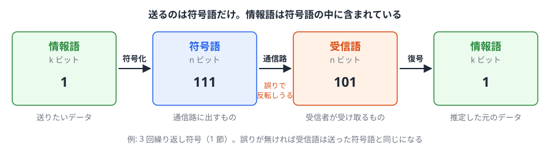

# 06. 誤り訂正の基礎 — ハミング距離と「どこまで直せるか」

> **この章で扱う問い.**
> 通信路や記憶媒体では、ビットがときどき反転する。宇宙線でメモリのビットが反転したり、ディスクの傷で読み取りが化けたりする。
> それでもデータを守るために、わざと冗長なビットを足して送るのが**誤り訂正符号**である。
>
> この章では次の 3 つの問いに答える。
>
> 1. なぜ冗長を足すと誤りを直せるのか。
> 2. 何ビットまで直せるのか。その限界は何で決まるのか。
> 3. 冗長はどれだけ必要か。
>
> 3 つとも、**ハミング距離**という 1 つの量で答えが書ける。

> **この章で使う既出の用語（定義は各リンク先）.**
> $`\mathrm{GF}(2)`$と XOR $`\oplus`$（[02 章 4 節](02_群・環・体.md#gf-2-最小の体を作ってみる)、[04 章 1 節](04_多項式と既約多項式.md#加算-=-xor)）。
> 二項係数$`\binom{n}{i}`$と切り捨て$`\lfloor \cdot \rfloor`$は、この章の中で定義する。

## 1. 符号とは — 「使ってよい語」を制限する

### 基本の枠組み

送信者と受信者の間では、データは次の順に形を変える。

- **情報語**: 送りたい$`k`$ビットのデータ
- **符号化**: 情報語を、それより長い$`n`$ビット（$`n > k`$）のビット列に変換すること。異なる情報語は異なるビット列に変換する（1 対 1 の対応付け）
- **符号語**: 符号化で得られる$`n`$ビットのビット列。情報語の内容をすべて含み、さらに誤りを見つけるための余分なビット（冗長）が加わっている
- **受信語**: 受信者が受け取った$`n`$ビットのビット列。途中で誤りが起きれば、送った符号語と異なる
- **復号**: 受信語から元の情報語を推定すること
- **符号**$`C`$: 符号語全体の集合

通信路に出すのは符号語だけで、情報語を符号語と別に送るわけではない。情報語は符号語の中に含まれており、受信者は復号で取り出す。

*3 回繰り返し符号（下の例）での流れ。送るのは符号語`111`だけで、受信語`101`から情報語`1`を推定する。*

$`n`$ビットのビット列は$`2^n`$通りあるが、そのうち符号語として使うのは$`2^k`$個だけである。この符号を$`(n, k)`$**符号**と呼び、$`R = k/n`$を**符号化率**という。$`R`$は送ったビットのうち情報が占める割合である。

**誤り検出・訂正の原理**は次のとおりである。送信者が送るのは必ず符号語なので、途中で誤りが起きなければ、受信者が受け取るビット列も符号語である。つまり、符号語以外の$`2^n - 2^k`$個のビット列が受信者の手元に現れるのは、途中で誤りが起きたときだけである。

- 受信したビット列が符号語でなければ、途中で誤りがあったと分かる（**誤り検出**）。
- 受信したビット列に最も近い符号語を探せば、元の符号語を推定できる（**誤り訂正**）。

したがって符号の設計とは、符号語どうしをなるべく遠くに離して配置することである。離れていれば、多少ずれても最も近い符号語を取り違えない。「近い」「遠い」の測り方を 2 節で定める。

### 例: 3 回繰り返し符号 (3,1)

$`0 \to 000`$、$`1 \to 111`$と符号化する。$`n = 3`$、$`k = 1`$で、符号語は 2 個、残りの$`001, 010, 011, 100, 101, 110`$の 6 個は符号語ではない。

`101` を受信したとすると、符号語ではないので誤りがあったと分かる。
`111` とは 1 ビット、`000` とは 2 ビット違うので、`111` が送られたと推定する。これは 3 ビットの多数決と同じである。

## 2. ハミング距離とハミング重み

### 定義

- **ハミング距離**$`d(x,y)`$: 同じ長さのビット列$`x, y`$で、値が異なる位置の個数
- **ハミング重み**$`w(x)`$: $`x`$の中の 1 の個数。すべて 0 のビット列を$`0`$と書くと$`w(x) = d(x, 0)`$

ビット列どうしの XOR は各位置で「違えば 1、同じなら 0」なので、異なる位置にだけ 1 が立つ。したがって

$$
d(x,y) = w(x \oplus y)
$$

**例**: $`x = 10110`$、$`y = 11010`$なら$`x \oplus y = 01100`$で、$`d(x,y) = 2`$。

### 距離の性質

ハミング距離は、普通の距離と同じ次の 3 つの性質を持つ。

1. $`d(x,y) \geq 0`$で、$`d(x,y) = 0`$となるのは$`x = y`$のときに限る。異なる位置が 1 つも無いことが$`x = y`$の意味だからである。
2. $`d(x,y) = d(y,x)`$。「異なる位置」は$`x`$と$`y`$を入れ替えても同じだからである。
3. **三角不等式**$`d(x,z) \leq d(x,y) + d(y,z)`$

**三角不等式の導出**: 左辺は$`x_i \neq z_i`$となる位置$`i`$の個数、右辺は$`x_i \neq y_i`$となる位置の個数と$`y_i \neq z_i`$となる位置の個数の和である。
$`x_i \neq z_i`$となる位置では、$`y_i`$は 0 か 1 なので$`x_i`$と$`z_i`$の少なくとも一方と異なる。つまり$`x_i \neq y_i`$と$`y_i \neq z_i`$の少なくとも一方が成り立ち、その位置は右辺で少なくとも 1 回数えられている。よって左辺 ≤ 右辺 ∎

三角不等式は 3 節の訂正能力の導出で使う。

### 最小距離

符号$`C`$の異なる 2 つの符号語の距離のうち最小のものを**最小距離**$`d_{\min}`$という:

$$
d_{\min} = \min_{c_1, c_2 \in C,\ c_1 \neq c_2} d(c_1, c_2)
$$

最小距離が符号の検出・訂正能力を決める（3 節）。$`(n, k)`$符号で最小距離が$`d`$のものを$`(n,k,d)`$符号と書くことも多い。
3 回繰り返し符号は符号語が$`000`$と$`111`$の 2 つで、距離は 3 なので$`(3,1,3)`$符号である。

## 3. 検出能力と訂正能力（この章の中心定理）

### 定理

最小距離$`d_{\min}`$の符号について、次が成り立つ。

$$
\boxed{\text{誤り検出: } d_{\min} - 1 \text{ ビットまで}, \qquad
\text{誤り訂正: } t = \left\lfloor \frac{d_{\min}-1}{2} \right\rfloor \text{ ビットまで}}
$$

$`\lfloor \cdot \rfloor`$は小数点以下の切り捨てである。$`d_{\min} = 4`$なら$`(4-1)/2 = 1.5`$を切り捨てて$`t = 1`$、$`d_{\min} = 5`$なら$`(5-1)/2 = 2`$で$`t = 2`$である。
3 回繰り返し符号（$`d_{\min} = 3`$）なら 2 ビットまで検出、1 ビットまで訂正できる。

「$`e`$ビットまで検出できる」とは、送った符号語のうち$`e`$個以下のビットがどのように反転しても、受信語が符号語でないと分かることを言う。「$`t`$ビットまで訂正できる」とは、$`t`$個以下のビットがどのように反転しても、受信語に最も近い符号語が送った符号語にただ 1 つに決まることを言う。

### 導出 1: 検出能力

**方針**: 誤りに気づけないのは、受信語が別の符号語にちょうど化けたときだけである。それには$`d_{\min}`$ビット以上の反転が要ることを示す。

**導出**: 符号語$`c_1`$を送り、$`e`$ビットが反転して$`y`$を受信したとする。$`d(c_1, y) = e`$である。
$`y`$が別の符号語$`c_2`$に一致したとすると$`e = d(c_1, c_2) \geq d_{\min}`$である。したがって$`e \leq d_{\min} - 1`$なら$`y`$はどの符号語とも一致せず、必ず誤りが検出される ∎

逆に、距離がちょうど$`d_{\min}`$の 2 つの符号語$`c_1, c_2`$について、$`c_1`$の異なる$`d_{\min}`$ビットを全部反転すると$`c_2`$になり、検出できない。よって$`d_{\min} - 1`$が検出の限界である。

### 導出 2: 訂正能力

**方針**: 受信語$`y`$に最も近い符号語を選ぶという訂正方法を使う。$`d_{\min} \geq 2t + 1`$なら、$`t`$ビット以下の誤りでは送った符号語が必ず最も近いことを示す。逆に$`d_{\min} \leq 2t`$だと、$`t`$ビット以下の誤りで別の符号語のほうが近く（または同じ距離に）なる例を作る。

**$`d_{\min} \geq 2t+1`$なら訂正できる**: $`c_1`$を送り、$`t`$ビット以下が反転して$`y`$を受信したとする。$`d(c_1, y) \leq t`$である。
別の符号語$`c_2`$について、三角不等式$`d(c_1, c_2) \leq d(c_1, y) + d(y, c_2)`$を変形すると

$$
d(y, c_2) \geq d(c_1, c_2) - d(c_1, y) \geq (2t + 1) - t = t + 1 > t \geq d(y, c_1)
$$

どの$`c_2`$も$`c_1`$より$`y`$から遠いので、最も近い符号語は$`c_1`$ただ 1 つである。

**$`d_{\min} \leq 2t`$だと訂正できない場合がある**: 距離が$`d = d_{\min}`$の 2 つの符号語$`c_1, c_2`$を取る。異なる$`d`$か所のうち$`\lceil d/2 \rceil`$か所（$`d/2`$以上の最小の整数）について、$`c_2`$のビットを$`c_1`$の値に書き換えた語を$`y`$とする。
$`c_2`$を送って$`\lceil d/2 \rceil`$ビットが反転すれば$`y`$が受信される。$`d \leq 2t`$より$`\lceil d/2 \rceil \leq t`$なので、これは$`t`$ビット以下の誤りである。
ところが$`d(y, c_1) = d - \lceil d/2 \rceil \leq \lceil d/2 \rceil = d(y, c_2)`$なので、$`c_1`$のほうが近いか同じ距離であり、$`c_2`$をただ 1 つに決められない。

したがって$`t`$ビットまで訂正できる条件は$`d_{\min} \geq 2t + 1`$、すなわち$`t \leq (d_{\min} - 1)/2`$であり、$`t`$は整数なので最大は$`\lfloor (d_{\min}-1)/2 \rfloor`$である ∎

**図形的な見方**: 各符号語を中心に、距離$`t`$以内のビット列を集めた「半径$`t`$の球」を考える。$`d_{\min} \geq 2t+1`$はこれらの球が互いに重ならない条件であり、受信語が落ちた球の中心が送った符号語である。上の図はこの様子を表している。

### 数値例

| $`d_{\min}`$ | 検出 | 訂正 | 例 |
|---|---|---|---|
| 2 | 1 ビット | 0 | 単純パリティ（[07 章](07_線形符号.md)） |
| 3 | 2 ビット | 1 ビット | 3 回繰り返し、ハミング符号（[08 章](08_ハミング符号.md)） |
| 4 | 3 ビット | 1 ビット | 拡張ハミング符号（[08 章](08_ハミング符号.md)） |
| 5 | 4 ビット | 2 ビット | 2 ビット訂正の BCH 符号（[10 章](10_BCH符号.md)） |
| 7 | 6 ビット | 3 ビット | 3 ビット訂正の BCH 符号 |

### 訂正と検出を組み合わせる

$`t`$ビットまでは訂正し、それを超えて$`e`$ビット（$`e \geq t`$）までは訂正せず検出だけする、という使い方もできる。その条件は

$$
t + e \leq d_{\min} - 1
$$

である。

**方針**: 受信語から距離$`t`$以内に符号語があれば訂正し、無ければ「訂正できない誤り」として検出する。この運用が誤るのは、$`e`$ビット以下の誤りを受けた受信語が、送った符号語ではない符号語の距離$`t`$以内に入ってしまうときだけである。

**導出**: $`c_1`$を送り、$`e`$ビット以下の誤りで$`y`$を受信したとする。別の符号語$`c_2`$が$`d(y, c_2) \leq t`$を満たすなら、三角不等式より$`d(c_1, c_2) \leq d(c_1, y) + d(y, c_2) \leq e + t`$である。
よって$`e + t \leq d_{\min} - 1`$なら、そのような$`c_2`$は存在せず、運用は誤らない ∎

**例**: $`d_{\min} = 4`$なら、「$`t = 0, e = 3`$（訂正せず 3 ビットまで検出）」と「$`t = 1, e = 2`$（1 ビット訂正し、2 ビットは検出）」のどちらでも使える。訂正に距離を使うと、そのぶん検出できる範囲が減る。
再送できる通信では検出を重視し、再送できないディスクや宇宙探査機では訂正を重視するのが典型である。

## 4. 符号の限界 — どこまで欲張れるか

符号長$`n`$は短く、情報ビット数$`k`$は多く、最小距離$`d`$は大きいほど良いが、3 つを同時には満たせない。その限界を表す不等式を 3 つ示す。

### ハミング限界（球充填限界）

$`n`$個の位置から$`i`$個を選ぶ選び方の数を**二項係数**$`\binom{n}{i} = \dfrac{n!}{i!\,(n-i)!}`$で表す（$`{}_n\mathrm{C}_i`$と同じもの）。
ちょうど$`i`$ビットが反転するパターンは、反転する位置の選び方なので$`\binom{n}{i}`$通りある。したがって半径$`t`$の球に含まれるビット列の個数は

$$
V(n,t) = \sum_{i=0}^{t}\binom{n}{i}
$$

である。$`t`$ビット訂正できる符号では、3 節より$`2^k`$個の符号語の球が互いに重ならない。重ならない球の合計が全体の$`2^n`$個を超えることはないので

$$
\boxed{2^k \sum_{i=0}^{t}\binom{n}{i} \leq 2^n}
$$

等号が成り立つ符号、つまり球で全体を隙間なく埋め尽くす符号を**完全符号**という。
たとえばハミング符号$`(7, 4)`$は$`t = 1`$で、$`2^4 \times (1 + 7) = 128 = 2^7`$と等号が成り立つ。完全符号は非常に少なく、2 値の場合は自明なものを除くとハミング符号とゴレイ符号しかない（[08 章](08_ハミング符号.md)）。

### シングルトン限界

$$
\boxed{d_{\min} \leq n - k + 1}
$$

**方針**: すべての符号語から同じ$`d_{\min} - 1`$個の位置を削っても、符号語どうしは区別できることを示す。区別できる$`2^k`$個の語が入るだけの長さが残っている必要がある。

**導出**: すべての符号語から、先頭の$`d_{\min}-1`$個の位置を削除する。
異なる 2 つの符号語は$`d_{\min}`$か所以上で異なるので、削除した$`d_{\min} - 1`$か所がすべて異なる箇所だったとしても、異なる箇所が少なくとも 1 つ残る。したがって削除後の$`2^k`$個の語はすべて異なる。
削除後の長さは$`n - d_{\min}+1`$ビットで、この長さのビット列は$`2^{n - d_{\min} + 1}`$通りしかないので

$$
2^{n-d_{\min}+1} \geq 2^k \Longrightarrow n - d_{\min}+1 \geq k \Longrightarrow d_{\min} \leq n-k+1 \qquad \blacksquare
$$

等号を達成する符号を**MDS 符号**（Maximum Distance Separable、最大距離分離符号）という。与えられた$`n, k`$で最大の最小距離を持つ、という意味である。
3 回繰り返し符号は$`d_{\min} = 3 = 3 - 1 + 1`$で MDS である。実用上重要な例は**リード・ソロモン符号**で、$`(n, k)`$を自由に選んでも常に MDS になる（[11 章](11_リードソロモン符号.md)）。

### ギルバート・ヴァルシャモフ限界（存在の保証）

上の 2 つは「これ以上は無理」という上限だったが、次は「これなら作れる」という保証である:

$$
2^k \sum_{i=0}^{d-1}\binom{n}{i} \le 2^n \quad\Longrightarrow\quad \text{最小距離 } d \text{ 以上の } (n,k) \text{ 符号が存在する}
$$

**方針**: 符号語を 1 つずつ選び、選んだ符号語の近くを使用禁止にしていく。禁止された語の合計が全体に届かない限り、次の符号語が選べる。

**導出**: 符号語を 1 つずつ選ぶ。選んだ符号語それぞれについて、距離$`d - 1`$以内の語（1 つあたり$`V(n, d-1) = \sum_{i=0}^{d-1}\binom{n}{i}`$個）を使用禁止にし、禁止されていない語から次の符号語を選ぶ。こうして選んだ符号語は、既に選んだどの符号語とも距離$`d`$以上離れる。
$`j`$個目を選ぶ時点で禁止されている語は多くとも$`(j-1)\,V(n, d-1)`$個である。$`j \leq 2^k`$なら仮定より$`(j-1)\,V(n,d-1) < 2^k\,V(n,d-1) \leq 2^n`$なので、禁止されていない語が必ず残っている。よって$`2^k`$個の符号語を選べる ∎

## 5. シャノンの通信路符号化定理（理論的な最終目標）

各ビットが独立に確率$`p`$で反転する通信路を**2 元対称通信路**という。この通信路で 1 ビット送るごとに運べる情報量の上限を**通信路容量**といい、1 節の符号$`C`$と区別するため$`\mathrm{Cap}`$と書く。2 元対称通信路では

$$
\mathrm{Cap} = 1 - H(p), \qquad H(p) = -p\log_2 p - (1-p)\log_2(1-p)
$$

である。$`H(p)`$は**2 値エントロピー**と呼ばれ、確率$`p`$で起きる出来事の不確かさを表す。$`p = 0`$や$`p = 1`$（結果が確定している）なら 0、$`p = 1/2`$（五分五分）なら最大の 1 になる。
受信側は 1 ビット受け取るごとに「反転したかどうか」という$`H(p)`$ビット分の不確かさを抱えるので、確実に運べるのは残りの$`1 - H(p)`$ビットである、と読める。

**例**: $`p = 0.1`$（10 ビットに 1 ビット反転）なら$`H(0.1) \approx 0.469`$で、$`\mathrm{Cap} \approx 0.531`$。送るビットのうち約 53% を情報に使える符号化率まで、誤りをいくらでも減らせる。

**定理**（シャノン、1948 年）: 符号化率$`R`$が$`R < \mathrm{Cap}`$なら、符号長$`n`$を十分大きくすることで、復号の誤り率をいくらでも 0 に近づけられる符号が存在する。$`R > \mathrm{Cap}`$ではそれは不可能である。

この定理は存在を示すだけで、作り方は示さない。証明は「$`2^k`$個の符号語をランダムに選んだ符号」の平均の誤り率が 0 に近づくことを示すもので、平均が小さいなら良い符号が少なくとも 1 つある、と言えるだけだからである。
その後の符号理論は、実際に作れる符号でこの限界にどこまで近づけるかの歴史になった。

- ハミング符号（1950 年）: 実用的だが、限界からは遠い
- リード・ソロモン符号（1960 年）: バースト誤りに強く、CD や QR コードで広く使われた
- ターボ符号（1993 年）、LDPC 符号（1962 年に提案され 1996 年に再発見）: 限界のすぐ近くまで到達した

現在の 5G のデータ通信や Wi-Fi は LDPC 符号を使っている。

## 6. 誤りのモデル

| モデル | 説明 | 有効な符号 |
|---|---|---|
| **ランダム誤り** | 各ビットが独立に反転する | ハミング符号、BCH 符号、LDPC 符号 |
| **バースト誤り** | 連続した区間がまとめて壊れる（ディスクの傷、電波が一時的に弱まるなど） | リード・ソロモン符号、インターリーブ |
| **消失** | どこが壊れたかは分かるが、値が分からない | リード・ソロモン符号 |

**インターリーブ**は、複数の符号語のビットを交互に並べ替えて送る方法である。連続したバースト誤りが、各符号語には少しずつ分散して届くので、ランダム誤り向けの符号でも直せるようになる（[11 章](11_リードソロモン符号.md#インターリーブとの組み合わせ)）。

### 消失は誤りの約 2 倍直せる

位置の分かっている$`e`$か所を空欄とし、残りの$`n - e`$か所だけを見る。
異なる 2 つの符号語は$`d_{\min}`$か所以上で異なるので、$`e \leq d_{\min} - 1`$なら空欄以外にも異なる箇所が残る。つまり空欄以外の部分が一致する符号語はただ 1 つであり、符号語が決まる。

したがって**消失は$`d_{\min} - 1`$個まで復元できる**。位置が分からない誤りの$`\lfloor (d_{\min}-1)/2 \rfloor`$個と比べて約 2 倍（$`d_{\min}`$が奇数ならちょうど 2 倍）である。
RAID や分散ストレージがリード・ソロモン符号を使うのは、ディスクの故障は「どのディスクが壊れたか分かる」消失だからである。

## 7. まとめ

| 概念 | 内容 |
|---|---|
| $`(n,k,d)`$符号 | 長さ$`n`$、情報$`k`$ビット、最小距離$`d`$ |
| ハミング距離 | 異なるビットの個数。$`d(x,y)=w(x\oplus y)`$ |
| 検出能力 | $`d_{\min}-1`$ビット |
| 訂正能力 | $`\lfloor (d_{\min}-1)/2 \rfloor`$ビット |
| ハミング限界 | 球が重ならない条件。等号なら完全符号 |
| シングルトン限界 | $`d \leq n-k+1`$。等号なら MDS 符号（リード・ソロモン符号など） |
| シャノン限界 | 符号化率$`R < \mathrm{Cap}`$なら誤り率をいくらでも小さくできる |

次章では、符号語の集合に**線形性**という構造を入れて、符号化と復号を行列の計算で行えるようにする。

→ 次: [07_線形符号.md](07_線形符号.md)
