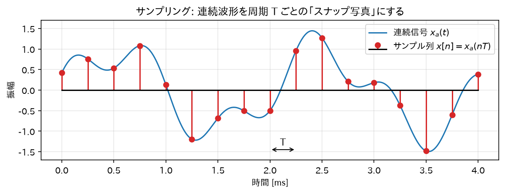
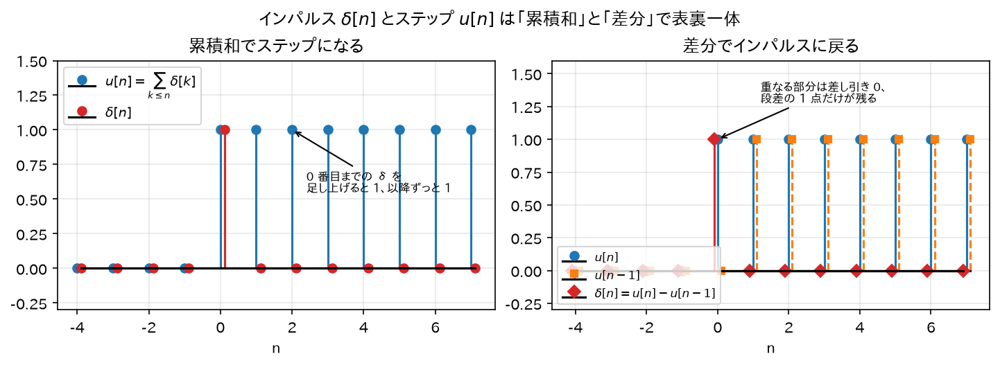
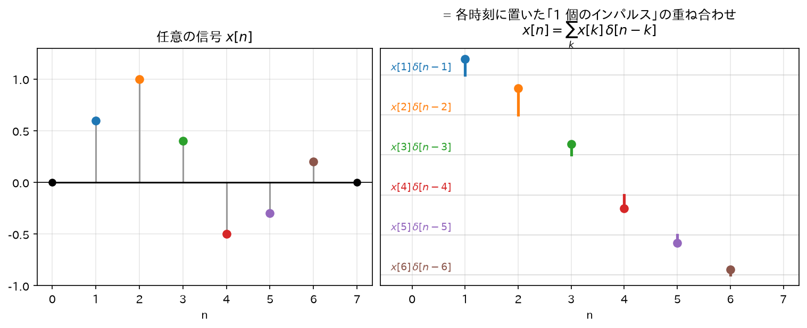
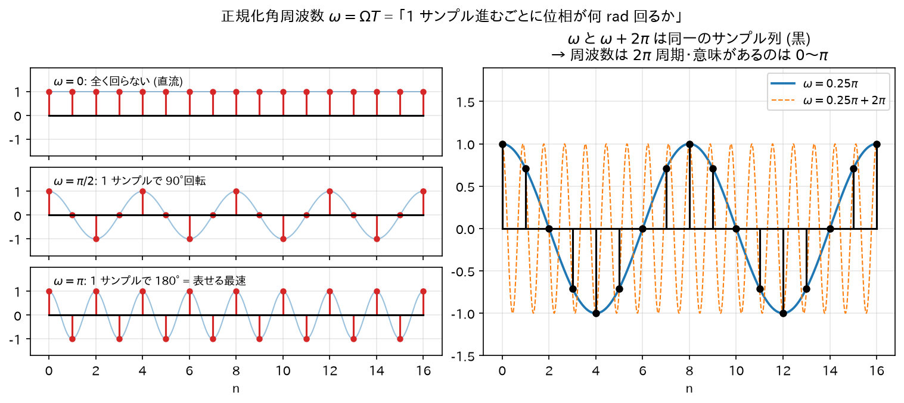
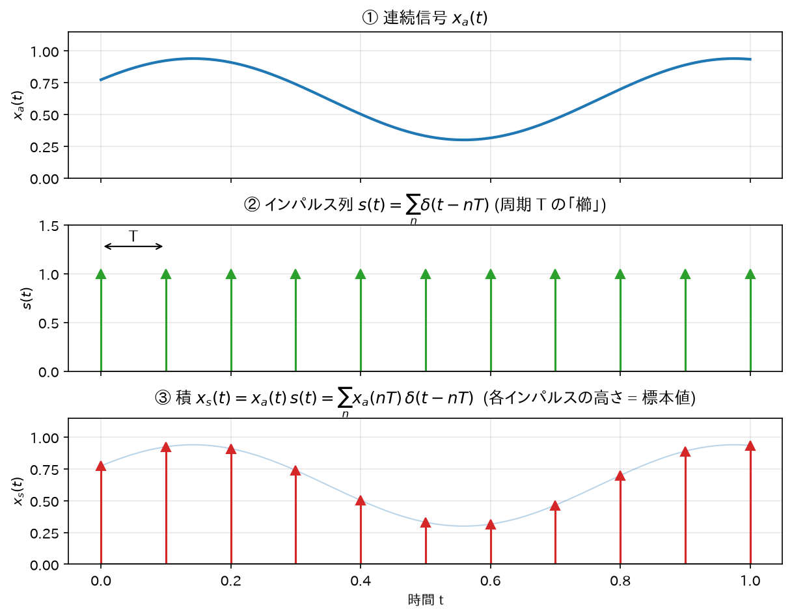
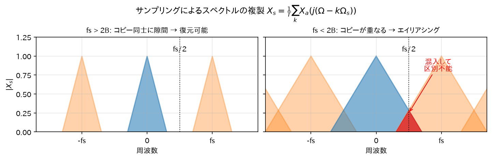
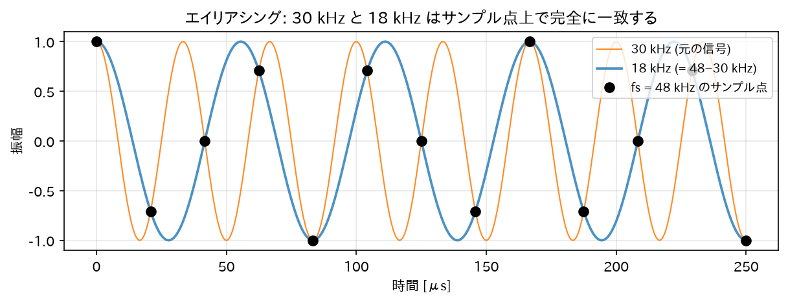

# 01. 離散時間信号とサンプリング

## 1. 離散時間信号とは

### 直感

マイクで音を録るとき、空気の振動（連続的な波）を一定間隔でパシャパシャと「スナップ写真」に撮って数値の列にする。
この数値の列が**離散時間信号**である。

$$
x[n] = x_a(nT), \quad n = \dots, -2, -1, 0, 1, 2, \dots
$$

- $x_a(t)$ : 元のアナログ（連続時間）信号
- $T$ : サンプリング周期 [s]
- $f_s = 1/T$ : サンプリング周波数 [Hz]（例: CD なら 44100 Hz）

離散時間信号は「$T$ 秒ごとの値だけを覚えた数列」であり、サンプル同士の**間の時刻には値が存在しない**。



*図: 連続波形(青)から周期 $T$ ごとに値を抜き出したものがサンプル列(赤)。以後の全議論はこの「数列」の上で行われる。*

### 重要な基本信号

**単位インパルス（デルタ）信号** — 離散信号処理で最も重要な信号:

$$
\delta[n] =
\begin{cases}
1 & (n = 0)\\
0 & (n \neq 0)
\end{cases}
$$

直感: 「時刻 0 に一発だけ叩く」信号。太鼓を一回だけポンと叩くイメージ。
連続時間のディラックのデルタ関数と違い、離散版は単なる「高さ 1 の 1 サンプル」なので数学的に何も難しくない。

**単位ステップ信号**:

$$
u[n] =
\begin{cases}
1 & (n \geq 0)\\
0 & (n < 0)
\end{cases}
$$

直感: 「時刻 0 でスイッチを入れてそのまま」。

**両者の関係の導出**:

$\delta[n]$ を時刻 0 まで足し合わせるとステップになる:

$$
u[n] = \sum_{k=-\infty}^{n} \delta[k]
$$

確認: $n < 0$ のとき、和の範囲に $k=0$ が含まれないのですべての項が 0、よって $u[n]=0$。
$n \geq 0$ のとき、$k=0$ の項だけが 1 で他は 0、よって $u[n]=1$。定義と一致する。∎

逆に、ステップの「差分」がインパルスになる:

$$
\delta[n] = u[n] - u[n-1]
$$

確認: $n=0$ で $u[0]-u[-1] = 1-0 = 1$。$n\geq 1$ で $1-1=0$。$n\leq -1$ で $0-0=0$。∎



*図: 左は $u[n]=\sum_{k\leq n}\delta[k]$ — インパルス(赤)を 0 番目まで積み上げると 1 になり、以降ずっと 1。右は $\delta[n]=u[n]-u[n-1]$ — $u[n]$ と 1 サンプルずらした $u[n-1]$ の差は段差の 1 点だけが残りインパルスに戻る。積分と微分の離散版という表裏一体の関係。*

**任意の信号のインパルスによる分解**（後の畳み込みの導出で使う超重要式）:

$$
x[n] = \sum_{k=-\infty}^{\infty} x[k]\,\delta[n-k]
$$

導出: $\delta[n-k]$ は $n=k$ のときだけ 1、それ以外は 0。
したがって右辺の無限和のうち生き残るのは $k=n$ の項だけで、その値は $x[n] \cdot 1 = x[n]$。左辺と一致する。∎

直感: どんな信号も「各時刻に置かれた、高さの違うインパルスの列」として見なせる、ということ。
レゴブロックを 1 個ずつ並べて任意の形を作るのと同じで、$\delta$ が「ブロック 1 個」に相当する。



*図: 左の信号 $x[n]$ を、右のように「各時刻 $k$ に高さ $x[k]$ で置いた 1 個のインパルス $x[k]\delta[n-k]$」へ分解する。これらを全部足し戻すと元の信号になる($x[n]=\sum_k x[k]\delta[n-k]$)。この「積み木」の見方が畳み込み(03章)の出発点になる。*

## 2. 正規化周波数

離散信号の世界では、時間の単位が「秒」ではなく「サンプル」になる。そこで周波数も正規化する。

アナログの正弦波 $\cos(\Omega t) = \cos(2\pi f t)$ を周期 $T$ でサンプリングすると:

$$
x[n] = \cos(\Omega n T) = \cos\!\left(2\pi \frac{f}{f_s} n\right) = \cos(\omega n)
$$

ここで

$$
\omega = \Omega T = 2\pi \frac{f}{f_s} \quad [\text{rad/sample}]
$$

を**正規化角周波数**と呼ぶ。

直感: $\omega$ は「1 サンプル進むごとに位相が何ラジアン回るか」。
- $\omega = 0$ : 直流（全く回らない）
- $\omega = \pi$ : 1 サンプルごとに半回転 = 表現できる最高の速さ（後述のナイキスト周波数 $f_s/2$ に対応）
- $\omega = 2\pi$ : 1 サンプルごとに 1 回転 = **サンプル点上では直流と区別がつかない**

最後の点が本質的で、離散信号の周波数は $2\pi$ 周期でしか意味を持たない。実際、任意の整数 $m$ に対して

$$
\cos((\omega + 2\pi m) n) = \cos(\omega n + 2\pi m n) = \cos(\omega n)
$$

（$mn$ は整数なので $2\pi m n$ は位相として一周の整数倍、よって消える）。∎



*図: 左は $\omega$ が「1 サンプルあたりの位相回転量」であること — $\omega=0$ は回らず(直流)、$\omega=\pi$ で 1 サンプルごとに半回転(±1 の交互)となりこれが表現できる最速。右は $\omega$ と $\omega+2\pi$ が全く同じサンプル列(黒)を生む様子で、離散信号の周波数が $2\pi$ 周期でしか意味を持たない(見るべきは $0$〜$\pi$)ことを示す。*

## 3. サンプリング定理とエイリアシング

### 直感

回転するタイヤをビデオで撮ると、逆回転して見えることがある（ワゴンホイール効果）。
これは「撮影のコマ間隔に対してタイヤが速く回りすぎて、遅い回転と区別がつかなくなる」現象で、
サンプリングにおける**エイリアシング（折り返し歪み）**そのものである。

### インパルス列によるサンプリングのモデル化

サンプリングを数式で扱うため、連続信号 $x_a(t)$ に周期 $T$ のインパルス列

$$
s(t) = \sum_{n=-\infty}^{\infty} \delta(t - nT)
$$

を掛けたもの（$\delta(\cdot)$ はディラックのデルタ関数）をサンプリング済み信号とみなす:

$$
x_s(t) = x_a(t)\, s(t) = \sum_{n=-\infty}^{\infty} x_a(nT)\, \delta(t - nT)
$$

（デルタ関数の性質 $x_a(t)\delta(t-nT) = x_a(nT)\delta(t-nT)$ を使った。デルタは $t=nT$ でしか「生きて」いないので、掛ける関数はその点の値だけが効く。）



*図: サンプリングを「掛け算」でモデル化する 3 段。①連続信号 $x_a(t)$ に、②高さ 1・周期 $T$ のインパルス列(櫛)$s(t)$ を掛けると、③各インパルスの高さがその時刻の標本値 $x_a(nT)$ になった信号 $x_s(t)$ が得られる。この積の形が、次のフーリエ級数展開でスペクトルの複製を導く鍵になる。*

### インパルス列のフーリエ級数展開（導出）

$s(t)$ は周期 $T$ の周期関数なので、フーリエ級数で書ける:

$$
s(t) = \sum_{k=-\infty}^{\infty} c_k\, e^{j k \Omega_s t}, \qquad \Omega_s = \frac{2\pi}{T}
$$

係数 $c_k$ を計算する。フーリエ係数の公式より:

$$
c_k = \frac{1}{T} \int_{-T/2}^{T/2} s(t)\, e^{-j k \Omega_s t}\, dt
$$

積分区間 $[-T/2, T/2]$ の中にあるインパルスは $t=0$ の $\delta(t)$ 一本だけ。デルタ関数の抜き出し性質
$\int \delta(t) g(t)\, dt = g(0)$ より:

$$
c_k = \frac{1}{T}\, e^{-j k \Omega_s \cdot 0} = \frac{1}{T}
$$

すなわち**すべての係数が等しく $1/T$**:

$$
s(t) = \frac{1}{T} \sum_{k=-\infty}^{\infty} e^{j k \Omega_s t}
$$

直感: 時間軸で「等間隔のトゲの列」は、周波数軸でも「等間隔（$\Omega_s$ おき）の成分がすべて同じ強さで並ぶ」。

### サンプリングされた信号のスペクトル（導出）

$x_a(t)$ のフーリエ変換を $X_a(j\Omega) = \int_{-\infty}^{\infty} x_a(t) e^{-j\Omega t} dt$ とする。
$x_s(t)$ のフーリエ変換を計算する:

$$
X_s(j\Omega) = \int_{-\infty}^{\infty} x_s(t)\, e^{-j\Omega t}\, dt
= \int_{-\infty}^{\infty} x_a(t) \left[\frac{1}{T}\sum_{k=-\infty}^{\infty} e^{jk\Omega_s t}\right] e^{-j\Omega t}\, dt
$$

和と積分を入れ替えて:

$$
X_s(j\Omega) = \frac{1}{T} \sum_{k=-\infty}^{\infty} \int_{-\infty}^{\infty} x_a(t)\, e^{-j(\Omega - k\Omega_s) t}\, dt
= \frac{1}{T} \sum_{k=-\infty}^{\infty} X_a\big(j(\Omega - k\Omega_s)\big)
$$

（積分の中身は「周波数を $\Omega - k\Omega_s$ に置き換えたフーリエ変換の定義式」そのものである。）

$$
\boxed{\;X_s(j\Omega) = \frac{1}{T} \sum_{k=-\infty}^{\infty} X_a\big(j(\Omega - k\Omega_s)\big)\;}
$$

### この式の意味（最重要の直感）

サンプリングすると、元のスペクトル $X_a$ の**コピーが $\Omega_s = 2\pi f_s$ おきに無限に並ぶ**。

```
元のスペクトル:           サンプリング後:
                          コピーが fs おきに複製される
   /\                        /\      /\      /\
  /  \                      /  \    /  \    /  \
 /    \                    /    \  /    \  /    \
──────────Ω              ──────────┴──────┴───────Ω
 -B  0  B                 -B 0 B   fs      2fs
```

- 元の信号の最高周波数を $B$ とすると、コピー同士が重ならない条件は
  $$
  f_s - B > B \quad \Longleftrightarrow \quad f_s > 2B
  $$
  これが**サンプリング定理（ナイキスト・シャノンの定理）**:
  「信号の最高周波数の 2 倍より速くサンプリングすれば、元の信号は完全に復元できる」。
- コピーが重なると、隣のコピーの成分が混入して元と区別できなくなる。これが**エイリアシング**。
  周波数 $f > f_s/2$ の成分は $f_s - f$ の位置に「折り返して」現れる。



*図: 左は $f_s > 2B$ でコピー同士に隙間があり復元可能。右は $f_s < 2B$ でコピーの裾が重なり(赤)、混入した成分は元の成分と区別できない。*

### エイリアシングの周波数を具体的に導出

周波数 $f_0$（ただし $f_s/2 < f_0 < f_s$）の正弦波 $\cos(2\pi f_0 t)$ をサンプリングする:

$$
x[n] = \cos\!\left(2\pi \frac{f_0}{f_s} n\right)
$$

ここで $f_1 = f_s - f_0$（これは $0 < f_1 < f_s/2$ を満たす）とおくと $f_0 = f_s - f_1$ なので:

$$
x[n] = \cos\!\left(2\pi \frac{f_s - f_1}{f_s} n\right)
= \cos\!\left(2\pi n - 2\pi \frac{f_1}{f_s} n\right)
$$

$2\pi n$ は一周の整数倍だから位相として消え、さらに $\cos(-\theta)=\cos\theta$ より:

$$
x[n] = \cos\!\left(2\pi \frac{f_1}{f_s} n\right)
$$

つまり **$f_0$ の正弦波のサンプル列は、$f_s - f_0$ の正弦波のサンプル列と完全に同一**。∎

例: $f_s = 48$ kHz で 30 kHz の音をサンプリングすると、$48-30 = 18$ kHz の音と区別がつかない。
だから A/D 変換の前には必ずアナログのローパスフィルタ（アンチエイリアシングフィルタ）を入れる。



*図: 上の例そのもの。30 kHz(橙)と 18 kHz(青)は連続波形としては全く別物だが、48 kHz のサンプル点(黒丸)の上では 1 点残らず一致してしまう。*

## 4. まとめ — IIR とのつながり

- IIR フィルタは離散時間信号 $x[n]$ を入力にとる。すべての議論は「サンプル列」の上で行われる。
- IIR フィルタの周波数特性は正規化周波数 $\omega \in [0, \pi]$（実周波数 $0$ 〜 $f_s/2$）の範囲で設計する。
- 次章では、周波数を扱うための数学的道具である複素指数関数を固める。

→ 次: [02_複素指数関数とオイラーの公式.md](02_複素指数関数とオイラーの公式.md)
