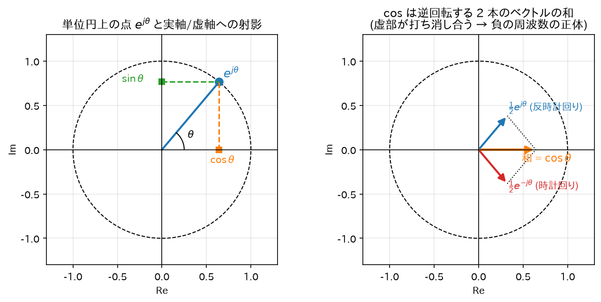

# 02. 複素指数関数とオイラーの公式

信号処理では正弦波を$\cos$や$\sin$のままではなく、複素指数関数$e^{j\omega n}$で扱う。
「なぜわざわざ複素数を持ち出すのか」を含めて、必要な数学をすべて導出する。

## 1. オイラーの公式の導出

### 主張

$$
e^{j\theta} = \cos\theta + j\sin\theta
$$

### 導出（テイラー級数による）

指数関数、余弦、正弦のテイラー級数（マクローリン展開）はそれぞれ:

$$
e^{x} = \sum_{k=0}^{\infty} \frac{x^k}{k!} = 1 + x + \frac{x^2}{2!} + \frac{x^3}{3!} + \frac{x^4}{4!} + \cdots
$$

$$
\cos\theta = \sum_{m=0}^{\infty} \frac{(-1)^m \theta^{2m}}{(2m)!} = 1 - \frac{\theta^2}{2!} + \frac{\theta^4}{4!} - \cdots
$$

$$
\sin\theta = \sum_{m=0}^{\infty} \frac{(-1)^m \theta^{2m+1}}{(2m+1)!} = \theta - \frac{\theta^3}{3!} + \frac{\theta^5}{5!} - \cdots
$$

$e^x$の級数に$x = j\theta$を代入する（この級数は複素数でも絶対収束するので代入が正当化される）:

$$
e^{j\theta} = 1 + j\theta + \frac{(j\theta)^2}{2!} + \frac{(j\theta)^3}{3!} + \frac{(j\theta)^4}{4!} + \frac{(j\theta)^5}{5!} + \cdots
$$

$j$のべき乗は 4 周期で循環する:$j^0=1,\; j^1=j,\; j^2=-1,\; j^3=-j,\; j^4=1,\dots$。これを使って各項を整理:

$$
e^{j\theta} = 1 + j\theta - \frac{\theta^2}{2!} - j\frac{\theta^3}{3!} + \frac{\theta^4}{4!} + j\frac{\theta^5}{5!} - \cdots
$$

実部と虚部に分けてまとめる:

$$
e^{j\theta} = \underbrace{\left(1 - \frac{\theta^2}{2!} + \frac{\theta^4}{4!} - \cdots\right)}_{=\;\cos\theta}
+ j\underbrace{\left(\theta - \frac{\theta^3}{3!} + \frac{\theta^5}{5!} - \cdots\right)}_{=\;\sin\theta}
$$

よって

$$
e^{j\theta} = \cos\theta + j\sin\theta \qquad \blacksquare
$$

### 直感

$e^{j\theta}$は**複素平面上の単位円周上の点**であり、$\theta$はその角度。
$\theta$を時間とともに増やすと、点は単位円上を反時計回りにぐるぐる回る。

```
        Im
        │    ● e^{jθ} = cosθ + j sinθ
        │   /│
        │  / │ sinθ
        │ /θ │
────────┼────┴──── Re
        │ cosθ
```

**正弦波は「回転する点の影」**: 単位円上を回る点を実軸に射影すると$\cos\theta$、虚軸に射影すると$\sin\theta$が得られる。
観覧車のゴンドラに横から光を当てたときの影が上下に単振動するのと同じ。

## 2. cos と sin を複素指数で表す（逆向きの公式）

オイラーの公式で$\theta \to -\theta$とすると、$\cos(-\theta)=\cos\theta$、$\sin(-\theta)=-\sin\theta$より:

$$
e^{-j\theta} = \cos\theta - j\sin\theta
$$

2 式を足す:

$$
e^{j\theta} + e^{-j\theta} = 2\cos\theta
\quad\Longrightarrow\quad
\boxed{\cos\theta = \frac{e^{j\theta} + e^{-j\theta}}{2}}
$$

2 式を引く:

$$
e^{j\theta} - e^{-j\theta} = 2j\sin\theta
\quad\Longrightarrow\quad
\boxed{\sin\theta = \frac{e^{j\theta} - e^{-j\theta}}{2j}}
$$

直感: 実信号の$\cos$は「右回りの回転と左回りの回転を半分ずつ足したもの」。
だから実信号のスペクトルには必ず正負両方の周波数が対で現れる（負の周波数 = 逆回転）。



*図: 左は$e^{j\theta}$が単位円上の点であり cos/sin がその射影であること。右は$\cos\theta$が逆回転する 2 本のベクトルの和で、虚部が常に打ち消し合うこと(=「負の周波数」の正体)。*

## 3. 複素数の極形式と演算

複素数$z = a + jb$は極形式で書ける:

$$
z = r e^{j\phi}, \qquad r = |z| = \sqrt{a^2 + b^2}, \qquad \phi = \angle z = \arctan\frac{b}{a}
$$

（$r$の導出:$|z|^2 = z z^* = (a+jb)(a-jb) = a^2 - (jb)^2 = a^2 + b^2$。
$\phi$は$a = r\cos\phi,\; b = r\sin\phi$から。象限は$a, b$の符号で決める。）

**掛け算は「大きさを掛けて、角度を足す」**:

$$
z_1 z_2 = r_1 e^{j\phi_1} \cdot r_2 e^{j\phi_2} = r_1 r_2\, e^{j(\phi_1 + \phi_2)}
$$

これは指数法則$e^{A}e^{B} = e^{A+B}$から直ちに従う。
（指数法則自体の確認: 級数の積をコーシー積で展開すると
$\left(\sum_k \frac{A^k}{k!}\right)\left(\sum_l \frac{B^l}{l!}\right) = \sum_m \frac{1}{m!}\sum_{k=0}^{m}\binom{m}{k}A^k B^{m-k} = \sum_m \frac{(A+B)^m}{m!}$、
最後の等号は二項定理。$A, B$が可換な複素数なら成立する。）

この「掛け算 = 回転と伸縮」という見方が、後の**極・零点によるフィルタ特性の図形的解釈**（06 章）の土台になる。

## 4. なぜ信号処理は複素指数を使うのか — LTI システムの固有関数

これが最重要ポイント。答えを先に言うと:

> **複素指数$e^{j\omega n}$を LTI システム（フィルタ）に入れると、出てくるのは同じ$e^{j\omega n}$の定数倍。
> つまり複素指数はフィルタを通しても「形が変わらない」唯一の信号族である。**

### 導出

インパルス応答$h[k]$を持つ LTI システム（詳細は 03 章。ここでは出力が
$y[n] = \sum_{k} h[k]\, x[n-k]$で与えられることだけ使う）に$x[n] = e^{j\omega n}$を入力する:

$$
y[n] = \sum_{k=-\infty}^{\infty} h[k]\, e^{j\omega (n-k)}
= \sum_{k=-\infty}^{\infty} h[k]\, e^{j\omega n} e^{-j\omega k}
$$

$e^{j\omega n}$は$k$に依存しないので和の外に出せる:

$$
y[n] = e^{j\omega n} \underbrace{\sum_{k=-\infty}^{\infty} h[k]\, e^{-j\omega k}}_{\displaystyle H(e^{j\omega})}
= H(e^{j\omega})\, e^{j\omega n} \qquad \blacksquare
$$

- 出力 = 入力 × 複素定数$H(e^{j\omega})$。線形代数の言葉では$e^{j\omega n}$は**固有ベクトル（固有関数）**、$H(e^{j\omega})$は**固有値**。
- $H(e^{j\omega})$を**周波数応答**と呼ぶ。極形式$H(e^{j\omega}) = |H(e^{j\omega})|\, e^{j\angle H(e^{j\omega})}$で書くと:
  - $|H(e^{j\omega})|$: その周波数の**振幅を何倍にするか**（振幅特性）
  - $\angle H(e^{j\omega})$: その周波数の**位相を何ラジアンずらすか**（位相特性）

### 実信号での確認（導出）

実際の入力$x[n] = \cos(\omega n)$に対する出力を、上の結果から導く。
$\cos(\omega n) = \frac{1}{2}(e^{j\omega n} + e^{-j\omega n})$と線形性より:

$$
y[n] = \frac{1}{2}\left[H(e^{j\omega})\, e^{j\omega n} + H(e^{-j\omega})\, e^{-j\omega n}\right]
$$

$h[k]$が実数なら$H(e^{-j\omega}) = \sum_k h[k] e^{j\omega k} = \left(\sum_k h[k] e^{-j\omega k}\right)^* = H(e^{j\omega})^*$（共役対称性）。
$H(e^{j\omega}) = A e^{j\phi}$（$A = |H|$,$\phi = \angle H$）とおくと:

$$
y[n] = \frac{1}{2}\left[A e^{j\phi} e^{j\omega n} + A e^{-j\phi} e^{-j\omega n}\right]
= \frac{A}{2}\left[e^{j(\omega n + \phi)} + e^{-j(\omega n + \phi)}\right]
= A\cos(\omega n + \phi)
$$

つまり **「$\cos$を入れると、振幅が$|H|$倍、位相が$\angle H$ずれた$\cos$が出てくる」**。∎

### 直感のまとめ

- フィルタ設計とは「各周波数$\omega$に対する倍率$|H(e^{j\omega})|$の形を望み通りに作る」こと。
  ローパスフィルタなら「低い$\omega$で倍率 1、高い$\omega$で倍率 0」。
- $\cos, \sin$のまま計算すると加法定理だらけの計算地獄になるが、複素指数なら「掛け算 = 回転」だけで済む。
  複素数は面倒を増やす道具ではなく、**三角関数の面倒な計算を消すための道具**である。

## 5. 等比級数の和（今後頻繁に使う公式）

Z 変換やフィルタ解析で何度も使うので、ここで導出しておく。

**有限和**:$S_N = \sum_{k=0}^{N-1} r^k = 1 + r + r^2 + \cdots + r^{N-1}$とおく。

$$
S_N - r S_N = (1 + r + \cdots + r^{N-1}) - (r + r^2 + \cdots + r^{N}) = 1 - r^N
$$

（中間の項がすべて打ち消し合う）。$r \neq 1$で割って:

$$
\boxed{\sum_{k=0}^{N-1} r^k = \frac{1 - r^N}{1 - r}} \qquad (r \neq 1)
$$

**無限和**:$|r| < 1$のとき$N \to \infty$で$|r^N| = |r|^N \to 0$なので:

$$
\boxed{\sum_{k=0}^{\infty} r^k = \frac{1}{1 - r}} \qquad (|r| < 1)
$$

$|r| \geq 1$では項が 0 に収束しないため級数は発散する。
**「$|r|<1$でのみ収束」という条件が、後の Z 変換の収束領域（ROC）と IIR の安定条件の正体**である。

→ 次: [03_LTIシステムと畳み込み.md](03_LTIシステムと畳み込み.md)
