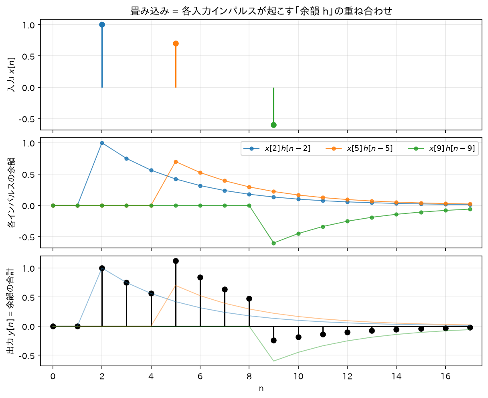

# 03. LTI システムと畳み込み

「フィルタ」と呼んでいるものの数学的な正体は **LTI システム（線形時不変システム）** である。
この章で「フィルタはインパルス応答 $h[n]$ で完全に決まる」ことと、畳み込みの公式を導出する。

## 1. システムとは

入力信号 $x[n]$ を受け取り出力信号 $y[n]$ を返す「箱」をシステムと呼ぶ:

$$
y[n] = \mathcal{T}\{x[n]\}
$$

例: $y[n] = \frac{1}{2}(x[n] + x[n-1])$（隣り合う 2 サンプルの平均 = 簡単なローパスフィルタ）。

## 2. 線形性と時不変性

### 線形性 (Linearity)

任意の信号 $x_1, x_2$ と定数 $a, b$ に対して:

$$
\mathcal{T}\{a\, x_1[n] + b\, x_2[n]\} = a\, \mathcal{T}\{x_1[n]\} + b\, \mathcal{T}\{x_2[n]\}
$$

直感: 「重ね合わせが効く」。2 つの音を混ぜてからフィルタに通しても、別々に通してから混ぜても結果が同じ。

### 時不変性 (Time-Invariance)

入力を $n_0$ サンプル遅らせると、出力もそっくりそのまま $n_0$ サンプル遅れる:

$$
\mathcal{T}\{x[n]\} = y[n] \quad \Longrightarrow \quad \mathcal{T}\{x[n - n_0]\} = y[n - n_0]
$$

直感: 「システムの性質が時間によって変わらない」。今日通しても明日通しても同じ音になるエフェクター。

この 2 つを満たすシステムが **LTI システム**。実用フィルタ（IIR/FIR）はすべて LTI である。

## 3. 畳み込みの導出 — LTI システムはインパルス応答で完全に決まる

### インパルス応答の定義

システムに単位インパルス $\delta[n]$ を入れたときの出力を**インパルス応答**と呼ぶ:

$$
h[n] = \mathcal{T}\{\delta[n]\}
$$

直感: 「一発だけ叩いたときの応答」。お寺の鐘を一回突いたときの「ゴーン…（余韻）」が鐘というシステムのインパルス応答。

### 導出

01 章で導出した信号の分解を出発点にする:

$$
x[n] = \sum_{k=-\infty}^{\infty} x[k]\, \delta[n-k]
$$

これをシステムに入力する:

$$
y[n] = \mathcal{T}\left\{\sum_{k=-\infty}^{\infty} x[k]\, \delta[n-k]\right\}
$$

**ステップ 1（線形性を使う）**: 和の各項は「定数 $x[k]$ × 信号 $\delta[n-k]$」の形（$k$ は和のインデックスであり、信号としての時間変数は $n$ であることに注意）。線形性より $\mathcal{T}$ を和の中に入れ、定数を外に出せる:

$$
y[n] = \sum_{k=-\infty}^{\infty} x[k]\, \mathcal{T}\{\delta[n-k]\}
$$

**ステップ 2（時不変性を使う）**: $\mathcal{T}\{\delta[n]\} = h[n]$ だから、入力を $k$ 遅らせた $\delta[n-k]$ に対する出力は $h[n-k]$:

$$
\mathcal{T}\{\delta[n-k]\} = h[n-k]
$$

代入して:

$$
\boxed{\;y[n] = \sum_{k=-\infty}^{\infty} x[k]\, h[n-k] \;\equiv\; (x * h)[n]\;}
$$

これが**畳み込み和 (convolution sum)**。∎

### この結果の重み

- LTI システムの入出力関係は、$h[n]$ という**1 本の信号だけで完全に記述できる**。
  システムの中身（回路図、プログラム）を知らなくても、$h[n]$ さえ測れば任意の入力への応答が計算できる。
- FIR / IIR という分類は、この $h[n]$ が有限長か無限長かの分類である（07 章）。

### 直感: 畳み込みは「重み付き残響の重ね合わせ」

$y[n] = \sum_k x[k]\, h[n-k]$ は次のように読める:

> 過去の各時刻 $k$ に入力された値 $x[k]$ が、それぞれ「$h$ の形の余韻」を高さ $x[k]$ 倍で発生させる。
> 時刻 $n$ の出力は、いま鳴っているすべての余韻の合計。

鐘を連打すると、各打撃の「ゴーン」が重なり合って聞こえる。あれが畳み込みである。

*図: 上段の 3 本のインパルスがそれぞれ「$h$ の形の余韻」を自分の高さ倍で発生させ(中段)、時刻ごとにそれらを合計したものが出力(下段)。畳み込み和の各項が中段の 1 本ずつに対応する。*

## 4. 畳み込みの性質(すべて導出)

### (a) 可換性: $x * h = h * x$

$$
(x*h)[n] = \sum_{k=-\infty}^{\infty} x[k]\, h[n-k]
$$

変数変換 $m = n - k$（つまり $k = n - m$。$k$ が $-\infty \to \infty$ を動くとき $m$ も $\infty \to -\infty$ の全整数を動く）:

$$
(x*h)[n] = \sum_{m=-\infty}^{\infty} x[n-m]\, h[m] = \sum_{m=-\infty}^{\infty} h[m]\, x[n-m] = (h*x)[n] \qquad \blacksquare
$$

意味: 「入力とインパルス応答の役割は対称」。実装上どちらをずらしながら掛けてもよい。

### (b) 結合性: $(x * h_1) * h_2 = x * (h_1 * h_2)$

$$
\big((x*h_1)*h_2\big)[n] = \sum_{m} (x*h_1)[m]\; h_2[n-m]
= \sum_{m} \left(\sum_{k} x[k]\, h_1[m-k]\right) h_2[n-m]
$$

和の順序を交換（絶対収束を仮定）し、$l = m - k$ と変数変換（$k$ 固定で $m$ が全整数を動けば $l$ も全整数を動く）:

$$
= \sum_{k} x[k] \sum_{m} h_1[m-k]\, h_2[n-m]
= \sum_{k} x[k] \sum_{l} h_1[l]\, h_2[(n-k)-l]
= \sum_{k} x[k]\, (h_1 * h_2)[n-k]
$$

これは $x * (h_1 * h_2)$ の定義そのもの。∎

意味: **フィルタの直列接続は、インパルス応答同士の畳み込みを持つ 1 つのフィルタと等価**。
しかも可換性より接続順序を入れ替えても結果は同じ。これが 09 章の「biquad 縦続接続」の理論的根拠。

### (c) 分配性: $x * (h_1 + h_2) = x * h_1 + x * h_2$

$$
\big(x*(h_1+h_2)\big)[n] = \sum_k x[k]\,(h_1[n-k] + h_2[n-k])
= \sum_k x[k]\,h_1[n-k] + \sum_k x[k]\,h_2[n-k]
$$

（有限の値をとる 2 つの和への分割）。これは $(x*h_1)[n] + (x*h_2)[n]$。∎

意味: フィルタの並列接続は、インパルス応答の和を持つ 1 つのフィルタと等価。

## 5. 因果性

**定義**: 出力 $y[n]$ が現在と過去の入力（$x[m], m \leq n$）だけで決まるシステムを**因果的 (causal)** という。

**LTI システムが因果的 ⟺ $h[n] = 0 \;(n < 0)$ の導出**:

($\Leftarrow$) $h[n-k] $ は $n - k < 0$ すなわち $k > n$ で 0。よって

$$
y[n] = \sum_{k=-\infty}^{n} x[k]\, h[n-k]
$$

となり、未来の入力 $x[k]\,(k>n)$ は出力に影響しない。因果的である。

($\Rightarrow$) 対偶を示す。ある $n_0 < 0$ で $h[n_0] \neq 0$ とする。入力 $x[n] = \delta[n]$ を考えると
$y[n_0] = h[n_0] \neq 0$。つまり入力が時刻 0 に来るより**前の時刻 $n_0$** に出力が出ている。
これは「原因より先に結果が出る」ことなので因果的でない。∎

直感: リアルタイム動作するフィルタは未来のサンプルを読めないので必ず因果的。
IIR フィルタは通常、因果的なものとして設計・実装する。

## 6. BIBO 安定性(IIR 理解の要)

**定義**: 有界な入力（$|x[n]| \leq B_x < \infty$ がすべての $n$ で成立）に対して、出力も必ず有界になるとき、
システムは **BIBO 安定 (Bounded-Input Bounded-Output stable)** という。

### 定理

$$
\text{LTI システムが BIBO 安定} \quad \Longleftrightarrow \quad \sum_{k=-\infty}^{\infty} |h[k]| < \infty
\;\;(\text{インパルス応答が絶対総和可能})
$$

### 導出（十分性: $\sum|h| < \infty \Rightarrow$ 安定）

$|x[n]| \leq B_x$ とする。三角不等式より:

$$
|y[n]| = \left|\sum_{k} h[k]\, x[n-k]\right|
\leq \sum_{k} |h[k]|\, |x[n-k]|
\leq B_x \sum_{k} |h[k]| < \infty
$$

出力はすべての $n$ で有界。∎

### 導出（必要性: 安定 $\Rightarrow \sum|h| < \infty$。対偶で示す）

$\sum_k |h[k]| = \infty$ と仮定し、出力が発散する有界入力を具体的に作る。

次の入力を考える（各サンプルは $\pm1$ か 0 なので明らかに有界、$B_x = 1$）:

$$
x[n] = \operatorname{sgn}(h[-n]) =
\begin{cases}
+1 & (h[-n] > 0)\\
0 & (h[-n] = 0)\\
-1 & (h[-n] < 0)
\end{cases}
$$

時刻 $n = 0$ の出力を計算する:

$$
y[0] = \sum_{k} h[k]\, x[0-k] = \sum_{k} h[k]\, x[-k]
= \sum_{k} h[k]\, \operatorname{sgn}(h[k])
= \sum_{k} |h[k]| = \infty
$$

（$h[k]\operatorname{sgn}(h[k]) = |h[k]|$ を使った。）
有界な入力なのに出力が無限大になったので BIBO 安定ではない。∎

### 直感

- 「余韻 $h[n]$ の総量（絶対値の合計）が有限」なら、どんなに意地悪な入力でも出力は暴れない。
- FIR は $h[n]$ が有限個の値しか持たないので**無条件に安定**（有限和は必ず有限）。
- **IIR は $h[n]$ が無限に続くので、その減衰が十分速いかどうかで安定/不安定が分かれる**。
  例えば $h[n] = a^n u[n]$ なら $\sum_{n=0}^\infty |a|^n$ は $|a|<1$ のときだけ収束（02 章の等比級数）。
  この条件が 06 章で「極が単位円の内側」という形に一般化される。

→ 次: [04_DTFT_離散時間フーリエ変換.md](04_DTFT_離散時間フーリエ変換.md)
