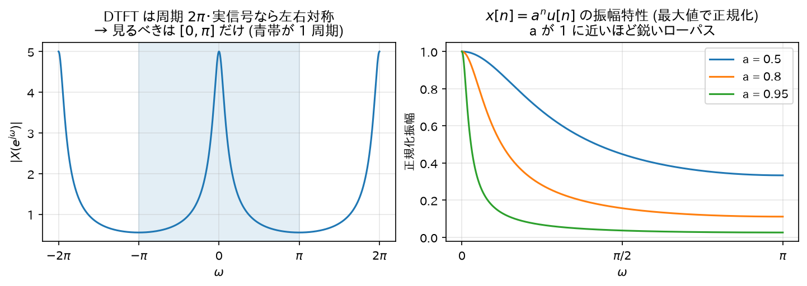

# 04. DTFT（離散時間フーリエ変換）

「フィルタの周波数特性」を正確に定義する道具が DTFT である。
Z 変換（05 章）は DTFT の拡張なので、まずここを固める。

## 1. 定義

信号 $x[n]$ の **DTFT (Discrete-Time Fourier Transform)**:

$$
X(e^{j\omega}) = \sum_{n=-\infty}^{\infty} x[n]\, e^{-j\omega n}
$$

（$\sum_n |x[n]| < \infty$ なら級数は絶対収束し、DTFT は存在する。）

### 直感

$X(e^{j\omega})$ は「信号 $x[n]$ の中に、周波数 $\omega$ の回転成分 $e^{j\omega n}$ が**どれだけの量と位相で含まれているか**」を測る内積である。

- $e^{-j\omega n}$ を掛ける = 信号を逆回転させて、周波数 $\omega$ の成分だけを「静止」させる
- 全時刻で足す = 静止した成分だけが同じ向きに積み上がり大きな値になる。他の周波数成分は回転したまま足されるので打ち消し合ってほぼ 0

「合唱の中から特定の人の声だけ聞き取るために、その人のリズムに合わせて首を振る」ようなイメージ。

### 記法について

引数を $\omega$ でなく $e^{j\omega}$ と書くのは、05 章の Z 変換 $X(z)$ に $z = e^{j\omega}$ を代入したものが DTFT に一致するから。つまり **DTFT = Z 変換を単位円上で評価したもの**（先取り）。

## 2. DTFT の周期性(導出)

$$
X(e^{j(\omega + 2\pi)}) = \sum_n x[n]\, e^{-j(\omega+2\pi)n}
= \sum_n x[n]\, e^{-j\omega n}\, \underbrace{e^{-j2\pi n}}_{=1\;(n\text{は整数})}
= X(e^{j\omega})
$$

DTFT は必ず周期 $2\pi$ の周期関数。∎

直感: 01 章で見たとおり、離散信号では $\omega$ と $\omega + 2\pi$ は同じ信号を表すので、スペクトルも同じ値になるしかない。
これが「デジタルフィルタの周波数特性は $0 \leq \omega \leq \pi$ だけ見ればよい」理由
（実係数なら $|X(e^{-j\omega})| = |X(e^{j\omega})|$ の対称性もあるため、負側も冗長）。

## 3. 逆変換の導出

### 主張

$$
x[n] = \frac{1}{2\pi} \int_{-\pi}^{\pi} X(e^{j\omega})\, e^{j\omega n}\, d\omega
$$

### 準備: 複素指数の直交性

任意の整数 $m$ について次を計算する:

$$
I(m) = \frac{1}{2\pi} \int_{-\pi}^{\pi} e^{j\omega m}\, d\omega
$$

**場合 1: $m = 0$** — 被積分関数は 1 なので $I(0) = \frac{1}{2\pi} \cdot 2\pi = 1$。

**場合 2: $m \neq 0$** — 原始関数は $\frac{e^{j\omega m}}{jm}$ なので:

$$
I(m) = \frac{1}{2\pi} \left[\frac{e^{j\omega m}}{jm}\right]_{-\pi}^{\pi}
= \frac{e^{j\pi m} - e^{-j\pi m}}{2\pi j m}
= \frac{2j \sin(\pi m)}{2\pi j m}
= \frac{\sin(\pi m)}{\pi m} = 0
$$

（$m$ が 0 でない整数なら $\sin(\pi m) = 0$。）

まとめると:

$$
\frac{1}{2\pi} \int_{-\pi}^{\pi} e^{j\omega m}\, d\omega = \delta[m]
$$

直感: 回転する複素指数を一周期分積分すると、ちょうど円を整数周して打ち消し合い 0 になる。回らない ($m=0$) ときだけ 1 が残る。

### 本体の導出

逆変換の右辺に DTFT の定義を代入する（総和のダミー変数を $k$ にしておく）:

$$
\frac{1}{2\pi} \int_{-\pi}^{\pi} \left[\sum_{k=-\infty}^{\infty} x[k]\, e^{-j\omega k}\right] e^{j\omega n}\, d\omega
$$

積分と和を交換（絶対収束を仮定）:

$$
= \sum_{k=-\infty}^{\infty} x[k]\; \frac{1}{2\pi}\int_{-\pi}^{\pi} e^{j\omega(n-k)}\, d\omega
= \sum_{k=-\infty}^{\infty} x[k]\; \delta[n-k]
= x[n] \qquad \blacksquare
$$

（最後は 01 章のインパルス分解の式。）

### 直感

逆変換の式は「信号は、あらゆる周波数の回転成分 $e^{j\omega n}$ を、重み $X(e^{j\omega})$ で混ぜ合わせたもの」と読める。
DTFT が「分解」、逆 DTFT が「合成」。

## 4. 畳み込み定理(導出) — フィルタリングの周波数領域での姿

### 主張

$$
y[n] = (x * h)[n] \quad \Longrightarrow \quad Y(e^{j\omega}) = X(e^{j\omega})\, H(e^{j\omega})
$$

### 導出

$$
Y(e^{j\omega}) = \sum_{n=-\infty}^{\infty} y[n]\, e^{-j\omega n}
= \sum_{n=-\infty}^{\infty} \left[\sum_{k=-\infty}^{\infty} x[k]\, h[n-k]\right] e^{-j\omega n}
$$

和の順序を交換し、指数を $e^{-j\omega n} = e^{-j\omega k}\, e^{-j\omega (n-k)}$ と分解する:

$$
= \sum_{k=-\infty}^{\infty} x[k]\, e^{-j\omega k} \sum_{n=-\infty}^{\infty} h[n-k]\, e^{-j\omega (n-k)}
$$

内側の和で $m = n-k$ と変数変換（$k$ 固定で $n$ が全整数を動けば $m$ も全整数を動く）:

$$
= \sum_{k=-\infty}^{\infty} x[k]\, e^{-j\omega k} \sum_{m=-\infty}^{\infty} h[m]\, e^{-j\omega m}
= X(e^{j\omega})\, H(e^{j\omega}) \qquad \blacksquare
$$

### 直感（これがフィルタ理論の中心的な絵）

> **時間領域の畳み込み（面倒な計算）は、周波数領域では単なる掛け算になる。**

各周波数成分ごとに見れば、フィルタは「その周波数の倍率 $H(e^{j\omega})$ を掛けるだけ」の装置である
（02 章の固有関数の議論と完全に整合する）。イコライザーのスライダーそのもの。

```
時間領域:   x[n] ──[畳み込み h]──→ y[n]        （計算はしんどい）
              ↕ DTFT                  ↕ DTFT
周波数領域: X(e^jω) ──[× H(e^jω)]──→ Y(e^jω)   （ただの掛け算）
```

## 5. よく使う DTFT の性質(導出付き)

### (a) 線形性

$$
\mathcal{F}\{a x_1[n] + b x_2[n]\} = \sum_n (a x_1[n] + b x_2[n]) e^{-j\omega n}
= a\sum_n x_1[n] e^{-j\omega n} + b\sum_n x_2[n] e^{-j\omega n}
= a X_1 + b X_2
$$

### (b) 時間シフト

$$
\mathcal{F}\{x[n - n_0]\} = \sum_n x[n-n_0]\, e^{-j\omega n}
$$

$m = n - n_0$ と置換:

$$
= \sum_m x[m]\, e^{-j\omega(m + n_0)} = e^{-j\omega n_0} \sum_m x[m]\, e^{-j\omega m}
= e^{-j\omega n_0}\, X(e^{j\omega}) \qquad \blacksquare
$$

直感: 時間の遅れは、スペクトルの大きさを変えず**位相だけを周波数に比例して回す**（$-\omega n_0$）。
「遅延 = 線形位相」という事実は位相特性を読むときの基準になる。

### (c) 実信号の共役対称性

$x[n]$ が実数のとき:

$$
X(e^{-j\omega}) = \sum_n x[n]\, e^{j\omega n}
= \overline{\sum_n x[n]\, e^{-j\omega n}}
= X(e^{j\omega})^*
$$

（実数 $x[n]$ は共役をとっても変わらないため。）
よって $|X(e^{-j\omega})| = |X(e^{j\omega})|$（振幅特性は偶関数）、$\angle X(e^{-j\omega}) = -\angle X(e^{j\omega})$（位相特性は奇関数）。∎

## 6. 例: 1 次の指数減衰信号の DTFT(導出)

IIR の最小構成要素になる信号 $x[n] = a^n u[n]$（$|a| < 1$）を変換する:

$$
X(e^{j\omega}) = \sum_{n=0}^{\infty} a^n e^{-j\omega n}
= \sum_{n=0}^{\infty} \left(a e^{-j\omega}\right)^n
$$

これは公比 $r = a e^{-j\omega}$ の等比級数。$|r| = |a| < 1$ なので収束し（02 章の公式）:

$$
X(e^{j\omega}) = \frac{1}{1 - a e^{-j\omega}}
$$

振幅特性を計算する（$a$ は実数とする）:

$$
|X(e^{j\omega})|^2 = \frac{1}{(1 - a e^{-j\omega})(1 - a e^{j\omega})}
= \frac{1}{1 - a(e^{j\omega} + e^{-j\omega}) + a^2}
= \frac{1}{1 - 2a\cos\omega + a^2}
$$

（$e^{j\omega} + e^{-j\omega} = 2\cos\omega$ を使用。）

$0 < a < 1$ の場合の挙動:
- $\omega = 0$: $|X|^2 = \dfrac{1}{(1-a)^2}$ … 最大（分母が最小）
- $\omega = \pi$: $|X|^2 = \dfrac{1}{(1+a)^2}$ … 最小

つまり**ローパス特性**。$a$ が 1 に近いほど $\omega=0$ でのピークが鋭くなる。
07 章で見る 1 次 IIR ローパスフィルタの周波数特性はまさにこれである。



*図: 左はこの $|X(e^{j\omega})|$ を広い範囲で見たもの — §2 で導出した周期 $2\pi$ と左右対称性が現れており、情報は青帯 $[-\pi,\pi]$ (実質 $[0,\pi]$)に全部ある。右は $a$ を変えたときのローパス特性の変化。*

→ 次: [05_Z変換.md](05_Z変換.md)
