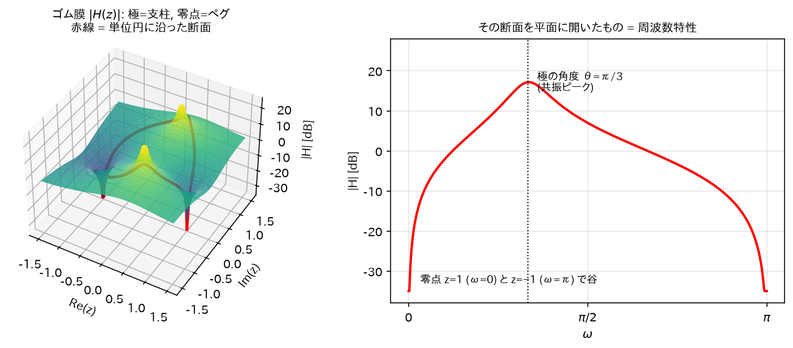
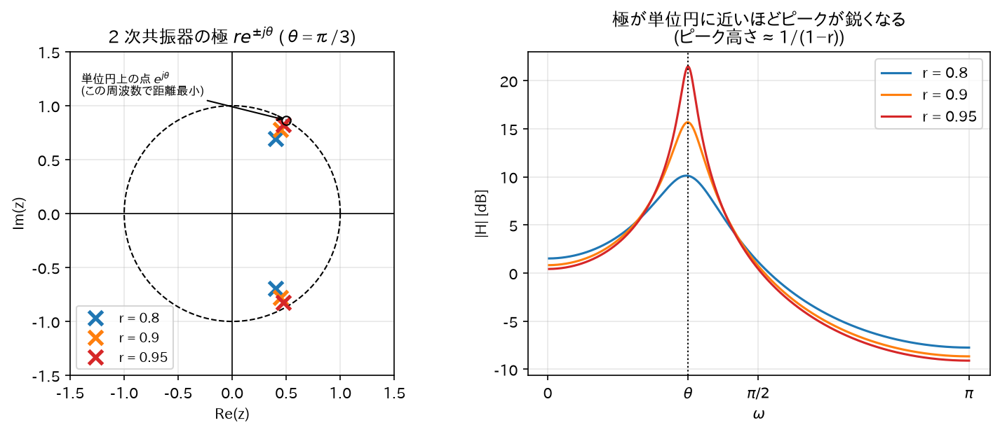

# 06. 伝達関数・極と零点・安定性

この章で「差分方程式 → 伝達関数 → 極零点 → 周波数特性と安定性」という IIR 解析の一本道を通す。

> **この章の位置づけ: ここまでの道具が 1 本につながる.**
> [05 章](05_Z変換.md)までで道具は揃った。この章はそれを使って、**フィルタを「地図の上の点」として見る**方法を手に入れる。
>
> どういうことか。フィルタは普通、$`y[n] = 0.5x[n] + 0.9y[n-1]`$のような**数式**として与えられる。
> これを見て「どんな音になるフィルタか」を言い当てるのは難しい。
> ところがこの章の手順を踏むと、フィルタが**複素平面上に打たれた数個の点**（極と零点）に姿を変える。
> そして——
>
> - **点の位置を見るだけで**、どの周波数が持ち上がりどこが削られるか（音色）が分かる
> - **点が円の内側にあるかどうか**を見るだけで、そのフィルタが安全か暴走するかが分かる
>
> 数式とにらめっこする作業が、**地図上の点の配置を眺める作業**に変わる。これがこの章の収穫である。

> **この章で使う既出の用語（定義は各リンク先）.**
> $`\delta[n]`$・$`u[n]`$（[01 章 §1](01_離散時間信号とサンプリング.md#重要な基本信号)）、複素数・共役・絶対値・偏角（[02 章 §0](02_複素指数関数とオイラーの公式.md#複素数の最小限の復習)）、極形式と「掛け算 = 大きさを掛けて角度を足す」（[02 章 §3](02_複素指数関数とオイラーの公式.md#複素数の極形式と演算)）、等比級数（[02 章 §5](02_複素指数関数とオイラーの公式.md#等比級数の和-今後頻繁に使う公式)）、LTI システム・線形性（[03 章 §2](03_LTIシステムと畳み込み.md#線形性と時不変性)）、畳み込み・インパルス応答（[03 章 §3](03_LTIシステムと畳み込み.md#畳み込みの導出-lti-システムはインパルス応答で完全に決まる)）、因果的（[03 章 §5](03_LTIシステムと畳み込み.md#因果性)）、BIBO 安定（[03 章 §6](03_LTIシステムと畳み込み.md#bibo-安定性-iir-理解の要)）、Z 変換・ROC・極（[05 章 §1–2](05_Z変換.md#収束領域-roc)）、時間シフト・畳み込み定理（[05 章 §3](05_Z変換.md#b-時間シフト-iir-で最も重要な性質)）、部分分数展開（[05 章 §4](05_Z変換.md#逆-z-変換-部分分数展開法)）

## 1. 差分方程式 — デジタルフィルタの実体

実装可能なデジタルフィルタは、次の**線形定係数差分方程式**で書ける:

（「差分方程式」という名前に構える必要はない。要は「**今の出力を、今と過去の値から計算する漸化式**」のこと。
数学の数列でやった$`a_{n+1} = 2a_n + 1`$と同じ種類のもので、それが信号処理版になっただけである。以下では「差分方程式」で統一するが、漸化式・再帰式と呼んでも同じものを指す。
そして実は、これが**そのまま実装コード**になる——プログラムでは 1 行の代入文として書ける。）

$$
y[n] = \sum_{k=0}^{M} b_k x[n-k] - \sum_{k=1}^{N} a_k y[n-k]
$$

- $`M`$: 入力側の最大の遅れ（何サンプル前の入力まで使うか）、$`N`$: 出力側の最大の遅れ。大きい方をフィルタの**次数**と呼ぶ
- 第 1 項: 現在と過去の**入力**の重み付き和（フィードフォワード）
- 第 2 項: 過去の**出力**の重み付き和（**フィードバック**）← これがあるのが IIR

直感: 「今の出力 = 入力の混ぜ合わせ + **自分の過去の出力の混ぜ合わせ**」。
フィードバック項があると、入力が止まった後も出力が自分自身を材料にして鳴り続けられる。
これが「無限インパルス応答」の源泉。フィードバック項を持つフィルタを **IIR**（Infinite Impulse Response、無限インパルス応答）、持たないものを **FIR**（Finite Impulse Response）と呼ぶ（[07 章](07_IIRフィルタの基礎.md)）。

標準形として、フィードバック項を左辺に移項した形も使う。$`y[n]`$ 自身を $`a_0 y[n]`$（$`a_0 = 1`$）と書けば、左辺は $`k = 0`$ から始まる 1 つの和にまとまる:

$$
\sum_{k=0}^{N} a_k y[n-k] = \sum_{k=0}^{M} b_k x[n-k], \qquad a_0 = 1
$$

（確認: 左辺の $`k = 0`$ の項 $`y[n]`$ を残して $`k \geq 1`$ の項を右辺に移すと、上の式に戻る。）

## 2. 伝達関数の導出

> **なぜ Z 変換するのか.** 差分方程式には$`y[n-1]`$や$`x[n-2]`$といった「ずれた項」が混ざっていて、
> このままでは「入力と出力の関係」を一言で言い表せない。
> ところが [05 章 §3(b)](05_Z変換.md#b-時間シフト-iir-で最も重要な性質)で見たとおり、Z 領域では**「1 サンプルの遅れ」が単なる$`z^{-1}`$の掛け算**になる。
> つまり Z 変換すると、遅延だらけの厄介な式が**ただの多項式の掛け算**に化ける。
> そうなれば「出力 ÷ 入力」という割り算が普通にでき、フィルタの性質が 1 つの分数で表せるようになる。
> その分数が**伝達関数**である。

差分方程式の両辺を Z 変換する。線形性と時間シフトの性質（[05 章](05_Z変換.md#b-時間シフト-iir-で最も重要な性質)で導出済み:$`x[n-k] \leftrightarrow z^{-k}X(z)`$）より:

$$
\sum_{k=0}^{N} a_k z^{-k} Y(z) = \sum_{k=0}^{M} b_k z^{-k} X(z)
$$

$`Y(z), X(z)`$はそれぞれ和の外に括り出せる:

$$
Y(z) \sum_{k=0}^{N} a_k z^{-k} = X(z) \sum_{k=0}^{M} b_k z^{-k}
$$

よって**伝達関数**$`H(z) \equiv Y(z)/X(z)`$は:

$$
\boxed{
H(z) = \frac{Y(z)}{X(z)} = \frac{\displaystyle\sum_{k=0}^{M} b_k z^{-k}}{\displaystyle 1 + \sum_{k=1}^{N} a_k z^{-k}}
= \frac{b_0 + b_1 z^{-1} + \cdots + b_M z^{-M}}{1 + a_1 z^{-1} + \cdots + a_N z^{-N}}
}
$$

一方、出力は畳み込み $`y = x * h`$ なので、[05 章](05_Z変換.md#c-畳み込み定理)の畳み込み定理より $`Y(z) = \mathcal{Z}\{h\}\, X(z)`$。
これを上の $`Y(z) = H(z) X(z)`$ と見比べれば $`H(z) = \mathcal{Z}\{h\}`$、すなわち$`H(z)`$は**インパルス応答$`h[n]`$の Z 変換**でもある
（別の言い方: 入力に $`\delta[n]`$ を入れると $`X(z) = 1`$ なので $`Y(z) = H(z)`$、そのときの出力が定義により $`h[n]`$）。
つまり:

> 差分方程式の係数$`\{a_k, b_k\}`$（実装コード）と、伝達関数$`H(z)`$（数学的解析）と、
> インパルス応答$`h[n]`$（時間波形）は、同じフィルタの 3 つの顔である。

## 3. 極と零点

分子・分母は$`z^{-1}`$の多項式なので、因数分解できる。分子分母に$`z^{N}`$を掛けると（$`N \geq M`$ の場合で書く）

$$
H(z) = \frac{z^N (b_0 + b_1 z^{-1} + \cdots + b_M z^{-M})}{z^N (1 + a_1 z^{-1} + \cdots + a_N z^{-N})}
= \frac{z^{N-M}\,(b_0 z^M + b_1 z^{M-1} + \cdots + b_M)}{z^N + a_1 z^{N-1} + \cdots + a_N}
$$

と、分子は $`z^{N-M}`$ × $`M`$ 次多項式、分母は $`N`$ 次多項式になる。$`M`$ 次多項式は $`b_0 \prod_{i=1}^{M}(z - q_i)`$、分母は $`\prod_{i=1}^{N}(z - p_i)`$ と因数分解できる（$`\prod`$ は $`\sum`$ の掛け算版で、$`\prod_{i=1}^{M}`$ は $`i = 1`$ から $`M`$ までの積）ので:

$$
H(z) = b_0 z^{N-M} \frac{\prod_{i=1}^{M} (z - q_i)}{\prod_{i=1}^{N} (z - p_i)}
$$

（$`M > N`$ なら $`z^{M}`$ を掛けて同じことをすればよく、そのとき $`z^{N-M}`$ は負のべきになる。式の形は同じ。）

- $`q_i`$: **零点 (zero)** —$`H(z) = 0`$になる点。分子多項式の根。
- $`p_i`$: **極 (pole)** —$`H(z) = \infty`$になる点。分母多項式の根。

> **名前の由来と、覚え方.**
> 「零点」は文字どおり**ゼロになる点**。分子がゼロになるので、そこで伝達関数の値が 0 に落ちる。
> 「極」は**極端に大きくなる点**（英語の pole は「柱」）。分母がゼロになるので値が無限大に吹き飛ぶ。
>
> なぜこの 2 種類が主役かというと、**分数は分子と分母だけで決まる**から。
> 分子の根（零点）と分母の根（極）さえ全部分かれば、定数倍を除いて伝達関数は完全に決まってしまう。
> つまり**極と零点の一覧表 = フィルタの設計図**である。以降ずっとこの見方で進む。

係数$`\{a_k, b_k\}`$が実数なら、極・零点は実数か、複素共役対で現れる
（実係数多項式の根の性質: $`P(z) = \sum_k c_k z^k`$ で係数 $`c_k`$ が実数なら、共役は和と積に分配できて $`c_k^* = c_k`$ なので $`P(p)^* = \sum_k c_k (p^*)^k = P(p^*)`$。よって$`P(p) = 0`$の両辺の共役をとると$`P(p^*) = 0`$、つまり $`p^*`$ も根）。

### 直感: ゴム膜のたとえ

$`|H(z)|`$を$`z`$平面上の高さと見なすと:
- **極 = テントの支柱**。その点で高さが無限大に突き上がる。
- **零点 = 地面に打ったペグ**。その点で高さが 0 に釘付けされる。

周波数特性$`|H(e^{j\omega})|`$は、**このゴム膜を単位円に沿って一周切り取った断面の高さ**。
極の近くを通れば山（ゲイン大）、零点の近くを通れば谷（ゲイン小）ができる。

*図: このたとえをそのまま描いたもの。左の曲面が$`|H(z)|`$で、共役極対の位置に 2 本の支柱、$`z=\pm1`$の零点に 2 本のペグが見える。赤線 = 単位円に沿った断面が、右の周波数特性そのものになる。*

## 4. 周波数特性の図形的解釈(導出)

$`z = e^{j\omega}`$を因数分解形に代入して絶対値をとる:

$$
|H(e^{j\omega})| = |b_0| \cdot \frac{\prod_{i=1}^{M} |e^{j\omega} - q_i|}{\prod_{i=1}^{N} |e^{j\omega} - p_i|}
$$

（$`|z^{N-M}| = |e^{j\omega}|^{N-M} = 1`$なので消える。絶対値は積・商に分配される:$`|AB| = |A||B|`$——極形式で書けば「掛け算は大きさを掛ける」（[02 章 §3](02_複素指数関数とオイラーの公式.md#複素数の極形式と演算)）そのもの。）

ここで$`|e^{j\omega} - q_i|`$は、**単位円上の点$`e^{j\omega}`$から零点$`q_i`$までのユークリッド距離**である
（複素数の差の絶対値 = 2 点間距離）。よって:

$$
\boxed{|H(e^{j\omega})| = |b_0| \frac{\text{各零点までの距離の積}}{\text{各極までの距離の積}}}
$$

同様に偏角について$`\angle(AB/C) = \angle A + \angle B - \angle C`$（「掛け算は角度を足す」）より。振幅では消えた $`z^{N-M}`$ も、偏角では $`\angle (e^{j\omega})^{N-M} = (N-M)\omega`$ として残る:

$$
\angle H(e^{j\omega}) = \angle b_0 + (N-M)\omega + \sum_i \angle(e^{j\omega} - q_i) - \sum_i \angle(e^{j\omega} - p_i)
$$

### 直感

単位円上を歩く点$`e^{j\omega}`$を想像する（$`\omega`$: 0 → π）。
- **極に近づくと分母の距離が小さくなり、ゲインが跳ね上がる**（共振ピーク）。
- **零点に近づくと分子の距離が小さくなり、ゲインが落ち込む**（ノッチ）。
- 極を単位円ギリギリ内側に置くほどピークは鋭くなる（共振の鋭さの指標を Q と呼び、Q が高くなる、と言う）。

フィルタ設計とは、**通過させたい周波数の近くに極を、消したい周波数の上に零点を配置するゲーム**である。

## 5. 安定性の定理と導出(この章のクライマックス)

### 定理

> **因果的（[03 章 §5](03_LTIシステムと畳み込み.md#因果性)）LTI システムが BIBO 安定（[03 章 §6](03_LTIシステムと畳み込み.md#bibo-安定性-iir-理解の要)）⟺ すべての極が単位円の内側（$`|p_i| < 1`$）にある。**

### 導出

**準備**: 因果的で有理伝達関数を持つシステムのインパルス応答は、部分分数展開（[05 章](05_Z変換.md#逆-z-変換-部分分数展開法)）により

$$
h[n] = \sum_{i=1}^{N} A_i p_i^n u[n]
$$

の形になる（まず単根の場合を考える。$`M \geq N`$ のときは、分子を分母で割り算して $`H(z) = `$（$`z^{-1}`$ の多項式）$`+`$（分子の次数が分母より低い分数）に分けられ、多項式の部分は $`\delta[n-k]`$ 型の有限個の項を与える。有限和なので安定性に影響しない）。

**（⇐）すべての$`|p_i| < 1`$⇒ 安定**:

[03 章](03_LTIシステムと畳み込み.md#導出-十分性-sumh-infty-rightarrow安定)の安定条件$`\sum_n |h[n]| < \infty`$を確認する。三角不等式より:

$$
\sum_{n=0}^{\infty} |h[n]| = \sum_{n=0}^{\infty} \left|\sum_{i} A_i p_i^n\right|
\leq \sum_{n=0}^{\infty} \sum_{i} |A_i| |p_i|^n
= \sum_{i} |A_i| \sum_{n=0}^{\infty} |p_i|^n
= \sum_{i} \frac{|A_i|}{1 - |p_i|} < \infty
$$

（等比級数は$`|p_i| < 1`$で収束。有限個の有限値の和は有限。）∎

**（⇒）ある極$`|p_1| \geq 1`$⇒ 不安定**:

対偶を示す。$`|p_1| \geq 1`$の極があるとする（$`A_1 \neq 0`$、簡単のため$`|p_1|`$が最大の極で他の極と大きさが異なるとする。大きさの等しい極が複数ある場合も結論は変わらないが、証明が長くなるので事実として引用する）。
このとき$`n \to \infty`$で

$$
|h[n]| = |p_1|^n \left|A_1 + \sum_{i \geq 2} A_i \left(\frac{p_i}{p_1}\right)^n\right|
$$

$`|p_i / p_1| < 1`$より括弧内の和 $`\varepsilon_n = \sum_{i \geq 2} A_i (p_i/p_1)^n`$ は 0 に収束する。三角不等式を $`|A_1| = |(A_1 + \varepsilon_n) - \varepsilon_n| \leq |A_1 + \varepsilon_n| + |\varepsilon_n|`$ と使うと $`|A_1 + \varepsilon_n| \geq |A_1| - |\varepsilon_n|`$ なので、$`|\varepsilon_n| \leq |A_1|/2`$ となる十分大きい$`n`$では括弧内は$`|A_1|/2`$以上。よって

$$
|h[n]| \geq \frac{|A_1|}{2} |p_1|^n \geq \frac{|A_1|}{2} \quad (\because |p_1| \geq 1)
$$

$`h[n]`$が 0 に収束しないので$`\sum |h[n]|`$は発散。BIBO 安定でない。∎

**重根の場合**: 重複度$`m`$の極には$`n^{m-1} p^n u[n]`$型の項が現れる（[05 章](05_Z変換.md#e-z-領域微分)の z 領域微分から導かれる）。
$`|p| < 1`$なら、任意の多項式次数に対して指数減衰が勝つ:
$`\sum_n n^{m-1} |p|^n`$は例えばダランベールの判定法（正の項の級数で、隣り合う項の比の極限が 1 未満なら収束する、という判定法。事実として使う）で、隣接項比

$$
\frac{(n+1)^{m-1}|p|^{n+1}}{n^{m-1}|p|^n} = \left(1 + \frac{1}{n}\right)^{m-1} |p| \longrightarrow |p| < 1 \quad (n \to \infty)
$$

より収束。よって結論は変わらない。∎

### 直感

- 各極$`p_i`$は「$`p_i^n`$という余韻」を生む。$`|p_i|`$は 1 サンプルごとの減衰率。
  - $`|p_i| < 1`$: 余韻はだんだん小さくなる（安定）
  - $`|p_i| = 1`$: 余韻が永遠に減らない（発振器。境界）
  - $`|p_i| > 1`$: 余韻が毎サンプル成長する（発散 = スピーカーが「ピー！」と暴走）
- **零点は安定性に無関係**。零点はどこにあってもよい（分子は出力を作る材料の混ぜ方であり、フィードバックしないから)。
- FIR は分母が 1（極は原点のみ）なので常に安定。IIR だけが安定性の検査を要求される。

## 6. 例: 2 次共振器で全部つなげる

$$
H(z) = \frac{1}{1 - 2r\cos\theta z^{-1} + r^2 z^{-2}}, \qquad 0 < r < 1
$$

**極の導出**: 分母$`= 0`$とおき、$`z^2`$を掛けて$`z^2 - 2r\cos\theta z + r^2 = 0`$。解の公式:

$$
z = \frac{2r\cos\theta \pm \sqrt{4r^2\cos^2\theta - 4r^2}}{2}
= r\cos\theta \pm r\sqrt{\cos^2\theta - 1}
= r\cos\theta \pm j r\sin\theta = r e^{\pm j\theta}
$$

（$`\cos^2\theta - 1 = -\sin^2\theta`$ なので $`\sqrt{-\sin^2\theta} = j|\sin\theta|`$。$`\pm`$ が両方の符号を覆うので $`\sin\theta`$ の符号によらず $`\pm jr\sin\theta`$ と書ける。最後はオイラーの公式。）

極は$`p = re^{j\theta}`$とその共役。すなわち**半径$`r`$、角度$`\pm\theta`$の共役対**。

**対応する差分方程式**（伝達関数の定義を逆にたどる）:

$$
y[n] = x[n] + 2r\cos\theta y[n-1] - r^2 y[n-2]
$$

**インパルス応答**: [05 章](05_Z変換.md#ここから得られる一般的な洞察-iir-の本質)末尾の結果より$`h[n] \propto r^n \cos(\theta n + \phi)`$型の減衰振動。

**周波数特性**: 単位円上の点が $`\omega = \theta`$ を通るとき極 $`re^{j\theta}`$ までの距離はちょうど $`1-r`$ で最小になり、
ゲインは $`\frac{1}{1-r}`$ に比例して跳ね上がる（正確にはもう 1 つの極 $`re^{-j\theta}`$ までの距離 $`\approx 2\sin\theta`$ でも割るが、$`r`$ を 1 に近づけたときに効くのは $`1-r`$ の方）。→ **中心周波数$`\omega = \theta`$、鋭さ$`r`$で決まるバンドパス（共振）特性**。

これで「係数 2 個の差分方程式」「共役極の位置」「減衰振動の余韻」「共振ピーク」が全部同じものの別名だと分かる。

*図: 極を単位円に近づける($`r \to 1`$)ほど、単位円上の点との最小距離$`1-r`$が縮み、ピークが$`\frac{1}{1-r}`$に比例して鋭く跳ね上がる。「極までの距離の逆数」という図形的解釈の実演。*

→ 次: [07_IIRフィルタの基礎.md](07_IIRフィルタの基礎.md)
