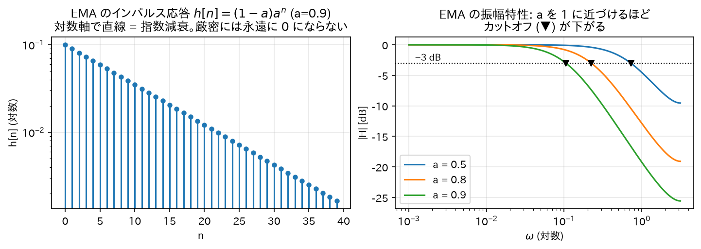
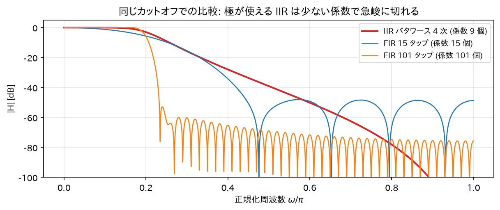
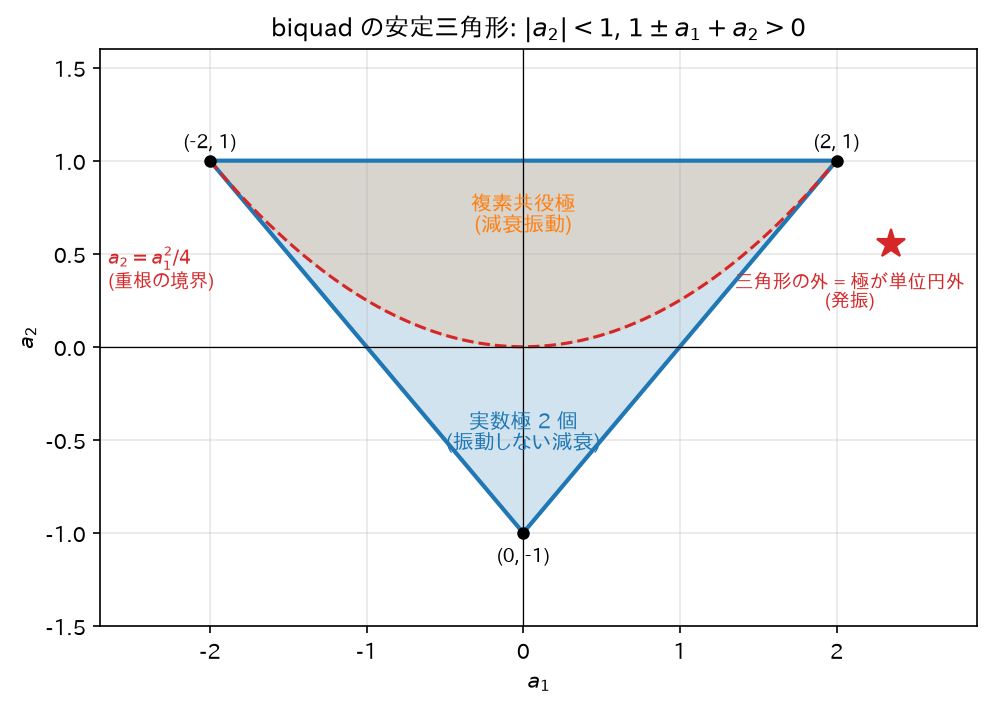

# 07. IIR フィルタの基礎【本丸】

これまでの道具（畳み込み、Z 変換、伝達関数、極零点、安定性）を使って IIR フィルタそのものを理解する。

## 1. FIR と IIR — 定義

デジタルフィルタはインパルス応答$`h[n]`$の長さで 2 種類に分類される:

| | FIR (Finite Impulse Response) | IIR (Infinite Impulse Response) |
|---|---|---|
| インパルス応答 | 有限長（いつか完全に 0 になる） | 無限長（無限に続く） |
| 差分方程式 |$`y[n] = \sum_{k=0}^{M} b_k x[n-k]`$|$`y[n] = \sum b_k x[n-k] - \sum a_k y[n-k]`$|
| フィードバック | なし | **あり**（過去の出力を再利用） |
| 伝達関数 | 多項式（極は原点のみ） | **有理関数（原点以外に極を持つ）** |
| 安定性 | 常に安定 | 極が単位円内のときのみ安定 |
| 位相 | 線形位相にできる | 厳密な線形位相は不可能 |
| 必要な次数 | 多い | **少ない（同じ仕様なら 1 桁少ないことも）** |

### 直感

- **FIR**: 「直近$`M+1`$個の入力を混ぜるだけ」。記憶は窓の長さぶんしかない。バケツリレー。
- **IIR**: 「自分の過去の出力を材料に再利用する」。一度入った信号の影響がフィードバックループを
  回り続けるので、**たった 1 発のインパルスの余韻が（減衰しながら）永遠に残る**。
  お風呂にコップ 1 杯の熱湯を入れたときの温度変化のように、影響は指数的に薄まるが厳密には消えない。

## 2. 最小の IIR: 1 次フィルタの完全解析

$$
y[n] = a y[n-1] + (1-a) x[n], \qquad 0 < a < 1
$$

これは実務で最も使われる**指数移動平均 (EMA: Exponential Moving Average)**。
「新しい入力を$`(1-a)`$だけ取り入れ、これまでの状態を$`a`$だけ保つ」平滑化フィルタである。

### 2.1 インパルス応答の導出（方法 1: 逐次代入）

$`x[n] = \delta[n]`$を入れ、初期条件$`y[-1] = 0`$（因果的・初期静止）で 1 ステップずつ計算する:

$$
\begin{aligned}
y[0] &= a y[-1] + (1-a)\delta[0] = 0 + (1-a) = (1-a)\\
y[1] &= a y[0] + (1-a)\delta[1] = a(1-a) + 0 = (1-a)a\\
y[2] &= a y[1] = (1-a)a^2\\
y[3] &= a y[2] = (1-a)a^3\\
&\vdots
\end{aligned}
$$

パターンより（帰納法:$`y[n] = (1-a)a^n`$を仮定すると$`y[n+1] = a \cdot (1-a)a^n = (1-a)a^{n+1}`$✓）:

$$
\boxed{h[n] = (1-a) a^n u[n]}
$$

**$`n`$がいくら大きくても$`h[n] = (1-a)a^n \neq 0`$。インパルス応答が無限に続く = IIR** の名の由来を、
最小の例で確認できた。

### 2.2 インパルス応答の導出（方法 2: Z 変換）

差分方程式を Z 変換（時間シフト性質$`y[n-1] \leftrightarrow z^{-1}Y(z)`$）:

$$
Y(z) = a z^{-1} Y(z) + (1-a) X(z)
$$

$$
Y(z)(1 - a z^{-1}) = (1-a) X(z)
\quad\Longrightarrow\quad
H(z) = \frac{Y(z)}{X(z)} = \frac{1-a}{1 - a z^{-1}}
$$

05 章の対$`a^n u[n] \leftrightarrow \frac{1}{1-az^{-1}}`$（ROC:$`|z|>|a|`$、因果的）より:

$$
h[n] = (1-a) a^n u[n]
$$

方法 1 と一致。∎ 極は$`z = a`$の 1 個。$`0 < a < 1`$なら単位円内 → 安定（06 章の定理どおり）。

### 2.3 周波数特性の導出

$`z = e^{j\omega}`$を代入:

$$
H(e^{j\omega}) = \frac{1-a}{1 - a e^{-j\omega}}
$$

振幅の 2 乗を計算する。分母の絶対値の 2 乗は:

$$
|1 - ae^{-j\omega}|^2 = (1 - ae^{-j\omega})(1 - ae^{j\omega})
= 1 - a(e^{j\omega} + e^{-j\omega}) + a^2 = 1 - 2a\cos\omega + a^2
$$

よって:

$$
|H(e^{j\omega})|^2 = \frac{(1-a)^2}{1 - 2a\cos\omega + a^2}
$$

**端点の値**:
- $`\omega = 0`$:$`|H|^2 = \dfrac{(1-a)^2}{1 - 2a + a^2} = \dfrac{(1-a)^2}{(1-a)^2} = 1`$→ **直流はそのまま通す**（ゲイン 1）
- $`\omega = \pi`$:$`|H|^2 = \dfrac{(1-a)^2}{1 + 2a + a^2} = \dfrac{(1-a)^2}{(1+a)^2}`$→ 高域は$`\left(\dfrac{1-a}{1+a}\right)^2`$倍に減衰

$`\cos\omega`$は$`\omega: 0 \to \pi`$で単調減少なので分母は単調増加、つまり$`|H|`$は**単調減少 = ローパスフィルタ**。

**カットオフ周波数（−3dB 点）の導出**:$`|H|^2 = \tfrac{1}{2}`$となる$`\omega_c`$を求める:

$$
\frac{(1-a)^2}{1 - 2a\cos\omega_c + a^2} = \frac{1}{2}
\Longrightarrow
2(1-a)^2 = 1 - 2a\cos\omega_c + a^2
$$

$$
\cos\omega_c = \frac{1 + a^2 - 2(1-a)^2}{2a} = \frac{1 + a^2 - 2 + 4a - 2a^2}{2a} = \frac{-a^2 + 4a - 1}{2a}
$$

$$
\boxed{\omega_c = \arccos\left(\frac{4a - a^2 - 1}{2a}\right)}
$$

例:$`a = 0.9`$→$`\cos\omega_c = \frac{3.6 - 0.81 - 1}{1.8} = \frac{1.79}{1.8} \approx 0.9944`$→$`\omega_c \approx 0.105`$rad/sample。
$`f_s = 48`$kHz なら$`f_c = \omega_c f_s / 2\pi \approx 805`$Hz。
**$`a`$を 1 に近づけるほど極$`z=a`$が単位円に近づき、カットオフが下がって平滑化が強くなる。**



*図: 左は$`h[n]`$が(対数軸で直線 = )指数減衰しつつ厳密には永遠に 0 にならないこと(IIR の名の由来)。右は導出した$`\omega_c`$の式どおり、$`a`$を上げるとカットオフ(▼)が下がっていく様子。*

### 2.4 位相特性と群遅延

$$
\angle H(e^{j\omega}) = \angle(1-a) - \angle(1 - ae^{-j\omega})
= -\arctan\left(\frac{a\sin\omega}{1 - a\cos\omega}\right)
$$

（$`1 - ae^{-j\omega} = (1 - a\cos\omega) + ja\sin\omega`$の偏角。分子は正の実数なので偏角 0。）

**群遅延**の定義は$`\tau_g(\omega) = -\dfrac{d\angle H}{d\omega}`$。「その周波数付近の波の**包絡線**が何サンプル遅れて出てくるか」を表す。

これが$`\omega`$に依存して変わる（= **非線形位相**）のが IIR の宿命で、
周波数によって遅延量が異なるため波形が崩れる。音声・オーディオでは問題にならないことが多いが、
波形の形が意味を持つ用途（計測、データ伝送、心電図など）では FIR の線形位相が好まれる。

## 3. なぜ IIR は低次数で済むのか(直感 + 図形的説明)

同じ「鋭い」ローパス特性を作るのに、FIR は 100 次以上、IIR は 4〜8 次で済むことがよくある。理由:

- **FIR の道具は零点だけ**。零点は特定の周波数を「谷」にすることしかできない。
  鋭い遮断を作るには大量の零点（= 高い次数 = 長い畳み込み）で通過域の外を敷き詰める必要がある。
- **IIR は極が使える**。極を単位円のすぐ内側、通過域の端に置くと、
  その周波数のゲインが距離の逆数$`\frac{1}{|e^{j\omega}-p|}`$で強烈に持ち上がる。
  少数の極で通過域の平坦さと遮断の鋭さを同時に「てこの原理」的に稼げる。

たとえるなら、FIR は「彫刻刀で削って形を作る」、IIR は「共振（増幅）も使って形を作る」。
共振という強力な道具の代償が、安定性への注意と位相の非線形性である。



*図: 同じカットオフのローパスを作った比較。IIR は係数 9 個(4 次)で、FIR の 15 タップよりはるかに急峻に切れる。FIR で肩を並べるには 100 タップ超が要る。*

## 4. biquad(双 2 次)セクション — IIR の実用単位

実際の IIR フィルタは、次の **2 次セクション (biquad)** を基本ブロックとして使う:

$$
H(z) = \frac{b_0 + b_1 z^{-1} + b_2 z^{-2}}{1 + a_1 z^{-1} + a_2 z^{-2}}
\quad\Longleftrightarrow\quad
y[n] = b_0 x[n] + b_1 x[n-1] + b_2 x[n-2] - a_1 y[n-1] - a_2 y[n-2]
$$

### なぜ 2 次を単位にするのか

実係数フィルタの極・零点は「実数」か「複素共役対」（06 章）。
複素共役対$`p, p^*`$をひとまとめにすると係数が実数の 2 次式になる:

$$
(1 - p z^{-1})(1 - p^* z^{-1}) = 1 - (p + p^*) z^{-1} + p p^* z^{-2}
= 1 - 2\mathrm{Re}(p) z^{-1} + |p|^2 z^{-2}
$$

（$`p + p^* = 2\mathrm{Re}(p)`$、$`p p^* = |p|^2`$はともに実数。）
つまり **2 次が「実数係数のまま複素極を 1 対持てる最小単位」**。
高次フィルタは biquad の縦続（カスケード）接続で作る（数値的理由は 09 章）。

### biquad の安定条件の導出（安定三角形）

分母$`D(z) = 1 + a_1 z^{-1} + a_2 z^{-2}`$の根（極）が両方$`|z| < 1`$にある条件を係数で表す。
$`z^2`$を掛けた$`z^2 + a_1 z + a_2 = 0`$の根を$`p_1, p_2`$とすると、根と係数の関係より:

$$
p_1 + p_2 = -a_1, \qquad p_1 p_2 = a_2
$$

**条件の導出**: 多項式$`P(z) = z^2 + a_1 z + a_2`$について、両根が単位円内にあるための必要十分条件は
次の 3 つである（2 次に対するジュリー安定判定）:

1. $`P(1) > 0`$:$`1 + a_1 + a_2 > 0`$
2. $`P(-1) > 0`$:$`1 - a_1 + a_2 > 0`$
3. $`|a_2| < 1`$

**導出**:
- (必要性) 両根が単位円内 ($`|p_1|, |p_2| < 1`$) なら:
  - $`|a_2| = |p_1 p_2| = |p_1||p_2| < 1`$→ 条件 3。
  - 実根の場合$`-1 < p_1, p_2 < 1`$なので$`z=1`$と$`z=-1`$は両根の外側にあり、
    上に凸でない 2 次関数$`P`$は区間$`(p_1, p_2)`$の外で正。よって$`P(1) > 0`$かつ$`P(-1) > 0`$→ 条件 1, 2。
  - 複素根の場合$`P(z) = (z - p)(z - p^*)`$で、実数$`t`$に対して$`P(t) = |t - p|^2 > 0`$。よって条件 1, 2 は自動的に成立。
- (十分性) 逆に 3 条件が成り立つとする。
  - 複素根なら$`|p_1|^2 = p_1 p_1^* = a_2 < 1`$（条件 3）より両根とも単位円内。
  - 実根なら$`P(1) > 0, P(-1) > 0`$より、根は区間$`(-1,1)`$の外に「またがって」いない
    （$`P`$は根の間でのみ負になるため、$`\pm 1`$がともに根の間に入らない）。
    可能性は (i) 両根とも$`(-1,1)`$内、(ii) 両根とも$`1`$より大、(iii) 両根とも$`-1`$より小、
    (iv) 片方が$`1`$より大かつ片方が$`-1`$より小。
    (ii)(iii) は$`|p_1 p_2| = |a_2| > 1`$となり条件 3 に矛盾。(iv) も$`|p_1 p_2| > 1`$で矛盾。よって (i)。∎

$`(a_1, a_2)`$平面でこの 3 条件が描く領域は三角形になるので**安定三角形**と呼ぶ:

```
   a₂
   1 ┌─────────────┐
     │＼    安定   ／│    頂点: (a₁,a₂) = (-2,1), (2,1), (0,-1)
     │  ＼領域 ／   │    境界線: a₂ = 1+a₁, a₂ = 1-a₁, a₂ = ±1... の内側
     │    ＼／      │
─────┼────────────── a₁
  -1 └───（0,-1）───┘
    -2       0      2
```

実装でフィルタ係数を動的に変える（例: シンセのフィルタスイープ）ときは、
係数がこの三角形から出ないことを保証する必要がある。



*図: 3 つの安定条件が$`(a_1, a_2)`$平面に描く三角形。放物線$`a_2 = a_1^2/4`$より上が複素共役極(減衰振動)、下が実数極 2 個。係数がこの外に出た瞬間、極が単位円の外に出て発振する。*

## 5. IIR の長所・短所まとめ

**長所**
- 同じ振幅特性なら FIR より圧倒的に低次数 → 計算量・メモリ・遅延が小さい
- アナログフィルタの蓄積された設計理論（バタワース等）をそのまま流用できる（08 章）
- 鋭い共振・急峻な遮断が少ない係数で作れる

**短所**
- 安定性の管理が必要（係数誤差・量子化で極が単位円外に出ると発振）
- 位相が非線形（波形が歪む）
- フィードバックがあるため量子化誤差が循環する（リミットサイクル等、09 章）
- 内部状態を持つため、係数変更時の過渡応答に注意が要る

→ 次: [08_IIRフィルタの設計法.md](08_IIRフィルタの設計法.md)
