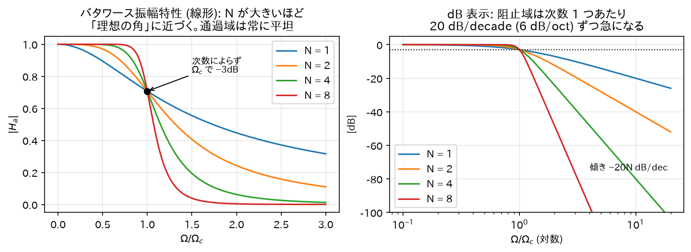
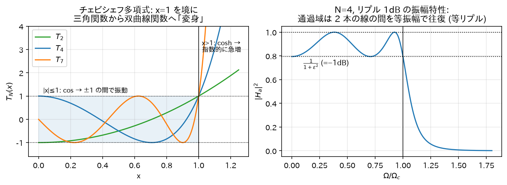
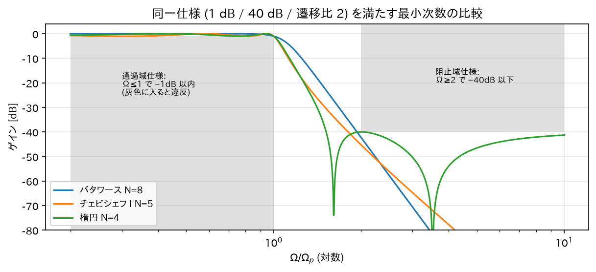
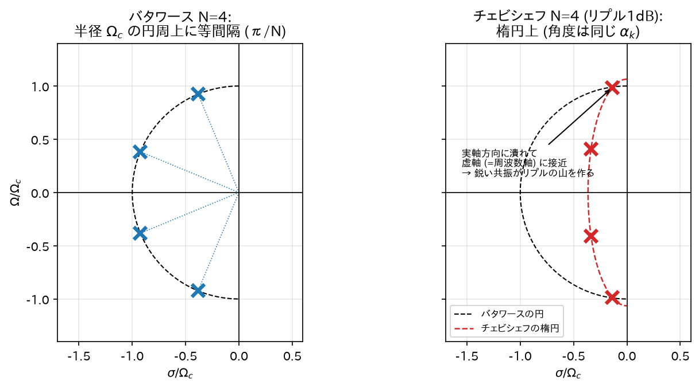
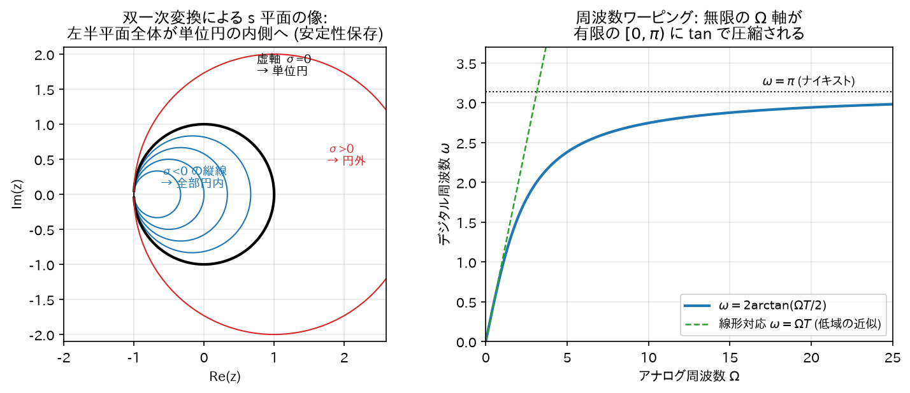
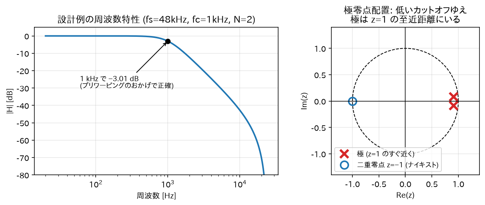
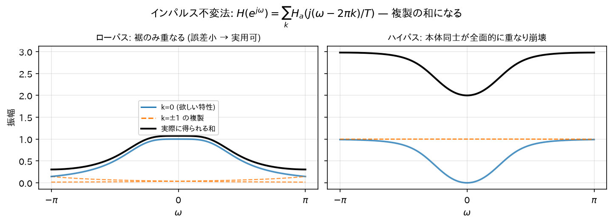

# 08. IIR フィルタの設計法

IIR 設計の王道は「**よくできたアナログフィルタを設計し、それをデジタルに変換する**」という 2 段構え。
アナログフィルタ理論には 100 年分の蓄積（バタワース、チェビシェフ、楕円）があり、それを丸ごと流用する。

```
仕様（カットオフ、通過域リプル、阻止域減衰量）
   ↓ ⓪次数 N の決定（§1.4, §2.4）
   ↓ ①アナログプロトタイプ設計（バタワース等）→ H_a(s)
   ↓ （必要なら）周波数変換で LPF → HPF/BPF（§6）
   ↓ ②s領域 → z領域 変換（双一次変換 or インパルス不変法）→ H(z)
デジタル IIR フィルタ（係数 a_k, b_k）
```

> **直感: なぜわざわざアナログ経由なのか。**
> 「デジタルフィルタが欲しいなら最初から z 領域で設計すればいい」と思うのが自然だが、
> z 領域で「この振幅特性に一番近い有理関数」を直接探すのは一般に非線形最適化になり、閉じた式では解けない。
> 一方アナログ側には「この意味で**最適**なフィルタはこれ」という**答えが公式として存在する**
> （バタワース = 最大平坦、チェビシェフ = 等リプル最急峻、楕円 = 両帯域等リプルで理論限界）。
> 「解けている問題に変換してから解く」のは数学の常套手段で、IIR 設計はその典型例。

## 0. 前提: ラプラス変換と s 平面（最小限）

アナログ側では Z 変換の連続時間版である**ラプラス変換**を使う:

$$
H_a(s) = \int_{-\infty}^{\infty} h_a(t)\, e^{-st}\, dt, \qquad s = \sigma + j\Omega
$$

- $s = j\Omega$（虚軸上）で評価するとフーリエ変換 = アナログの周波数特性。
  （Z 変換で単位円上が周波数特性だったのと並行的。）
- アナログの安定条件は「**極が左半平面（$\mathrm{Re}(s) < 0$）**」。
  理由: 極$s_0 = \sigma_0 + j\Omega_0$は時間応答$e^{s_0 t} = e^{\sigma_0 t}e^{j\Omega_0 t}$を生み、
  $\sigma_0 < 0$のときだけ$|e^{s_0 t}| = e^{\sigma_0 t} \to 0$と減衰するから。

| | アナログ (s 平面) | デジタル (z 平面) |
|---|---|---|
| 周波数特性を読む場所 | 虚軸$s = j\Omega$| 単位円$z = e^{j\omega}$|
| 安定領域（極の置き場） | 左半平面 | 単位円の内側 |

### (a) 基本対$e^{s_0 t}u(t) \leftrightarrow \dfrac{1}{s-s_0}$の導出

$$
X(s) = \int_0^\infty e^{s_0 t}\, e^{-st}\, dt = \int_0^\infty e^{(s_0 - s)t}\, dt
= \left[\frac{e^{(s_0-s)t}}{s_0 - s}\right]_0^\infty
$$

$\mathrm{Re}(s) > \mathrm{Re}(s_0)$のとき$|e^{(s_0-s)t}| = e^{\mathrm{Re}(s_0-s)t} \to 0$（$t\to\infty$）なので上端は 0:

$$
X(s) = \frac{0 - 1}{s_0 - s} = \frac{1}{s - s_0}, \qquad \text{ROC}: \mathrm{Re}(s) > \mathrm{Re}(s_0) \qquad\blacksquare
$$

### (b) 「$1/s$= 積分器」の導出

初期静止（$x(0)=0$、因果的）の信号に対し、微分のラプラス変換を部分積分で計算:

$$
\int_0^\infty x'(t)\, e^{-st}\, dt
= \Big[x(t)\, e^{-st}\Big]_0^\infty + s\int_0^\infty x(t)\, e^{-st}\, dt
= 0 + s X(s)
$$

（上端は ROC 内で$x(t)e^{-st}\to 0$、下端は$x(0)=0$で消える。）
つまり微分 ↔$s$倍。ゆえに$y(t) = \int_{-\infty}^t x\,d\tau$なら$y' = x$より$sY = X$、すなわち積分 ↔$\dfrac{1}{s}$倍。∎

### (c) 「安定 ⟺ 極が左半平面」の導出

因果的で有理な$H_a(s)$（単根とする）を部分分数展開（05 章のヘヴィサイド法と同一手順）すると、(a) の対から:

$$
h_a(t) = \sum_i A_i\, e^{s_i t}\, u(t), \qquad s_i = \sigma_i + j\Omega_i
$$

連続時間の BIBO 安定条件は$\int_0^\infty |h_a(t)|\,dt < \infty$（03 章の離散版と同じ論法: 和を積分に替えるだけ）。
$|e^{s_i t}| = e^{\sigma_i t}\,|e^{j\Omega_i t}| = e^{\sigma_i t}$に注意して:

$$
\int_0^\infty |h_a|\,dt \leq \sum_i |A_i| \int_0^\infty e^{\sigma_i t}\, dt,
\qquad
\int_0^\infty e^{\sigma t}\,dt = \left[\frac{e^{\sigma t}}{\sigma}\right]_0^\infty
= \begin{cases}-\dfrac{1}{\sigma} < \infty & (\sigma < 0)\\[4pt] \infty & (\sigma \geq 0)\end{cases}
$$

全極で$\sigma_i < 0$なら有限和で安定。逆にある$\sigma_1 \geq 0$なら$|h_a(t)|$が 0 に減衰せず発散（06 章の支配極の議論と同一）。∎

## 1. バタワースフィルタ

### 1.0 定義

$N$次バタワースローパスフィルタの振幅特性:

$$
|H_a(j\Omega)|^2 = \frac{1}{1 + \left(\dfrac{\Omega}{\Omega_c}\right)^{2N}}
$$

$\Omega_c$: カットオフ角周波数、$N$: 次数。

> **直感: この式の読み方。**
> 分母は「1 + (周波数比)の$2N$乗」。$\Omega \ll \Omega_c$では$(\Omega/\Omega_c)^{2N}$がほぼ 0 なので
> ゲインほぼ 1（素通し）、$\Omega \gg \Omega_c$では$2N$乗の項が爆発してゲインが潰れる（遮断）。
> 「$2N$乗」という高い冪がスイッチの役割を果たし、$N$が大きいほどスイッチの切り替わりが急になる。

### 1.1 性質の導出 1: カットオフでの値

$\Omega = \Omega_c$で$|H_a|^2 = \frac{1}{1+1} = \frac{1}{2}$、つまり$|H_a| = \frac{1}{\sqrt 2}$（**−3.01 dB**）。次数によらない。

### 1.2 性質の導出 2: 最大平坦性 (maximally flat)

$x = (\Omega/\Omega_c)^2$とおくと$|H_a|^2 = \frac{1}{1 + x^N}$。これを$x=0$の周りでテイラー展開する。
$|u| < 1$での等比級数$\frac{1}{1+u} = 1 - u + u^2 - \cdots$に$u = x^N$を代入:

$$
|H_a(j\Omega)|^2 = 1 - x^N + x^{2N} - \cdots = 1 - \left(\frac{\Omega}{\Omega_c}\right)^{2N} + \cdots
$$

$\Omega$に関する$1$次から$2N-1$次までの導関数が$\Omega = 0$ですべて 0
（展開に$\Omega^2, \Omega^4, \dots, \Omega^{2N-2}$の項が存在しないため）。

> **直感**: バタワースは「通過帯域を可能な限り平坦（リプルなし）にする」ことに全振りした設計。
> $N$次の自由度をすべて「$\Omega=0$での平坦さ」に注ぎ込んでいる、と読める（微係数を$2N-1$個も 0 にしている）。
> 音質・計測など「通過帯域を汚したくない」用途の第一候補。代償として遮断の鋭さはチェビシェフに劣る。

### 1.3 性質の導出 3: 高域での減衰傾度

$\Omega \gg \Omega_c$では$|H_a|^2 \approx (\Omega/\Omega_c)^{-2N}$、つまり$|H_a| \approx (\Omega/\Omega_c)^{-N}$。
デシベルでは

$$
20\log_{10}|H_a| \approx -20N \log_{10}\frac{\Omega}{\Omega_c}
$$

周波数が 10 倍になるごとに$-20N$dB。すなわち **$-20N$dB/decade（$-6N$dB/oct）**。次数 1 つで 6dB/oct 稼げる。



*図: §1.1〜1.3 の性質を一望したもの。どの次数でも$\Omega_c$で −3dB を通り(左)、通過域は平坦なまま、次数を上げるほど阻止域の傾きが 20N dB/dec ずつ急になる(右)。*

### 1.4 設計の核心: 仕様から次数 N を決める式の導出

実際の設計は「$N$を先に知っている」のではなく、**仕様から$N$を逆算する**ところから始まる。
仕様は普通、次の 4 つの数で与えられる:

- 通過域端$\Omega_p$で減衰$A_p$dB 以内（例: 1 dB）
- 阻止域端$\Omega_s$で減衰$A_s$dB 以上（例: 40 dB）

減衰量（dB）を定義通りに書くと:

$$
A(\Omega) = -20\log_{10}|H_a(j\Omega)| = -10\log_{10}|H_a(j\Omega)|^2
= 10\log_{10}\left[1 + \left(\frac{\Omega}{\Omega_c}\right)^{2N}\right]
$$

2 つの条件を不等式にする。$10^{x/10}$を両辺にとって整理すると:

$$
A(\Omega_p) \leq A_p
\;\Longleftrightarrow\;
\left(\frac{\Omega_p}{\Omega_c}\right)^{2N} \leq 10^{A_p/10} - 1,
\qquad
A(\Omega_s) \geq A_s
\;\Longleftrightarrow\;
\left(\frac{\Omega_s}{\Omega_c}\right)^{2N} \geq 10^{A_s/10} - 1
$$

未知数は$N$と$\Omega_c$の 2 つ。$\Omega_c$を消去するため、2 つ目の式を 1 つ目の式で辺々割る
（両辺とも正なので不等号の向きは保たれる）:

$$
\left(\frac{\Omega_s}{\Omega_p}\right)^{2N} \geq \frac{10^{A_s/10} - 1}{10^{A_p/10} - 1}
$$

両辺の$\log_{10}$をとって$N$について解く:

$$
\boxed{\;
N \geq \frac{\log_{10}\dfrac{10^{A_s/10} - 1}{10^{A_p/10} - 1}}{2\,\log_{10}\dfrac{\Omega_s}{\Omega_p}}
\;}
$$

これを満たす最小の整数を$N$とする。$N$が決まれば$\Omega_c$は 2 つの不等式のどちらか
（普通は通過域側を等号にして$\Omega_c = \Omega_p / (10^{A_p/10}-1)^{1/2N}$）から決める。

> **直感: この式は「必要な減衰量 ÷ 稼げる傾き」。**
> 分子は「通過域と阻止域でどれだけゲイン差が要るか」（要求の厳しさ）、
> 分母は「遷移帯域の幅が対数軸で何 decade あるか」（使える助走距離）。
> §1.3 で見たように次数 1 つあたり 20 dB/decade 稼げるので、
> 「必要 dB ÷（20 × 助走 decade 数）」でおおよその次数が出る、というのがこの式の中身。
> 遷移帯域を半分に狭めると（分母が減り）次数はほぼ倍になる — 急峻さは只ではない。

**数値例**:$A_p = 1$dB、$A_s = 40$dB、$\Omega_s/\Omega_p = 2$（1 オクターブで 40 dB 落とす）:

$$
N \geq \frac{\log_{10}\dfrac{10^4 - 1}{10^{0.1} - 1}}{2\log_{10}2}
= \frac{\log_{10}(9999/0.2589)}{0.6021}
= \frac{4.587}{0.6021} = 7.62
\;\Longrightarrow\; N = 8
$$

（この同じ仕様をチェビシェフで解くと$N=5$で済む。§2.4 で導出する。）

### 1.5 極の位置の導出

$|H_a(j\Omega)|^2 = H_a(s)H_a(-s)\big|_{s=j\Omega}$という関係を使う
（実係数なら$\overline{H_a(j\Omega)} = H_a(-j\Omega)$なので$|H_a(j\Omega)|^2 = H_a(j\Omega)H_a(-j\Omega)$、
これを$s = j\Omega \Leftrightarrow \Omega = s/j$で解析接続する）。
$\Omega^2 = (s/j)^2 = -s^2$より:

$$
H_a(s)\,H_a(-s) = \frac{1}{1 + \left(\dfrac{-s^2}{\Omega_c^2}\right)^{N}}
$$

極は分母 = 0、すなわち:

$$
\left(\frac{-s^2}{\Omega_c^2}\right)^{N} = -1
\quad\Longleftrightarrow\quad
s^{2N} = (-1)^{N+1}\, \Omega_c^{2N}
$$

右辺を極形式で書く。$(-1)^{N+1} = e^{j\pi(N+1)}$であり、$1 = e^{j2\pi k}$（$k$整数）を掛けられるので:

$$
s^{2N} = \Omega_c^{2N}\, e^{j\pi(N + 1 + 2k)}
$$

$2N$乗根をとる:

$$
s_k = \Omega_c\, \exp\!\left(j\pi\, \frac{N + 1 + 2k}{2N}\right), \qquad k = 0, 1, \dots, 2N-1
$$

**極は半径$\Omega_c$の円周上に等間隔（角度間隔$\pi/N$）に並ぶ**。
このうち左半平面にある$N$個（$\mathrm{Re}(s_k) < 0$のもの）を$H_a(s)$に採用する
（安定なフィルタにするため。残り$N$個は$H_a(-s)$側の極）。

> **直感: なぜ円に並ぶのか。**
> 極の条件は結局$s^{2N} = (\text{定数})$という「$2N$乗根」の方程式であり、
> 複素数の$n$乗根は常に円周上に等間隔に並ぶ（02 章）。
> 「振幅特性が単純な冪$1/(1+x^N)$」という平坦さ最優先の選択が、
> 極配置の美しい対称性としてそのまま現れている。

**具体例$N=2$の導出**:$k = 0,1,2,3$で角度は$\pi\frac{3}{4}, \pi\frac{5}{4}, \pi\frac{7}{4}, \pi\frac{9}{4}$。
左半平面（角度が$\pi/2$〜$3\pi/2$）にあるのは$\frac{3\pi}{4}$と$\frac{5\pi}{4}$:

$$
s_{1,2} = \Omega_c\, e^{j3\pi/4},\; \Omega_c\, e^{j5\pi/4} = \Omega_c\left(-\frac{1}{\sqrt2} \pm j\frac{1}{\sqrt2}\right)
$$

伝達関数を組み立てる（分子は直流ゲイン 1 になるよう$\Omega_c^2$）:

$$
H_a(s) = \frac{\Omega_c^2}{(s - s_1)(s - s_2)}
= \frac{\Omega_c^2}{s^2 - (s_1 + s_2)s + s_1 s_2}
$$

$s_1 + s_2 = -\sqrt{2}\,\Omega_c$、$s_1 s_2 = \Omega_c^2 e^{j(3\pi/4 + 5\pi/4)} = \Omega_c^2 e^{j2\pi} = \Omega_c^2$より:

$$
\boxed{\;H_a(s) = \frac{\Omega_c^2}{s^2 + \sqrt{2}\,\Omega_c\, s + \Omega_c^2}\;}
$$

これが 2 次バタワースの標準形（後の設計例で使う）。

## 2. チェビシェフフィルタ

### 2.0 定義

**チェビシェフ I 型**:

$$
|H_a(j\Omega)|^2 = \frac{1}{1 + \varepsilon^2\, T_N^2\!\left(\dfrac{\Omega}{\Omega_c}\right)}
$$

$\varepsilon$: リプルの大きさを決めるパラメータ、$T_N$: **チェビシェフ多項式**
（$T_N(\cos\phi) = \cos(N\phi)$で定義される）。

バタワースとの違いは、分母の$(\Omega/\Omega_c)^{2N}$（単調増加の冪）が
$\varepsilon^2 T_N^2(\Omega/\Omega_c)$（通過域で振動する多項式）に置き換わった点だけである。
この置き換えの意味を、以下で式から丁寧に読み取っていく。

### 2.1 チェビシェフ多項式 — 漸化式の導出

「$\cos(N\phi)$は$\cos\phi$の多項式で書ける」ことをまず確認する。加法定理より:

$$
\cos((N+1)\phi) + \cos((N-1)\phi) = 2\cos(N\phi)\cos\phi
$$

（右辺の展開:$\cos(N\phi \pm \phi) = \cos N\phi \cos\phi \mp \sin N\phi \sin\phi$を足すと$\sin$の項が消える。）
$x = \cos\phi$とおけば:

$$
T_{N+1}(x) = 2x\, T_N(x) - T_{N-1}(x), \qquad T_0(x) = 1,\; T_1(x) = x
$$

例:$T_2(x) = 2x^2 - 1$、$T_3(x) = 4x^3 - 3x$。
漸化式で毎回$2x$が掛かるので、**最高次係数は$2^{N-1}$**（$T_N(x) = 2^{N-1}x^N + \cdots$）。
この$2^{N-1}$が後で「同じ次数でバタワースより減衰が稼げる」理由として効いてくる（§2.3）。

### 2.2 性質の導出 1: 通過域が「等リプル」になる仕組み

通過域$0 \leq \Omega \leq \Omega_c$では$x = \Omega/\Omega_c \in [0, 1]$。
このとき$\phi = \arccos x$が実数なので:

$$
T_N(x) = \cos(N \arccos x)
$$

は$\cos$そのもの、つまり**必ず$-1$と$+1$の間を往復する**。
$x$が 1 から 0 へ動く間に$N\arccos x$は$0$から$N\pi/2$まで動くので、$T_N$は通過域内で
何度も$\pm 1$に触れながら振動する。したがって:

$$
0 \leq T_N^2 \leq 1
\quad\Longrightarrow\quad
\frac{1}{1+\varepsilon^2} \leq |H_a(j\Omega)|^2 \leq 1
$$

- $T_N = 0$の瞬間: ゲイン最大値 1（0 dB）
- $T_N = \pm 1$の瞬間: ゲイン最小値$\frac{1}{1+\varepsilon^2}$

つまり通過域のゲインは**上下 2 本の水平線の間で正確に等振幅で振動する**（等リプル: equiripple）。
リプルの深さを dB で書くと:

$$
A_p = 10\log_{10}(1 + \varepsilon^2)
\quad\Longleftrightarrow\quad
\boxed{\;\varepsilon = \sqrt{10^{A_p/10} - 1}\;}
$$

これが設計時の$\varepsilon$の決め方: **許せるリプル量（dB）を決めれば$\varepsilon$が一意に決まる**。
例:$A_p = 1$dB なら$\varepsilon = \sqrt{10^{0.1}-1} = 0.5088$。

> **直感: なぜ「わざと波打たせる」と得なのか。**
> バタワースは通過域の誤差（1 からのズレ）を$\Omega = 0$の 1 点に押し込めて極端に小さくし、
> 帯域端に向かって誤差が単調に増えるに任せる。「1 点だけ完璧、端はだんだん悪い」配分。
> チェビシェフは同じ誤差予算を**通過域全体に均等にばら撒く**。「どこも同じだけ少し悪い」配分。
> 誤差の最大値を抑えるという意味では均等配分が最適（ミニマックス近似）であり、
> 浮いた自由度がそのまま帯域端での切れ味に回る。
> 「一夜漬けで 1 科目 100 点を狙うより、全科目 80 点を狙う方が合計は伸びる」配分の話である。

### 2.3 性質の導出 2: 阻止域では cosh になって急増する

阻止域$\Omega > \Omega_c$、つまり$x > 1$では$\arccos x$が実数でなくなる。代わりに
$x = \cosh u$（$u = \mathrm{arccosh}\,x > 0$）とおくと:

$$
T_N(\cosh u) = \cosh(N u)
$$

が成り立つ。**導出**: 双曲線関数の加法定理から

$$
\cosh((N+1)u) + \cosh((N-1)u) = 2\cosh(Nu)\cosh u
$$

（$\cosh(Nu \pm u) = \cosh Nu \cosh u \pm \sinh Nu \sinh u$を足すと$\sinh$の項が消える。）
これは §2.1 の漸化式と**同じ漸化式**であり、初期値も$\cosh(0)=1=T_0(\cosh u)$、
$\cosh(u)=T_1(\cosh u)$で一致する。同じ漸化式・同じ初期値なら全$N$で一致する（帰納法）。∎

$\cosh(Nu) = \frac{e^{Nu}+e^{-Nu}}{2}$は$u$に対して**指数的に**増える。$x \gg 1$では
$\mathrm{arccosh}\,x = \ln(x + \sqrt{x^2-1}) \approx \ln 2x$を使って:

$$
T_N(x) \approx \frac{1}{2}e^{N\ln 2x} = \frac{(2x)^N}{2} = 2^{N-1}x^N
$$

（§2.1 の最高次係数と一致。検算 ✓）。したがって阻止域の遠方では:

$$
|H_a|^2 \approx \frac{1}{\varepsilon^2\, 2^{2(N-1)}\, x^{2N}}
$$

バタワースの$1/x^{2N}$と比べると、**同じ次数・同じ傾き（−20N dB/dec）だが、
$2^{2(N-1)}$倍 = 約$6(N-1)$dB だけ余分に減衰している**。

> **直感**: 通過域は$\cos$（有界・振動）、阻止域は$\cosh$（指数爆発）——
> **同じ 1 本の式が、$x=1$を境に三角関数から双曲線関数へ「変身」する**のがチェビシェフの仕掛け。
> 通過域では暴れを$\pm1$に閉じ込めて等リプルを作り、境界を越えた瞬間に指数関数の馬力で叩き落とす。
> $6(N-1)$dB のボーナスは「リプルを許した見返り」の定量的な正体である。



*図: 左は$T_N(x)$の「変身」—$x \leq 1$(青帯)では$\pm 1$の間を振動し、$x=1$を越えた瞬間に指数的に急増する。右はその結果できる振幅特性 — 通過域は 1 と$\frac{1}{1+\varepsilon^2}$の 2 本の線の間を正確に等振幅で往復する(§2.2 の導出どおり)。*

### 2.4 設計の核心: 仕様から次数 N を決める式の導出

$\Omega_c = \Omega_p$（通過域端をリプル帯の端に一致させる）とし、§1.4 と同じ仕様
（$\Omega_p$で$A_p$dB 以内、$\Omega_s$で$A_s$dB 以上）を課す。

通過域条件は §2.2 の通り$\varepsilon = \sqrt{10^{A_p/10}-1}$で消化済み。阻止域条件は:

$$
10\log_{10}\left[1 + \varepsilon^2 T_N^2\!\left(\frac{\Omega_s}{\Omega_p}\right)\right] \geq A_s
\quad\Longleftrightarrow\quad
T_N\!\left(\frac{\Omega_s}{\Omega_p}\right) \geq \frac{\sqrt{10^{A_s/10}-1}}{\varepsilon}
$$

$\Omega_s/\Omega_p > 1$なので §2.3 の cosh 表現$T_N(x) = \cosh(N\,\mathrm{arccosh}\,x)$を使い、
両辺の$\mathrm{arccosh}$をとって（$\cosh$は$u>0$で単調増加なので不等号保存）:

$$
\boxed{\;
N \geq \frac{\mathrm{arccosh}\sqrt{\dfrac{10^{A_s/10}-1}{10^{A_p/10}-1}}}{\mathrm{arccosh}\dfrac{\Omega_s}{\Omega_p}}
\;}
$$

**数値例**（§1.4 と同一仕様:$A_p=1$dB,$A_s=40$dB,$\Omega_s/\Omega_p = 2$）:

$$
N \geq \frac{\mathrm{arccosh}\sqrt{9999/0.2589}}{\mathrm{arccosh}\,2}
= \frac{\mathrm{arccosh}(196.5)}{1.317}
= \frac{5.974}{1.317} = 4.54
\;\Longrightarrow\; N = 5
$$

同じ仕様でバタワースは$N=8$だった。**次数 8 → 5、biquad 換算で 4 段 → 2.5 段**。
乗算回数・メモリ・レイテンシがそのまま 4 割減る——これがリプルを許す実利である。

> **直感: なぜ式の形が「log の比」から「arccosh の比」に変わったのか。**
> バタワース（§1.4）では減衰が冪$x^N$で増えるので、対数をとると$N$が線形に出てきて log の比になった。
> チェビシェフでは減衰が$\cosh(N\,\mathrm{arccosh}\,x)$で増えるので、逆関数 arccosh をとると
> $N$が取り出せて arccosh の比になる。**式の形の違いは「減衰の増え方が冪か指数か」の違いをそのまま映している。**



*図: §1.4・§2.4 の数値例をそのまま描いたもの。灰色が仕様違反ゾーン。同じ仕様(1 dB / 40 dB / 遷移比 2)をバタワースは N=8、チェビシェフ I は N=5、楕円なら N=4 でクリアする。リプルを許すほど(誤差予算を均等配分するほど)次数が下がる。*

### 2.5 極の位置の完全導出 — 極は楕円に並ぶ

バタワース（§1.5）と同じ道具立てで、$H_a(s)H_a(-s)$の極を求める。分母 = 0 は:

$$
1 + \varepsilon^2 T_N^2\!\left(\frac{s}{j\Omega_c}\right) = 0
\quad\Longleftrightarrow\quad
T_N\!\left(\frac{s}{j\Omega_c}\right) = \pm\frac{j}{\varepsilon}
$$

**ステップ 1: 複素角の導入。**$v = s/(j\Omega_c)$とおき、$v = \cos\theta$を満たす複素数
$\theta = \alpha + j\beta$（$\alpha, \beta$実数）を探す。このとき定義より$T_N(v) = \cos(N\theta)$。
複素引数の$\cos$を実部・虚部に分解する（加法定理 +$\cos(j\beta)=\cosh\beta$,$\sin(j\beta)=j\sinh\beta$、02 章）:

$$
\cos(N\alpha + jN\beta) = \cos(N\alpha)\cosh(N\beta) - j\,\sin(N\alpha)\sinh(N\beta)
$$

**ステップ 2: 実部と虚部の連立。** これが純虚数$\pm j/\varepsilon$に等しいので:

$$
\text{実部:}\quad \cos(N\alpha)\cosh(N\beta) = 0,
\qquad
\text{虚部:}\quad -\sin(N\alpha)\sinh(N\beta) = \pm\frac{1}{\varepsilon}
$$

$\cosh \geq 1 > 0$なので実部の条件は$\cos(N\alpha) = 0$、すなわち:

$$
\alpha_k = \frac{(2k+1)\pi}{2N}, \qquad k = 0, 1, \dots
$$

このとき$\sin(N\alpha_k) = \pm 1$なので、虚部の条件は$\sinh(N\beta) = \pm\frac{1}{\varepsilon}$、すなわち:

$$
\beta = \pm\beta_0, \qquad \beta_0 \equiv \frac{1}{N}\,\mathrm{arcsinh}\frac{1}{\varepsilon}
$$

**ステップ 3: s に戻す。**$s = j\Omega_c \cos(\alpha_k + j\beta)$を展開する:

$$
s = j\Omega_c\left[\cos\alpha_k \cosh\beta - j\sin\alpha_k \sinh\beta\right]
= \Omega_c \sin\alpha_k \sinh\beta + j\,\Omega_c \cos\alpha_k \cosh\beta
$$

安定側（実部 < 0）を選ぶ。$k = 0,\dots,N-1$で$\alpha_k \in (0,\pi)$だから$\sin\alpha_k > 0$であり、
$\beta = -\beta_0$を採れば実部が負になる。よって左半平面の$N$個の極は:

$$
\boxed{\;
s_k = -\Omega_c \sinh\beta_0\, \sin\alpha_k \;+\; j\,\Omega_c \cosh\beta_0\, \cos\alpha_k,
\qquad \alpha_k = \frac{(2k+1)\pi}{2N},\quad k = 0,\dots,N-1
\;}
$$

**ステップ 4: 軌跡の同定。**$\sigma_k = \mathrm{Re}(s_k)$,$\Omega_k = \mathrm{Im}(s_k)$とおくと:

$$
\left(\frac{\sigma_k}{\Omega_c \sinh\beta_0}\right)^2 + \left(\frac{\Omega_k}{\Omega_c \cosh\beta_0}\right)^2
= \sin^2\alpha_k + \cos^2\alpha_k = 1
$$

**極は、実軸方向の半径$\Omega_c\sinh\beta_0$・虚軸方向の半径$\Omega_c\cosh\beta_0$の楕円上に並ぶ**。∎

> **直感: 「円を虚軸に向かって押し潰した」のがチェビシェフ。**
> $\sinh\beta_0 < \cosh\beta_0$なので、楕円は必ず**横（実軸方向）に潰れている**。
> つまりチェビシェフの極はバタワースの円配置に比べて**虚軸（= 周波数軸）のすぐ近く**に置かれる。
> 06 章で見たとおり、極が周波数軸に近いほどその周波数で鋭いピークを作る——
> 通過域の各リプルの山は、すぐそばに置かれた極 1 個ずつが持ち上げているのである。
> 「切れ味を買うために極を危険な崖っぷち（虚軸ギリギリ）に寄せた」設計と読める。
>
> 整合性チェック: リプルを小さくする（$\varepsilon \to 0$）と$\beta_0 = \frac{1}{N}\mathrm{arcsinh}\frac{1}{\varepsilon} \to \infty$となり
> $\sinh\beta_0 \approx \cosh\beta_0$、つまり**楕円は円に近づき、バタワース的な配置に戻る**。
> 「リプル 0 のチェビシェフ ≒ バタワース」という直感が極配置のレベルでも成り立っている。



*図: N=4 での極配置の比較。バタワース(左)は半径$\Omega_c$の円周上に等間隔。チェビシェフ(右)は同じ角度$\alpha_k$のまま実軸方向に押し潰され、虚軸(=周波数軸)ギリギリに寄る — この「崖っぷちの極」がリプルの山と鋭い遮断を作る。*

### 2.6 参考: チェビシェフ II 型と楕円フィルタ

- **II 型（逆チェビシェフ）**: リプルを阻止域側に移した変種（通過域は単調・平坦）。
  $|H|^2 = \dfrac{\varepsilon^2 T_N^2(\Omega_s/\Omega)}{1 + \varepsilon^2 T_N^2(\Omega_s/\Omega)}$の形で、阻止域に伝達零点を持つ。
- **楕円（Cauer）フィルタ**: 通過域・阻止域の**両方**を等リプルにしたもの。
  ミニマックス近似を両帯域に適用した理論的最急峻で、同一仕様なら最小次数。
  導出には楕円関数（ヤコビの sn 関数）が要るため本章では割愛するが、
  「誤差予算を両帯域に均等配分し切った極限」という位置づけだけ押さえておけばよい。

## 3. 双一次変換 (bilinear transform) — s から z への橋

### 3.1 導出（台形積分による）

積分器$y(t) = \int x(t)\,dt$、すなわち$H_a(s) = \dfrac{1}{s}$をデジタルで近似することを考える
（任意のアナログ伝達関数は積分器の組み合わせで書けるので、積分器の対応を決めればすべて決まる）。

時刻$t = nT$と$t = (n-1)T$の間の積分を**台形則**で近似する:

$$
y(nT) = y((n-1)T) + \int_{(n-1)T}^{nT} x(t)\, dt
\approx y((n-1)T) + \frac{T}{2}\left[x(nT) + x((n-1)T)\right]
$$

（台形則: 区間幅 × 両端の平均高さ。）離散信号として書き直す:

$$
y[n] = y[n-1] + \frac{T}{2}\left(x[n] + x[n-1]\right)
$$

Z 変換する:

$$
Y(z) = z^{-1}Y(z) + \frac{T}{2}\left(X(z) + z^{-1}X(z)\right)
$$

$$
Y(z)\,(1 - z^{-1}) = \frac{T}{2}(1 + z^{-1})\, X(z)
\quad\Longrightarrow\quad
\frac{Y(z)}{X(z)} = \frac{T}{2}\cdot\frac{1 + z^{-1}}{1 - z^{-1}}
$$

これがアナログ積分器$\frac{1}{s}$のデジタル版。よって対応関係は:

$$
\frac{1}{s} \;\longleftrightarrow\; \frac{T}{2}\cdot\frac{1+z^{-1}}{1-z^{-1}}
\quad\Longleftrightarrow\quad
\boxed{\;s = \frac{2}{T}\cdot\frac{1 - z^{-1}}{1 + z^{-1}}\;}
$$

デジタルフィルタは$H(z) = H_a(s)\big|_{s = \frac{2}{T}\frac{1-z^{-1}}{1+z^{-1}}}$で得られる。

> **直感**: 「アナログ回路のすべての積分器を、台形則のデジタル積分器に総取っ替えする」のが双一次変換。
> 台形則は「両端の平均」を使うので前進・後退オイラー法より対称性がよく、
> この対称性が次に示す「安定性の完全保存」という強い性質の源になっている。

### 3.2 性質の導出 1: 安定性が保存される

$s = \sigma + j\Omega$に対応する$z$を求める。上式を$z$について解く:

$$
s\frac{T}{2}(1 + z^{-1}) = 1 - z^{-1}
\;\Longrightarrow\;
z^{-1}\left(1 + s\frac{T}{2}\right) = 1 - s\frac{T}{2}
\;\Longrightarrow\;
z = \frac{1 + sT/2}{1 - sT/2}
$$

絶対値を評価する。$s = \sigma + j\Omega$を代入:

$$
|z|^2 = \frac{|1 + \sigma T/2 + j\Omega T/2|^2}{|1 - \sigma T/2 - j\Omega T/2|^2}
= \frac{(1 + \sigma T/2)^2 + (\Omega T/2)^2}{(1 - \sigma T/2)^2 + (\Omega T/2)^2}
$$

分子と分母の差は:

$$
(1 + \sigma T/2)^2 - (1 - \sigma T/2)^2 = 4 \cdot \frac{\sigma T}{2} = 2\sigma T
$$

よって:
- $\sigma < 0$（左半平面）⇒ 分子 < 分母 ⇒$|z| < 1$（単位円内）
- $\sigma = 0$（虚軸）⇒$|z| = 1$（単位円上）
- $\sigma > 0$⇒$|z| > 1$

> **左半平面全体が単位円の内側にきれいに写る。したがって安定なアナログフィルタを双一次変換すると
> 必ず安定なデジタルフィルタになる。** これが双一次変換が標準になっている最大の理由。∎

### 3.3 性質の導出 2: 周波数の対応（ワーピング）

アナログの周波数軸$s = j\Omega$がデジタルの周波数軸$z = e^{j\omega}$のどこに写るかを計算する。
$z = e^{j\omega}$を代入:

$$
s = \frac{2}{T}\cdot\frac{1 - e^{-j\omega}}{1 + e^{-j\omega}}
$$

分子・分母から$e^{-j\omega/2}$を括り出す:

$$
= \frac{2}{T}\cdot\frac{e^{-j\omega/2}\left(e^{j\omega/2} - e^{-j\omega/2}\right)}{e^{-j\omega/2}\left(e^{j\omega/2} + e^{-j\omega/2}\right)}
= \frac{2}{T}\cdot\frac{2j\sin(\omega/2)}{2\cos(\omega/2)}
= j\,\frac{2}{T}\tan\frac{\omega}{2}
$$

（02 章の$\sin\theta = \frac{e^{j\theta}-e^{-j\theta}}{2j}$、$\cos\theta = \frac{e^{j\theta}+e^{-j\theta}}{2}$を使用。）
$s = j\Omega$と比較して:

$$
\boxed{\;\Omega = \frac{2}{T}\tan\frac{\omega}{2}\;}
\qquad\Longleftrightarrow\qquad
\omega = 2\arctan\frac{\Omega T}{2}
$$

### 3.4 直感: 無限を有限に折り畳む

アナログの周波数軸は$0 \to \infty$の無限長。デジタルの周波数軸は$0 \to \pi$の有限長。
双一次変換は$\tan$を使って**無限の軸を有限区間に非線形に圧縮**する:

- 低域 ($\omega \ll 1$):$\tan(\omega/2) \approx \omega/2$より$\Omega \approx \omega / T$— ほぼ線形（歪みなし）
- 高域:$\omega \to \pi$で$\Omega \to \infty$— アナログの無限遠が$\omega = \pi$に圧縮される

この非線形圧縮を**周波数ワーピング**と呼ぶ。エイリアシングは発生しない（軸の折り返しではなく圧縮だから）が、
指定したカットオフが意図とズレるという副作用がある。

> **たとえ**: 無限に長い定規を有限の紙に描くために、遠くへ行くほど目盛りを詰めて描くようなもの。
> 手元（低域）の目盛りはほぼ等間隔で正確、遠く（高域）ほど目盛りが密集して「縮尺が狂う」。
> 縮尺の狂い方は$\tan$で厳密にわかっているので、次のプリワーピングで完全に補正できる。



*図: 左は §3.2 の導出の可視化 — s 平面の縦線($\sigma$一定の線)が z 平面の円に写り、左半平面($\sigma<0$)の線はすべて単位円の内側に収まる。虚軸(黒)がちょうど単位円になる。右は §3.3 のワーピング曲線 — 低域では線形対応(緑)とほぼ一致し、高域は$\omega=\pi$に向かって圧縮される。*

### 3.5 プリワーピング（ズレの補正）

デジタルでカットオフ$\omega_c$を実現したければ、アナログプロトタイプのカットオフを最初から

$$
\Omega_c = \frac{2}{T}\tan\frac{\omega_c}{2}
$$

に「ずらして」設計しておけば、変換後にちょうど$\omega_c$に着地する。これを**プリワーピング**という。
（ワーピングで曲がる分をあらかじめ逆向きに曲げておく、という素直な発想。
カットオフ以外にも「正確に合わせたい周波数」——バンドパスの両端など——があれば、その各点をプリワープする。）

## 4. 設計例: 2 次バタワース・デジタルローパスの完全導出

**仕様**:$f_s = 48$kHz、カットオフ$f_c = 1$kHz →$\omega_c = 2\pi f_c / f_s = 2\pi/48 \approx 0.13090$rad/sample

（次数はここでは$N = 2$と与える。阻止域仕様から決める場合は §1.4 の式を使い、
プリワープ後の周波数比$\tan(\omega_s/2)/\tan(\omega_p/2)$を$\Omega_s/\Omega_p$として代入する。）

**ステップ 1: プリワーピング**

$$
\Omega_c = \frac{2}{T}\tan\frac{\omega_c}{2}
$$

（以後の式では比の形にまとまるので$T$は消える。数値では
$\tan(\omega_c/2) = \tan(0.06545) \approx 0.065544$。）

**ステップ 2: アナログプロトタイプ**（§1.5 で導出済みの 2 次バタワース）

$$
H_a(s) = \frac{\Omega_c^2}{s^2 + \sqrt{2}\,\Omega_c s + \Omega_c^2}
$$

**ステップ 3: 双一次変換を代入**

$s = \frac{2}{T}\frac{1-z^{-1}}{1+z^{-1}}$を代入し、記号を軽くするため

$$
\lambda \equiv \tan\frac{\omega_c}{2} \quad\left(\text{つまり } \Omega_c = \frac{2}{T}\lambda\right)
$$

とおく。分子・分母を$\left(\frac{2}{T}\right)^2 (1+z^{-1})^2$で通分すると$\frac{2}{T}$が全部約分されて:

$$
H(z) = \frac{\lambda^2 (1+z^{-1})^2}{(1-z^{-1})^2 + \sqrt{2}\,\lambda\,(1-z^{-1})(1+z^{-1}) + \lambda^2 (1+z^{-1})^2}
$$

各項を展開する:

- $(1+z^{-1})^2 = 1 + 2z^{-1} + z^{-2}$
- $(1-z^{-1})^2 = 1 - 2z^{-1} + z^{-2}$
- $(1-z^{-1})(1+z^{-1}) = 1 - z^{-2}$

分母$= (1 - 2z^{-1} + z^{-2}) + \sqrt2\lambda(1 - z^{-2}) + \lambda^2(1 + 2z^{-1} + z^{-2})$

$z^{-1}$の次数ごとに整理:

$$
\begin{aligned}
z^0:&\quad 1 + \sqrt2\lambda + \lambda^2\\
z^{-1}:&\quad -2 + 2\lambda^2 = 2(\lambda^2 - 1)\\
z^{-2}:&\quad 1 - \sqrt2\lambda + \lambda^2
\end{aligned}
$$

先頭係数$D \equiv 1 + \sqrt2\lambda + \lambda^2$で全体を割って標準形（分母先頭 1）にする:

$$
\boxed{\;
H(z) = \frac{b_0 + b_1 z^{-1} + b_2 z^{-2}}{1 + a_1 z^{-1} + a_2 z^{-2}},\qquad
\begin{aligned}
b_0 &= b_2 = \frac{\lambda^2}{D}, \quad b_1 = \frac{2\lambda^2}{D}\\
a_1 &= \frac{2(\lambda^2 - 1)}{D}, \quad a_2 = \frac{1 - \sqrt2\lambda + \lambda^2}{D}
\end{aligned}\;}
$$

**ステップ 4: 数値を入れる** ($\lambda = 0.065544$,$\lambda^2 = 0.0042960$,$\sqrt2\lambda = 0.092694$,$D = 1.096990$)

$$
b_0 = b_2 = 0.0039162,\quad b_1 = 0.0078324,\quad
a_1 = -1.815341,\quad a_2 = 0.831006
$$

**検算 1（直流ゲイン）**:$H(1) = \frac{b_0+b_1+b_2}{1+a_1+a_2} = \frac{0.0156648}{0.015665} \approx 1.0$✓（ローパスは直流を素通し）

**検算 2（安定性、07 章の安定三角形）**:$|a_2| = 0.831 < 1$✓、$1 + a_1 + a_2 = 0.0157 > 0$✓、$1 - a_1 + a_2 = 3.646 > 0$✓ → 安定

**検算 3（零点）**: 分子$\propto (1+z^{-1})^2$→ 二重零点が$z = -1$（$\omega = \pi$= ナイキスト周波数）。
双一次変換がアナログの「$\Omega = \infty$でゲイン 0」を$\omega = \pi$に写した結果であり、ローパスとして理にかなっている。



*図: 上で求めた係数をそのまま描いたもの。左: プリワーピングの効果で 1 kHz ちょうどで −3.01 dB を通過する。右: 検算 3 の二重零点$z=-1$と、低いカットオフ($f_c \ll f_s$)ゆえ$z=1$の至近に寄った共役極対(09 章の数値的注意につながる)。*

このように**双一次変換は最終的に「係数の計算式」に落ちる**。世の中のオーディオ EQ の
「biquad cookbook」係数式（Robert Bristow-Johnson の Audio EQ Cookbook が有名)は、
すべてこの手順を各フィルタタイプについて実行した結果である。

## 5. もう一つの変換: インパルス不変法（参考）

**発想**: アナログフィルタのインパルス応答をそのままサンプリングする:

$$
h[n] = T\, h_a(nT)
$$

### 5.1 極の写り方の導出

アナログの 1 極$H_a(s) = \frac{A}{s - s_0}$のインパルス応答は
$h_a(t) = A e^{s_0 t} u(t)$（§0(a) のラプラス対）。サンプリングすると:

$$
h[n] = T A\, e^{s_0 T n}\, u[n] = TA\, (e^{s_0 T})^n\, u[n]
$$

これは公比$e^{s_0 T}$の指数列なので、Z 変換は（05 章の基本対より）:

$$
H(z) = \frac{TA}{1 - e^{s_0 T} z^{-1}}
$$

つまり**極は$z = e^{s_0 T}$に写る**。$\mathrm{Re}(s_0) < 0$なら$|z| = e^{\mathrm{Re}(s_0) T} < 1$で安定性も保存される。

### 5.2 弱点の導出: エイリアシングが「必ず」起きる

01 章で導出したとおり、連続信号$x_a(t)$をサンプリングした列$x_a(nT)$のスペクトルは
元のスペクトルの$\frac{1}{T}$倍を周期$\frac{2\pi}{T}$で複製した和になる。
$h[n] = T\,h_a(nT)$と先頭に$T$を掛けてあるので$\frac{1}{T}$が打ち消えて:

$$
H(e^{j\omega}) = \sum_{k=-\infty}^{\infty} H_a\!\left(j\,\frac{\omega - 2\pi k}{T}\right)
$$

**デジタルの周波数特性は、アナログの特性を$2\pi$おきにずらして無限に足し合わせたもの**になる。
ここで問題になるのが、有理関数である$H_a$の裾の重さである。分子$M$次・分母$N$次なら:

$$
|H_a(j\Omega)| \sim \frac{C}{|\Omega|^{N-M}} \qquad (\Omega \to \infty)
$$

つまり**冪でしか減衰せず、どの周波数でも厳密に 0 にはならない**（帯域制限されていない）。
したがって複製同士の裾は**必ず重なり、和の中で混ざる = エイリアシング**。
双一次変換（軸を 1 対 1 で圧縮するだけで、足し算が発生しない）との決定的な違いがここにある。

> **直感: 被害の大小はフィルタの種類で決まる。**
> - **ローパス**: 裾は高域で$1/\Omega^{N-M}$に小さくなっているので、重なる量はわずか。実用可。
> - **ハイパス**: 通過域が$\Omega = \infty$まで続く、つまり「裾」ではなく「本体」が無限に伸びている。
>   複製すると本体同士が全面的に重なって特性が崩壊する。**使用不可**。
> - 同じ理由でバンドストップも不可。**インパルス不変法は LPF（と狭帯域 BPF）専用**と覚える。
>
> それでもこの方法に存在意義があるのは、**時間波形を保存する**から
> （$h[n]$はアナログのインパルス応答の正確なサンプル値そのもの）。
> ステップ応答やリンギングの「形」を再現したいシミュレーション用途では双一次変換より適する。



*図: 複製の和の式の可視化。ローパス(左)は複製(橙破線)の裾がわずかに混入するだけだが、ハイパス(右)は通過域そのものが無限に伸びているため複製の本体同士が全面的に重なり、和(黒)は原形をとどめない。*

## 6. 周波数変換: ローパス以外を作る

ここまでの理論はすべてローパスプロトタイプの話だった。ハイパス・バンドパスは
「**ローパスの周波数軸を変数変換で読み替える**」ことで作る。プロトタイプは
カットオフ 1 rad/s に正規化した$H_{LP}(s)$（§1 の式で$\Omega_c = 1$としたもの）とする。

### 6.1 LP → HP 変換の導出

$$
s \;\longrightarrow\; \frac{\Omega_c}{s}
\qquad\text{すなわち}\qquad
H_{HP}(s) = H_{LP}\!\left(\frac{\Omega_c}{s}\right)
$$

**周波数軸上で何が起きるか**:$s = j\Omega$を代入すると変換後の引数は

$$
\frac{\Omega_c}{j\Omega} = -j\,\frac{\Omega_c}{\Omega} = j\left(-\frac{\Omega_c}{\Omega}\right)
$$

実係数フィルタの振幅特性は偶関数（$|H(-j\Omega)| = |H(j\Omega)|$、06 章）なので:

$$
|H_{HP}(j\Omega)| = \left|H_{LP}\!\left(j\,\frac{\Omega_c}{\Omega}\right)\right|
$$

対応表を作ると:

| 変換後の$\Omega$| 参照される LP の周波数$\Omega_c/\Omega$| 意味 |
|---|---|---|
|$\Omega \to \infty$|$\to 0$（LP の通過域の芯） | 高域を通す ✓ |
|$\Omega = \Omega_c$|$1$（LP のカットオフ） | カットオフが$\Omega_c$に ✓ |
|$\Omega \to 0$|$\to \infty$（LP の阻止域の果て） | 直流を遮断 ✓ |

**周波数軸をカットオフを支点に裏返した**ことになり、ローパスがハイパスになる。

**安定性の確認**:$H_{LP}$の極$p$（$\mathrm{Re}(p) < 0$）は変換後$\Omega_c/s = p$、
すなわち$s = \Omega_c/p$に移る。その実部は

$$
\mathrm{Re}\left(\frac{\Omega_c}{p}\right) = \Omega_c\,\frac{\mathrm{Re}(\bar p)}{|p|^2} = \Omega_c\,\frac{\mathrm{Re}(p)}{|p|^2} < 0
$$

（$\Omega_c > 0$、$\mathrm{Re}(\bar p) = \mathrm{Re}(p)$）。**左半平面の極は左半平面に留まり、安定性は保存される**。∎

**具体例（2 次バタワース HP）**: 正規化プロトタイプ$H_{LP}(s) = \frac{1}{s^2 + \sqrt2 s + 1}$に
$s \to \Omega_c/s$を代入し、分子分母に$s^2$を掛けると:

$$
H_{HP}(s) = \frac{s^2}{s^2 + \sqrt{2}\,\Omega_c\, s + \Omega_c^2}
$$

分母は §1.5 の LP と同一で、分子だけ$\Omega_c^2 \to s^2$に変わる。
$s = 0$の二重零点（直流の完全遮断）が現れており、ハイパスの形として理にかなっている。
双一次変換すると、この零点は$z = 1$（$\omega = 0$）に写る。

### 6.2 LP → BP 変換（要点）

$$
s \;\longrightarrow\; \frac{s^2 + \Omega_0^2}{B\,s}
\qquad(\Omega_0: \text{中心周波数},\; B: \text{帯域幅})
$$

$s = j\Omega$上での引数は$j\,\dfrac{\Omega^2 - \Omega_0^2}{B\,\Omega}$となり:

- $\Omega = \Omega_0$: 引数 0 = LP の直流 → **中心周波数を素通し**
- $\Omega \to 0$および$\Omega \to \infty$: 引数$\to \pm j\infty$= LP の阻止域 → **両側を遮断**

$s$が 2 次式に化けるので**次数は 2 倍になる**（$N$次 LP →$2N$次 BP）。
「直流の周りの通過域を$\Omega_0$の周りに引っ越して両側に開く」変換と読める。

> **実務メモ**: デジタルフィルタ設計では、この変換を①アナログプロトタイプに施してから
> 双一次変換するのが定石（合わせたい周波数$\Omega_0$や帯域端はそれぞれプリワープする）。
> オーディオ用 biquad の HPF/BPF/notch の cookbook 係数式は、まさにこの合成
> （正規化 LP → 周波数変換 → 双一次変換）を閉じた式に整理したものである。

## 7. 設計法の選び方まとめ

**アナログプロトタイプの選択**（誤差予算の配分方針で選ぶ）:

| プロトタイプ | 通過域 | 阻止域 | 同一仕様での次数 | 使いどころ |
|---|---|---|---|---|
| バタワース | 単調・最大平坦 | 単調 | 大（例: 8） | 通過帯域を汚したくない。音質・計測 |
| チェビシェフ I | 等リプル | 単調 | 中（例: 5） | 次数を減らしたい。リプルは許せる |
| チェビシェフ II | 単調 | 等リプル | 中 | 通過域は平坦、次数も減らしたい |
| 楕円 | 等リプル | 等リプル | 最小 | とにかく最小次数・最急峻 |

**s → z 変換の選択**:

| 方式 | 長所 | 短所 | 使いどころ |
|---|---|---|---|
| 双一次変換 | エイリアシングなし・安定性保存 | 周波数軸が歪む（プリワーピングで補正） | **デフォルト。EQ、汎用フィルタ全般** |
| インパルス不変法 | 時間波形（インパルス応答）を保存 | エイリアシング（§5.2）。LPF 限定 | 時間応答の再現が大事な場合 |
| 直接設計（Yule-Walker 等） | 任意形状の特性を近似できる | 最適化計算が必要 | 変則的な特性が要るとき |

→ 次: [09_実装構造と数値的注意点.md](09_実装構造と数値的注意点.md)
