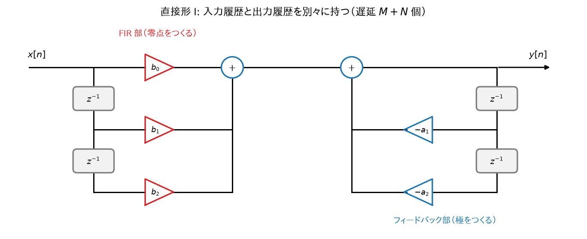
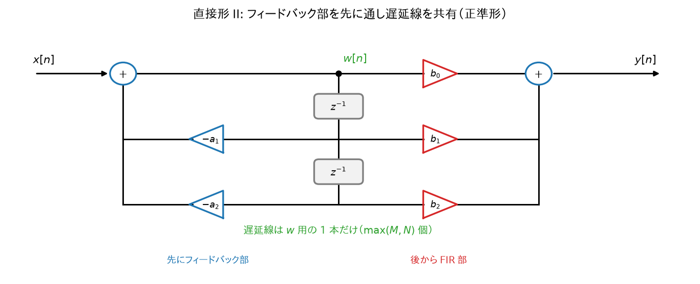
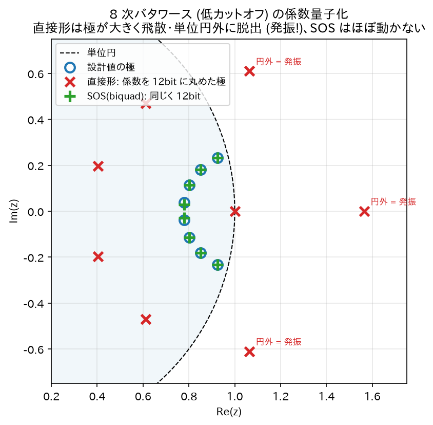
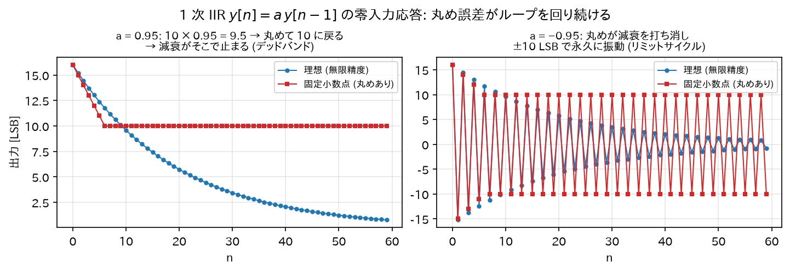

# 09. IIR の実装構造と数値的な注意点

同じ伝達関数$`H(z)`$でも、計算の組み方（**構造**）は複数あり、
無限精度なら等価だが**有限精度では性能が変わる**。
コンピュータの数の表し方には、小数点の位置を固定して整数のように扱う**固定小数点**（例: 16 ビット整数を $`2^{15}`$ で割った値とみなす）と、
「仮数 × 2 のべき」の形で桁を自動で動かす**浮動小数点**（C の float / double）がある。どちらも有限のビット数なので、表せる数は飛び飛びで、計算のたびに丸めが入る。

> **この章がなぜ必要なのか——「紙の上では正しいのに、動かすと壊れる」を防ぐ.**
>
> [08 章](08_IIRフィルタの設計法.md)までで、フィルタの係数を計算できるようになった。数学的にはこれで完成である。
> ところが、その係数をそのままプログラムに書くと、**実際には音が壊れたり、発振したりする**ことがある。
>
> 理由は 1 つ。**コンピュータは数を正確に扱えない**から。
> $`0.1`$すら 2 進数（0 と 1 だけで数を表す方式。コンピュータの内部表現）では割り切れず——$`1/10`$ は分母に 5 を含むので $`1/16 + 1/32 + 1/256 + \cdots`$ と無限に続く——わずかな誤差を抱えたまま計算される。
> 普通の計算ならこの誤差は無視できる。ところが IIR は**自分の出力を何度もループさせる**ので、
> 小さな誤差が回り続けて増幅され、無視できない狂いに育つことがある。
>
> この章は「**数学的には同じ式でも、計算の順番と組み方を変えると誤差への強さが全く違う**」という話である。
> 同じレシピでも、材料を入れる順番で失敗しやすさが変わるのに似ている。
> 結論だけ先に言うと——**高次のフィルタは必ず 2 次ずつに分けて実装せよ**。理由を以下で見る。

> **この章で使う既出の用語（定義は各リンク先）.**
> ナイキスト周波数（[01 章 2 節](01_離散時間信号とサンプリング.md#正規化周波数)）、畳み込み（[03 章](03_LTIシステムと畳み込み.md)）、DTFT（[04 章](04_DTFT_離散時間フーリエ変換.md)）、Z 変換・時間シフト（[05 章 1 節, 3 節](05_Z変換.md#b-時間シフト-iir-で最も重要な性質)）、差分方程式・フィードバック（[06 章 1 節](06_伝達関数_極零点_安定性.md#差分方程式-デジタルフィルタの実体)）、伝達関数（[06 章 2 節](06_伝達関数_極零点_安定性.md#伝達関数の導出)）、極・零点（[06 章 3 節](06_伝達関数_極零点_安定性.md#極と零点)）、周波数特性（[06 章 4 節](06_伝達関数_極零点_安定性.md#周波数特性の図形的解釈-導出)）、FIR・IIR（[07 章 1 節](07_IIRフィルタの基礎.md#fir-と-iir-定義)）、群遅延・線形位相（[07 章 2 節.4](07_IIRフィルタの基礎.md#位相特性と群遅延)）、biquad・安定三角形（[07 章 4 節](07_IIRフィルタの基礎.md#biquad-双-2-次-セクション-iir-の実用単位)）

## 1. 直接形 I (Direct Form I)

差分方程式をそのまま実装した形:

$$
y[n] = \sum_{k=0}^{M} b_k x[n-k] - \sum_{k=1}^{N} a_k y[n-k]
$$



*図: 差分方程式をそのまま回路にした形。前半（$`b_k`$ 側）が零点をつくる FIR 部、後半（$`a_k`$ 側）が極をつくるフィードバック部。入力履歴と出力履歴で遅延線を 2 本持つため、遅延メモリは $`M+N`$ 個必要。*

- 前半（$`b_k`$側）= 零点を作る FIR 部、後半（$`a_k`$側）= 極を作るフィードバック部。
- 遅延メモリが$`M + N`$個必要（入力履歴と出力履歴を別々に持つ）。
- 素直で頑健。固定小数点オーディオでは今でも定番。

## 2. 直接形 II (Direct Form II) — 遅延メモリの節約

### 導出

$`H(z)`$を「フィードバック部 → FIR 部」の縦続として書き直す:

$$
H(z) = \underbrace{\frac{1}{1 + \sum_{k=1}^N a_k z^{-k}}}_{H_1(z)} \cdot \underbrace{\sum_{k=0}^M b_k z^{-k}}_{H_2(z)}
$$

畳み込みの可換性・結合性（[03 章](03_LTIシステムと畳み込み.md)で導出）より、$`H_2 \cdot H_1`$の順でも$`H_1 \cdot H_2`$の順でも全体は同じ。
そこで**先にフィードバック部$`H_1`$を通す**ことにし、中間信号を$`w[n]`$とする:

$$
W(z) = H_1(z) X(z) \Longleftrightarrow w[n] = x[n] - \sum_{k=1}^{N} a_k w[n-k]
$$

$$
Y(z) = H_2(z) W(z) \Longleftrightarrow y[n] = \sum_{k=0}^{M} b_k w[n-k]
$$

2 つの式は**どちらも$`w`$の過去値だけを参照する**。1 本目は $`w[n-1], \dots, w[n-N]`$、2 本目は $`w[n-1], \dots, w[n-M]`$ を使うので、$`w[n-1]`$ から $`w[n-\max(M,N)]`$ までを覚えておけば両方計算できる。よって遅延線は$`w`$用の 1 本
（$`\max(M, N)`$個）で済む。これが直接形 II（canonical form: 最小遅延数の意味で正準形）。



*図: フィードバック部を先に通して中間信号 $`w[n]`$ を作り、その遅延線を FIR 部と**共有**する。2 つの式がどちらも $`w`$ の過去値しか参照しないため遅延線は 1 本（$`\max(M,N)`$ 個）で済む＝正準形。*

### 注意

直接形 II は中間信号$`w[n]`$に極の共振がフィルタされずに直撃するため、
**内部でオーバーフローしやすい**（オーバーフロー: 計算結果がその数の表現形式で表せる最大値を超えて壊れること。入力・出力が小さくても$`w`$が大きくなり得る）。
浮動小数点では通常問題ないが、固定小数点では直接形 I か転置形が選ばれることが多い。

### 転置形 (Transposed Direct Form II)

ブロック図の信号の流れをすべて逆向きにし、分岐点と加算点を入れ替えても伝達関数は変わらない、という一般則（転置定理）で得られるのが**転置形 II**である。
ここでは定理に頼らず、biquad の伝達関数から直接導く。$`Y(z)(1 + a_1 z^{-1} + a_2 z^{-2}) = X(z)(b_0 + b_1 z^{-1} + b_2 z^{-2})`$ を $`Y`$ について解き、$`z^{-1}`$ のべきごとにまとめると

$$
Y = b_0 X + z^{-1}\Bigl[\underbrace{(b_1 X - a_1 Y) + z^{-1}\underbrace{(b_2 X - a_2 Y)}_{S_2}}_{S_1}\Bigr]
$$

内側から $`S_2 = b_2 X - a_2 Y`$、$`S_1 = b_1 X - a_1 Y + z^{-1} S_2`$、$`Y = b_0 X + z^{-1} S_1`$ と名前を付け、$`z^{-1}`$ を 1 サンプル遅延（[05 章 3 節(b)](05_Z変換.md#b-時間シフト-iir-で最も重要な性質)）に戻すと:

$$
\begin{aligned}
y[n] &= b_0 x[n] + s_1[n-1]\\
s_1[n] &= b_1 x[n] - a_1 y[n] + s_2[n-1]\\
s_2[n] &= b_2 x[n] - a_2 y[n]
\end{aligned}
$$

（biquad の場合。$`s_1, s_2`$ は直接形 II の $`w`$ とは別の中間量で、**状態変数**（次のサンプルへ持ち越す記憶）と呼ぶ。この 2 個だけで済み、数値特性も良好。
SciPy の `lfilter` や多くのオーディオライブラリの内部実装がこれ。）

## 3. 縦続形(biquad カスケード) — 高次 IIR の標準実装

### なぜ高次を 1 つの直接形で実装してはいけないのか

> **要点を先に.** 8 次のフィルタを「8 次の式」のまま 1 個で実装すると、
> 係数のごくわずかな誤差（小数点以下 4 桁目とか）で**極が大きく吹き飛んで発振する**。
> ところが同じフィルタを「2 次 × 4 段」に分けて実装すると、同じ誤差でもびくともしない。
> 数学的には完全に同じフィルタなのに、である。なぜそんなことが起きるのか。

$`N`$次の分母多項式$`1 + a_1 z^{-1} + \cdots + a_N z^{-N}`$の**根（極）の位置は、係数の微小誤差に対して
次数が上がるほど極端に敏感になる**。

理由を式で見る。分母を $`z^N`$ 倍した $`P(z) = z^N + a_1 z^{N-1} + \cdots + a_N = \prod_{j=1}^{N}(z - p_j)`$ で、係数 $`a_k`$ だけを $`\delta`$ ずらしたとき根 $`p_i`$ がどれだけ動くか。
ずれた後も $`P(p_i + \delta p_i) + \delta \cdot (p_i)^{N-k} = 0`$ が成り立つはずなので、1 次近似 $`P(p_i + \delta p_i) \approx P(p_i) + P'(p_i)\,\delta p_i = P'(p_i)\,\delta p_i`$ より

$$
\delta p_i \approx -\frac{p_i^{N-k}}{P'(p_i)}\,\delta, \qquad P'(p_i) = \prod_{j \neq i}(p_i - p_j)
$$

（積の微分で、$`z = p_i`$ を入れると $`(z - p_i)`$ を含まない項だけが残る。）
分母は「その極から他のすべての極までの距離の積」である。ローパスなどでは極が単位円付近の狭い範囲に固まって並ぶので、この距離はどれも小さく、その $`N-1`$ 個の積は次数が上がるほど急速に 0 に近づく。
つまり同じ係数誤差 $`\delta`$ でも根の動き $`\delta p_i`$ は次数とともに爆発的に大きくなる。
（有名な実例が Wilkinson 多項式 $`(x-1)(x-2)\cdots(x-20)`$: $`x^{19}`$ の係数を $`2^{-23}`$ だけ変えると、根の半分が複素数に飛ぶ。）
特に IIR では極が単位円ギリギリに配置されがちなので、
係数の量子化（例: float32 への丸め）で**極が単位円の外に押し出されて発振**する事故が起きる。

### 解決: 2 次ずつに分けて縦続する

$`H(z)`$を極・零点の共役対ごとに biquad へ分解する:

$$
H(z) = G \prod_{i=1}^{\lceil N/2 \rceil} \frac{b_{0i} + b_{1i} z^{-1} + b_{2i} z^{-2}}{1 + a_{1i} z^{-1} + a_{2i} z^{-2}}
$$

（[03 章](03_LTIシステムと畳み込み.md#b-結合性-x-*-h1-*-h2-=-x-*-h1-*-h2)の結合性より、縦続接続の全体特性は各段の積。分解は数学的に厳密に等価。）

- 各 biquad の係数はその段の 1 対の極だけを決めるので、**量子化誤差の影響がその段に局所化**される。
- 2 次の極位置は係数から直接読める（[06 章](06_伝達関数_極零点_安定性.md#極と零点):$`|p|^2 = a_2`$,$`2\mathrm{Re}(p) = -a_1`$）ので、
  安定性の検査・保証（安定三角形）も段ごとに簡単。

> **実務の鉄則: 3 次以上の IIR は必ず biquad（+ 必要なら 1 次セクション）のカスケードで実装する。**
> SciPy で `butter(8, ...)` を使うときも `output='sos'`（second-order sections）を指定し、
> `sosfilt` で流すのが標準プラクティス。`output='ba'` の高次係数は次数が上がると簡単に破綻する。

```python
# 推奨パターン (SciPy)
from scipy.signal import butter, sosfilt
sos = butter(8, 1000, btype='low', fs=48000, output='sos')  # 8次 = biquad 4段
y = sosfilt(sos, x)
```



*図: 8 次バタワース(低カットオフ)の係数を 12 bit に丸めた実験。直接形(赤 ×)は 8 次多項式の根の悪条件のせいで極が大幅に飛散し、この実験条件では 3 個が単位円の外に出て発振する。同じ 12 bit でも SOS(緑 +)の極は設計値(青 ○)からほぼ動かない。*

## 4. 量子化に起因する現象

### (a) 係数量子化

設計した係数を有限ビットに丸めると極・零点が設計位置からずれる。
→ 特性の変形、最悪の場合は不安定化。対策: biquad 分解、倍精度で設計、係数感度の低い構造。

### (b) 丸め誤差の蓄積とリミットサイクル

各サンプルの積和演算（係数 × 信号値を足し合わせる、差分方程式そのものの計算）で生じる丸め誤差は、FIR なら出力に一度混ざって終わりだが、
**IIR ではフィードバックループを回って再入力され続ける**。

固定小数点実装では、入力が 0 になった後も丸め誤差が自己再生して
小さな発振が永久に残る**リミットサイクル**が起きることがある
（例: 出力が …, +1 LSB, −1 LSB, +1 LSB, … と振動し続ける。LSB は Least Significant Bit、表せる最小の刻み 1 つぶん）。
対策: 誤差フィードバック（error feedback / noise shaping。丸めで捨てた端数を次のサンプルの計算に足し戻し、誤差が蓄積しないようにする）、ディザ（丸める前にごく小さなランダム雑音を足し、丸め誤差が同じ向きに固まって自己再生するのを崩す）、浮動小数点の採用。



*図: 1 次 IIR の零入力応答を「毎サンプル LSB に丸める」固定小数点で計算した実験。理想(青)は 0 に減衰するが、固定小数点(赤)は左: 丸めが減衰を打ち消して 0 に届かず途中の値で止まる(この止まってしまう値の帯をデッドバンドと呼ぶ)、右: この実験の係数では ±10 LSB の永久振動(リミットサイクル)に陥る。*

### (c) 極が単位円に近いときの一般的注意

カットオフがナイキスト周波数 $`f_s/2`$ に比べて極端に低い（例:$`f_s = 48`$kHz で$`f_c = 20`$Hz）と、
極が$`z = 1`$の至近距離に来る。biquad の係数は $`a_1 \approx -2`$、$`a_2 \approx 1`$ となり、極の位置は「1 からのごくわずかなずれ」で決まるのに、係数にはその 1 の部分が丸ごと含まれるので、
ずれの情報が下位の桁に押し込まれて丸めで失われる（ほぼ等しい数どうしの引き算で有効桁が消えることを**桁落ち**と呼ぶ）。
float32 では特性が崩れることがあり、倍精度状態変数や SVF（state variable filter: 積分器を 2 段縦続した構造で、係数がカットオフの正接に比例する小さな数そのものになり「1 − 小さな数」の形を含まないため桁落ちに強い）構造への
置き換えが定石。

## 5. 実装チェックリスト

- [ ] 3 次以上は SOS（biquad カスケード）に分解したか
- [ ] 各段の係数が安定三角形の内側にあるか（$`|a_2| < 1`$,$`1 \pm a_1 + a_2 > 0`$）
- [ ] 状態変数の初期化（ゼロクリア or 過渡応答対策）をしたか
- [ ] 係数を実行時に変化させる場合、変化中も安定か・ジップノイズ（係数を段階的に切り替えるたびに出力に乗る「ジッ」という小さな不連続音）は許容範囲か
- [ ] 固定小数点なら: 内部ワード長、オーバーフロー対策（飽和演算）、リミットサイクル対策
- [ ] 位相の非線形性がアプリケーション上問題ないか（問題なら FIR か、信号を前向きに通した後、時間を反転して同じフィルタをもう一度通すことで位相のずれを打ち消す零位相フィルタリング `filtfilt` を検討。リアルタイムでは使えない）

## 6. 学習のまとめ — IIR 理解の全体像

| 章 | 核心 |
|---|---|
| サンプリング (01) | 信号を数列にする。周波数は $`\omega=2\pi f/f_s`$、意味があるのは $`0`$〜$`\pi`$ |
| 複素指数 (02) | $`e^{j\omega n}`$ は LTI の固有関数。フィルタ = 各周波数に複素倍率を掛ける装置 |
| 畳み込み (03) | LTI は $`h[n]`$ で完全記述。安定 ⟺ $`\sum\lvert h\rvert < \infty`$ |
| DTFT (04) | 周波数特性の定義。畳み込み ↔ 掛け算 |
| Z 変換 (05) | $`z^{-1}`$ = 1 サンプル遅延。有理関数と部分分数展開が IIR の言語 |
| 伝達関数と極零点 (06) | 差分方程式 ↔ $`H(z)`$ ↔ $`h[n]`$。極 = 共振と余韻、零点 = ノッチ。安定 ⟺ 全極が単位円内 |
| IIR 本体 (07) | フィードバック → 無限の余韻。低次数で急峻な特性。biquad が実用単位 |
| 設計 (08) | アナログ理論（バタワース等）+ 双一次変換（台形則、$`\Omega=(2/T)\tan(\omega/2)`$） |
| 実装 (09) | 高次は SOS カスケード（各段の構造は用途に応じて直接形 I か転置形）。量子化と極の感度に注意 |

これで「IIR フィルタとは何か・なぜ動くか・どう設計しどう実装するか」の一通りが、
すべての式の導出付きで追えるようになっている。
